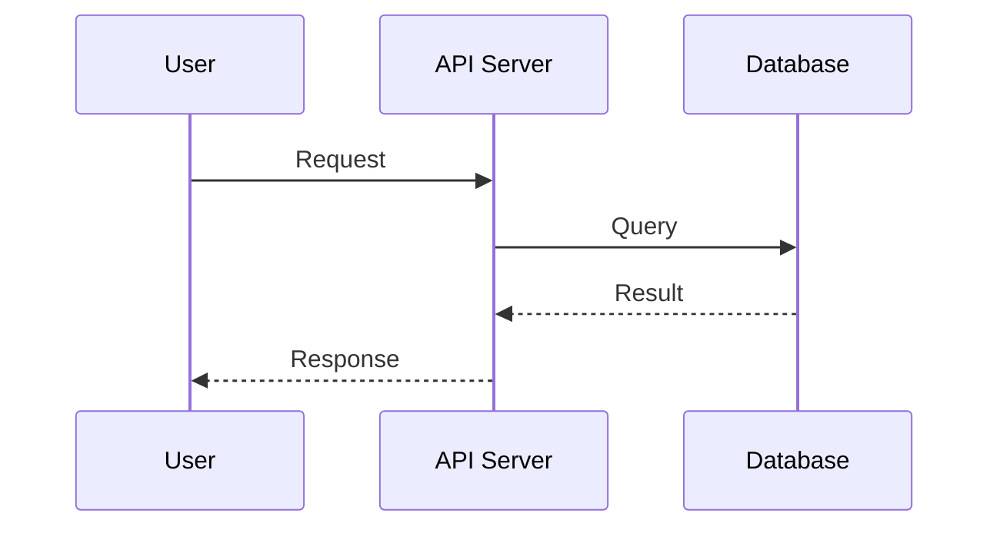

# AGENTS.md

Behavioral guidelines to reduce common LLM coding mistakes. Merge with project-specific instructions as needed.

**Tradeoff:** These guidelines bias toward caution over speed. For trivial tasks, use judgment.

## 1. Think Before Coding

**Don't assume. Don't hide confusion. Surface tradeoffs.**

Before implementing:
- State your assumptions explicitly. If uncertain, ask.
- If multiple interpretations exist, present them - don't pick silently.
- If a simpler approach exists, say so. Push back when warranted.
- If something is unclear, stop. Name what's confusing. Ask.

## 2. Simplicity First

**Minimum code that solves the problem. Nothing speculative.**

- No features beyond what was asked.
- No abstractions for single-use code.
- No "flexibility" or "configurability" that wasn't requested.
- No error handling for impossible scenarios.
- If you write 200 lines and it could be 50, rewrite it.

Ask yourself: "Would a senior engineer say this is overcomplicated?" If yes, simplify.

## 3. Surgical Changes

**Touch only what you must. Clean up only your own mess.**

When editing existing code:
- Don't "improve" adjacent code, comments, or formatting.
- Don't refactor things that aren't broken.
- Match existing style, even if you'd do it differently.
- If you notice unrelated dead code, mention it - don't delete it.

When your changes create orphans:
- Remove imports/variables/functions that YOUR changes made unused.
- Don't remove pre-existing dead code unless asked.

The test: Every changed line should trace directly to the user's request.

## 4. Goal-Driven Execution

**Define success criteria. Loop until verified.**

Transform tasks into verifiable goals:
- "Add validation" → "Write tests for invalid inputs, then make them pass"
- "Fix the bug" → "Write a test that reproduces it, then make it pass"
- "Refactor X" → "Ensure tests pass before and after"

For multi-step tasks, state a brief plan:
```
1. [Step] → verify: [check]
2. [Step] → verify: [check]
3. [Step] → verify: [check]
```

Strong success criteria let you loop independently. Weak criteria ("make it work") require constant clarification.

## 5. Teach While Coding

**Treat every task as a teaching opportunity. Explain, don't just deliver.**

When a task involves any non-obvious knowledge (a pattern, algorithm, technical
choice, library, or how a mechanism works), explain it so the reader learns:
- Explain **why** this approach was chosen over alternatives (the tradeoff).
- Explain the **underlying mechanism**, not just what the code does.
- Point out **pitfalls and common mistakes** related to it.
- Keep it concise and use small examples when helpful.

The goal is to build the product and grow understanding at the same time.

## 6. Document With Diagrams

**For design-level changes, produce docs and diagrams - not just code.**

When a change has a design dimension (new feature, business flow, architecture,
or API), create or update documentation:
- **Docs / PRD**: context, goals, requirements, scope.
- **Technical design**: architecture, components, data model, key decisions.
- **Diagrams**: use **Mermaid** or **Excalidraw**, whichever fits the need:
  - **Mermaid** (default) for precise, version-controlled diagrams embedded in Markdown:
    - **Sequence diagram** (`sequenceDiagram`) for interaction / API / auth flows.
    - **Flowchart** (`flowchart`) for business logic.
    - **ER diagram** (`erDiagram`) for data models.
    - **State diagram** (`stateDiagram-v2`) for state machines.
  - **Excalidraw** when a free-form, hand-drawn / whiteboard-style sketch communicates better -
    high-level architecture, system context, or brainstorming visuals. Save the source as an
    `.excalidraw` file (JSON) under `docs/` so it stays editable, and export a `.png`/`.svg`
    alongside it to embed in the Markdown.

Pick the tool per need: Mermaid when the structure is well-defined and should diff cleanly in
git; Excalidraw when a looser, more visual sketch is clearer.

Example of the expected Mermaid block:



Put documentation under `docs/` (create it if missing), named clearly per feature.

---

**These guidelines are working if:** fewer unnecessary changes in diffs, fewer rewrites due to overcomplication, and clarifying questions come before implementation rather than after mistakes.
