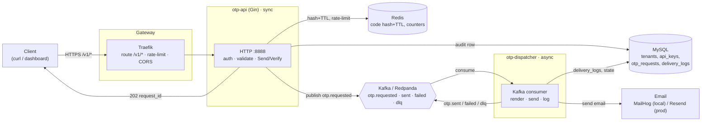
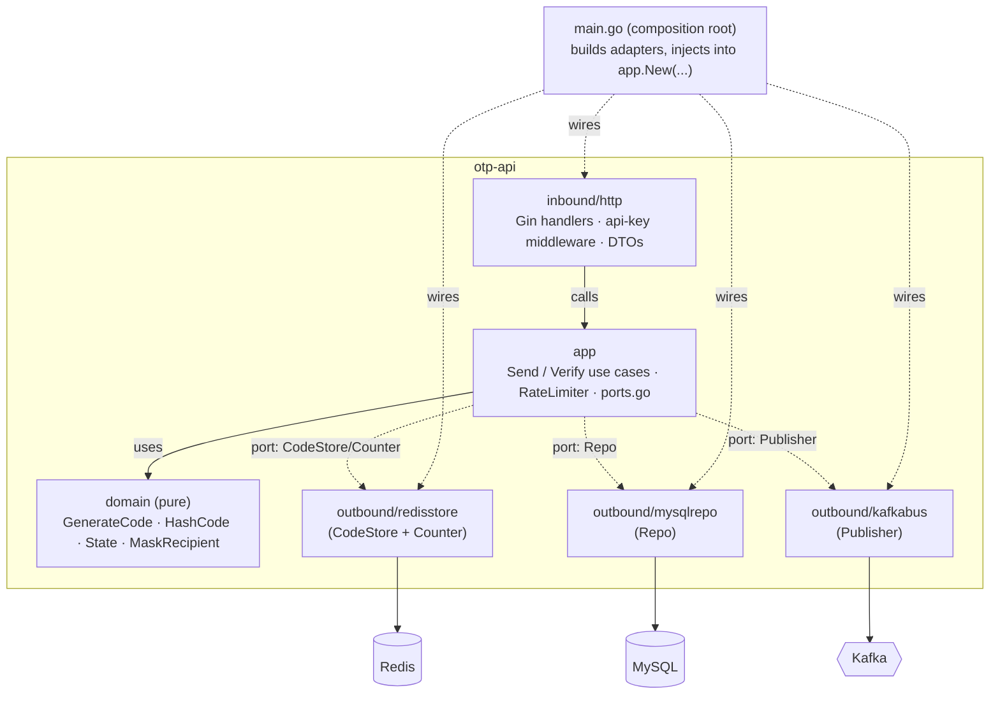
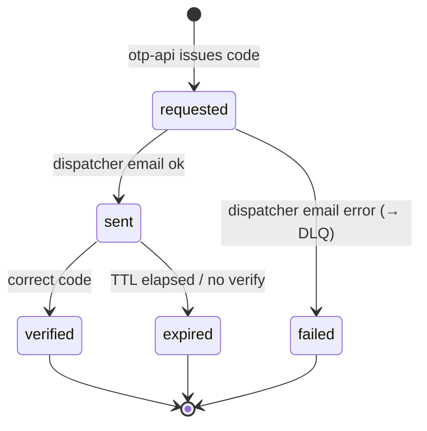
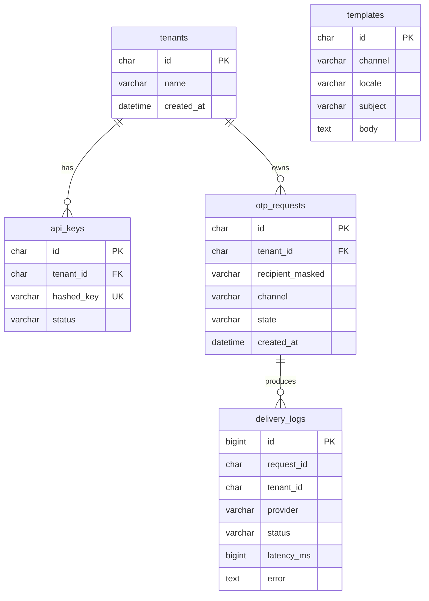
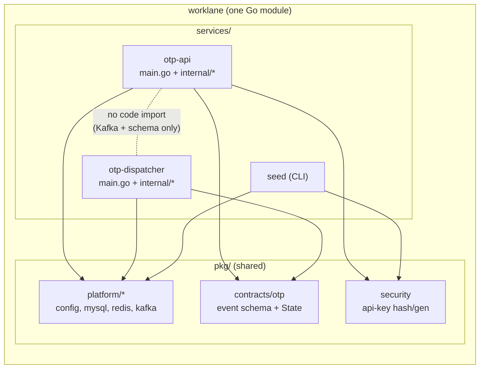

# Architecture (after Phases 1-4)

Visual reference for the OTP walking skeleton as actually built and running. Diagrams are Mermaid
(render in GitHub, most IDEs, or any Mermaid viewer). For the folder layout and the GoFrame→Gin
mapping see [reference/architecture-and-layout.md](./reference/architecture-and-layout.md); for the
concept-by-concept learning notes see [learning/go-notes.md](./learning/go-notes.md).

---

## 1. Runtime topology (docker-compose stack)

What runs, and how a request flows through it. The two services share nothing at runtime except the
MySQL schema and the Kafka event contract - they talk only over Kafka.



Dev-only web UIs (also in compose, not part of the request path): Adminer (MySQL), RedisInsight,
Redpanda Console, MailHog, Traefik dashboard.

---

## 2. End-to-end sequence (send, then verify)

```mermaid
sequenceDiagram
    autonumber
    participant C as Client
    participant GW as Traefik
    participant A as otp-api
    participant R as Redis
    participant DB as MySQL
    participant K as Kafka
    participant D as otp-dispatcher
    participant M as Email (MailHog/Resend)

    C->>GW: POST /v1/otp/send (Bearer key)
    GW->>A: forward (edge rate-limit + CORS)
    A->>A: hash key, resolve tenant, validate
    A->>R: check idempotency + rate limits
    A->>A: GenerateCode + HashCode (pure)
    A->>R: store hash+salt, TTL
    A->>DB: insert otp_requests (requested, masked)
    A->>K: publish otp.requested
    A-->>C: 202 { request_id }

    K->>D: consume otp.requested
    D->>M: render template + send email
    M-->>D: ok / error
    D->>DB: insert delivery_logs; state = sent|failed
    D->>K: publish otp.sent | otp.failed (+ otp.dlq on failure)

    Note over C,M: --- later ---
    C->>GW: POST /v1/otp/verify (code)
    GW->>A: forward
    A->>R: get record; attempt-lock guard
    A->>A: VerifyHash (constant-time)
    A->>R: delete code (single use)
    A->>DB: state = verified
    A-->>C: 200 verified | 401 mismatch | 410 gone | 429 locked
```

---

## 3. Hexagon inside one service (otp-api)

Dependencies point inward only. The inbound adapter drives a use case; the use case depends on ports;
outbound adapters implement those ports. The composition root (`main.go`) is the only place that knows
the concrete adapters.



`otp-dispatcher` has the same shape: inbound is a Kafka consumer, the use case is `Handle`, and the
outbound ports are `EmailProvider` (resendmail **or** smtpmail, chosen by config), `Repo`, `Publisher`.

---

## 4. OTP request state machine

Enforced in `domain/state.go` (allowed transitions) and driven by the two services.



---

## 5. Data model (MySQL)



> Note: the plaintext OTP code lives **only** in Redis (as a salted hash, TTL-bound) and is never in
> MySQL. `otp_requests.recipient_masked` stores `d***@gmail.com`, not the real address.

---

## 6. Monorepo, two deployables



Services never import each other's `internal/` (Go enforces it). They meet only at the shared
`pkg/contracts` event schema and the shared MySQL schema - which is exactly what makes each one
independently deployable and, later, independently extractable into its own repo.
