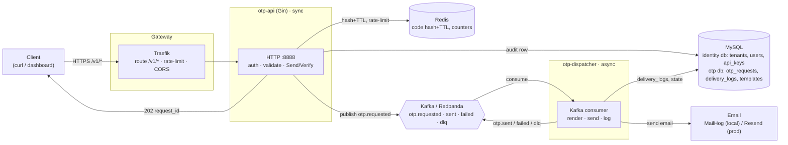
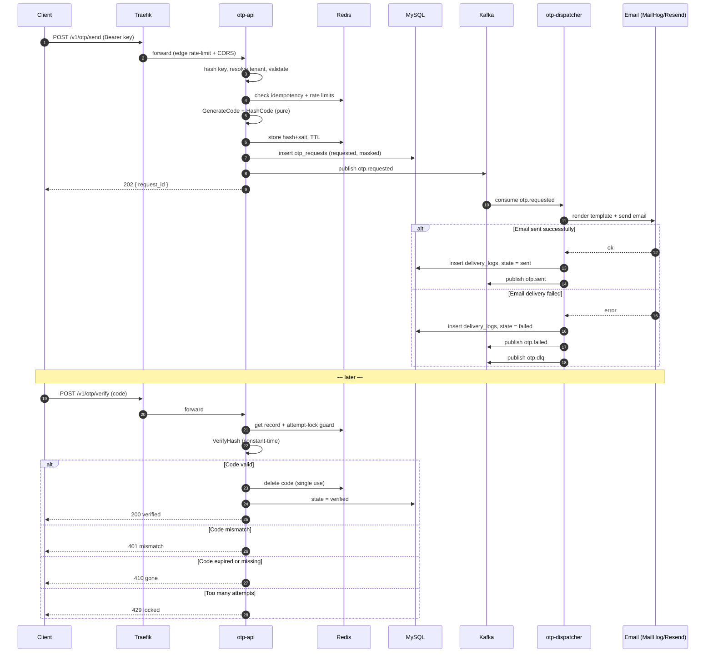
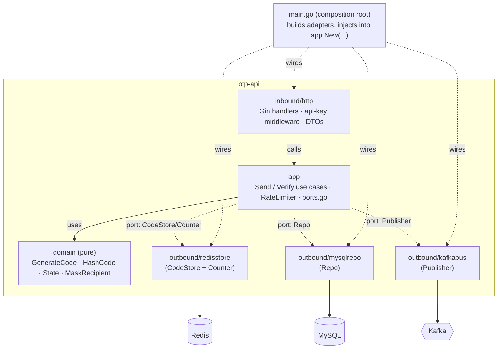
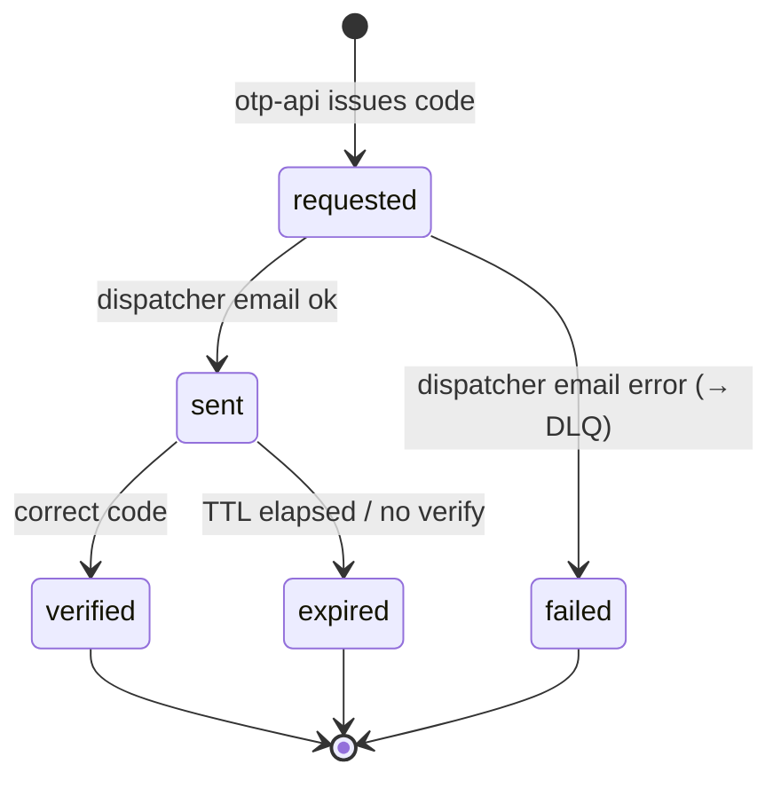
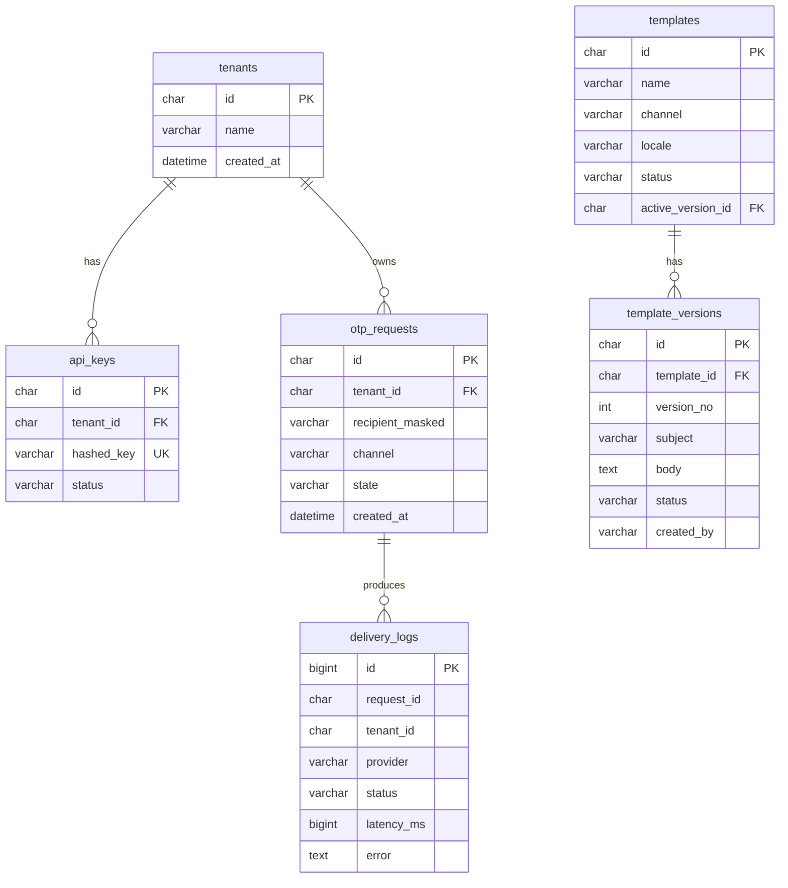
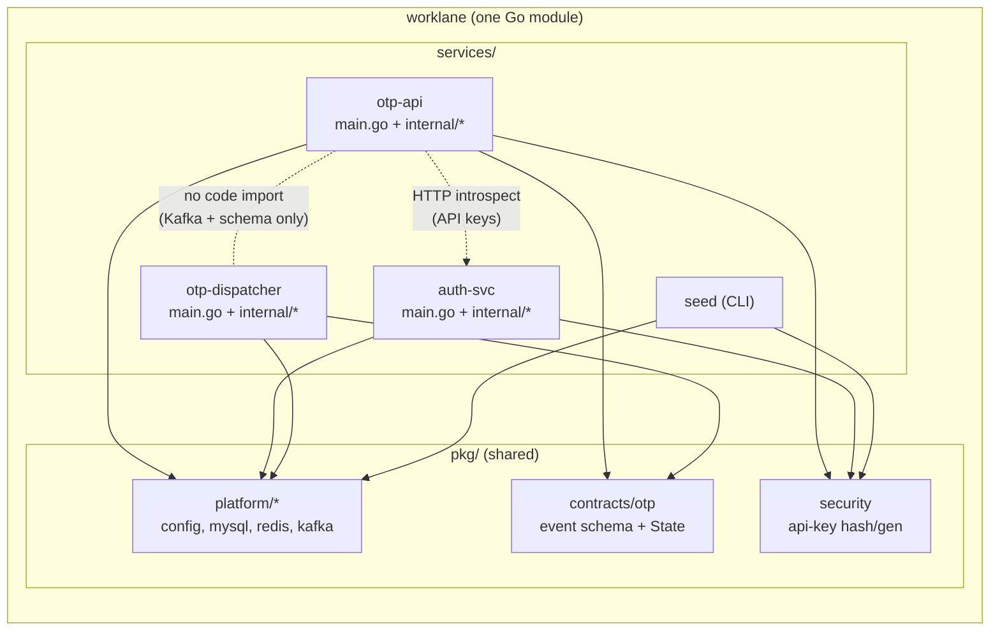

# Architecture (after Phases 1-4)

Visual reference for the OTP walking skeleton as actually built and running. Diagrams are Mermaid
(render in GitHub, most IDEs, or any Mermaid viewer). For the folder layout and the GoFrame→Gin
mapping see [reference/architecture-and-layout.md](./reference/architecture-and-layout.md); for the
concept-by-concept learning notes see [learning/go-notes.md](./learning/go-notes.md).

---

## 1. Runtime topology (docker-compose stack)

What runs, and how a request flows through it. The two services share nothing at runtime except the
MySQL schema and the Kafka event contract - they talk only over Kafka.

```mermaid
flowchart LR
    Client["Client<br/>(curl / dashboard)"]

    subgraph edge["Gateway"]
        Traefik["Traefik<br/>route /v1/* · rate-limit · CORS"]
    end

    subgraph api["otp-api (Gin) · sync"]
        API["HTTP :8888<br/>auth · validate · Send/Verify"]
    end

    subgraph disp["otp-dispatcher · async"]
        DISP["Kafka consumer<br/>render · send · log"]
    end

    Redis[("Redis<br/>code hash+TTL, counters")]
    MySQL[("MySQL<br/>identity db: tenants, users, api_keys<br/>otp db: otp_requests, delivery_logs, templates")]
    Kafka{{"Kafka / Redpanda<br/>otp.requested · sent · failed · dlq"}}
    Mail["Email<br/>MailHog (local) / Resend (prod)"]

    Client -->|"HTTPS /v1/*"| Traefik --> API
    API -->|"hash+TTL, rate-limit"| Redis
    API -->|"audit row"| MySQL
    API -->|"publish otp.requested"| Kafka
    Kafka -->|"consume"| DISP
    DISP -->|"send email"| Mail
    DISP -->|"delivery_logs, state"| MySQL
    DISP -->|"otp.sent / failed / dlq"| Kafka
    API -->|"202 request_id"| Client
```

Dev-only web UIs (also in compose, not part of the request path): Adminer (MySQL), RedisInsight,
Redpanda Console, MailHog, Traefik dashboard.

**Auth & identity:** human login (email+password -> EdDSA JWT) and machine API keys are owned
by a dedicated `auth-svc` backed by its own `identity` database (tenants, users, api_keys).
otp-api verifies JWTs locally with the public key, and resolves API keys by calling auth-svc's
network-internal `/internal/introspect` (Redis-cached). See
[dashboard-auth-identity-service-design](superpowers/specs/2026-08-19-dashboard-auth-identity-service-design.md).

---

## 2. End-to-end sequence (send, then verify)

```mermaid
sequenceDiagram
    autonumber
    participant C as Client
    participant GW as Traefik
    participant A as otp-api
    participant R as Redis
    participant DB as MySQL
    participant K as Kafka
    participant D as otp-dispatcher
    participant M as Email (MailHog/Resend)

    C->>GW: POST /v1/otp/send (Bearer key)
    GW->>A: forward (edge rate-limit + CORS)
    A->>A: hash key, resolve tenant, validate
    A->>R: check idempotency + rate limits
    A->>A: GenerateCode + HashCode (pure)
    A->>R: store hash+salt, TTL
    A->>DB: insert otp_requests (requested, masked)
    A->>K: publish otp.requested
    A-->>C: 202 { request_id }

    K->>D: consume otp.requested
    D->>M: render template + send email

    alt Email sent successfully
        M-->>D: ok
        D->>DB: insert delivery_logs, state = sent
        D->>K: publish otp.sent
    else Email delivery failed
        M-->>D: error
        D->>DB: insert delivery_logs, state = failed
        D->>K: publish otp.failed
        D->>K: publish otp.dlq
    end

    Note over C,M: --- later ---

    C->>GW: POST /v1/otp/verify (code)
    GW->>A: forward
    A->>R: get record + attempt-lock guard
    A->>A: VerifyHash (constant-time)

    alt Code valid
        A->>R: delete code (single use)
        A->>DB: state = verified
        A-->>C: 200 verified
    else Code mismatch
        A-->>C: 401 mismatch
    else Code expired or missing
        A-->>C: 410 gone
    else Too many attempts
        A-->>C: 429 locked
    end
```

---

## 3. Hexagon inside one service (otp-api)

Dependencies point inward only. The inbound adapter drives a use case; the use case depends on ports;
outbound adapters implement those ports. The composition root (`main.go`) is the only place that knows
the concrete adapters.

```mermaid
flowchart TB
    subgraph svc["otp-api"]
        direction TB
        IN["inbound/http<br/>Gin handlers · api-key middleware · DTOs"]
        APP["app<br/>Send / Verify use cases · RateLimiter · ports.go"]
        DOM["domain (pure)<br/>GenerateCode · HashCode · State · MaskRecipient"]
        RS["outbound/redisstore<br/>(CodeStore + Counter)"]
        MR["outbound/mysqlrepo<br/>(Repo)"]
        KB["outbound/kafkabus<br/>(Publisher)"]

        IN -->|calls| APP
        APP -->|uses| DOM
        APP -. "port: CodeStore/Counter" .-> RS
        APP -. "port: Repo" .-> MR
        APP -. "port: Publisher" .-> KB
    end

    RS --> Redis[("Redis")]
    MR --> MySQL[("MySQL")]
    KB --> Kafka{{"Kafka"}}

    MAIN["main.go (composition root)<br/>builds adapters, injects into app.New(...)"]
    MAIN -.wires.-> IN
    MAIN -.wires.-> RS
    MAIN -.wires.-> MR
    MAIN -.wires.-> KB
```

`otp-dispatcher` has the same shape: inbound is a Kafka consumer, the use case is `Handle`, and the
outbound ports are `EmailProvider` (resendmail **or** smtpmail, chosen by config), `Repo`, `Publisher`.

---

## 4. OTP request state machine

Enforced in `domain/state.go` (allowed transitions) and driven by the two services.

```mermaid
stateDiagram-v2
    [*] --> requested: otp-api issues code
    requested --> sent: dispatcher email ok
    requested --> failed: dispatcher email error (→ DLQ)
    sent --> verified: correct code
    sent --> expired: TTL elapsed / no verify
    verified --> [*]
    failed --> [*]
    expired --> [*]
```

---

## 5. Data model (MySQL)

> Database-per-service: `tenants`, `users`, and `api_keys` live in the **identity** database
> (owned by auth-svc); `otp_requests`, `delivery_logs`, and `templates` live in the **otp**
> database (owned by otp-api). The relationships below are logical - `tenant_id` is a soft
> reference across databases, with no cross-database foreign key.

```mermaid
erDiagram
    tenants ||--o{ api_keys : "has"
    tenants ||--o{ otp_requests : "owns"
    otp_requests ||--o{ delivery_logs : "produces"
    templates ||--o{ template_versions : "has"

    tenants {
        char id PK
        varchar name
        datetime created_at
    }
    api_keys {
        char id PK
        char tenant_id FK
        varchar hashed_key UK
        varchar status
    }
    otp_requests {
        char id PK
        char tenant_id FK
        varchar recipient_masked
        varchar channel
        varchar state
        datetime created_at
    }
    delivery_logs {
        bigint id PK
        char request_id
        char tenant_id
        varchar provider
        varchar status
        bigint latency_ms
        text error
    }
    templates {
        char id PK
        varchar name
        varchar channel
        varchar locale
        varchar status
        char active_version_id FK
    }
    template_versions {
        char id PK
        char template_id FK
        int version_no
        varchar subject
        text body
        varchar status
        varchar created_by
    }
```

> Note: the plaintext OTP code lives **only** in Redis (as a salted hash, TTL-bound) and is never in
> MySQL. `otp_requests.recipient_masked` stores `d***@gmail.com`, not the real address.

> **Template Studio (sub-project A):** `templates` is a logical entity (one per `channel` + `locale`),
> and each edit appends an immutable `template_versions` row. Publishing repoints
> `templates.active_version_id` (`draft → published → superseded`). The dispatcher resolves the
> active template for `(channel, locale)` via **Redis cache-aside** (`tmpl:{channel}:{locale}`,
> invalidated by otp-api on publish) and renders it through the shared `pkg/templating` engine -
> the same code the dashboard preview calls, so a preview cannot diverge from what is delivered.
> If no active row exists (or on any DB/cache error) the dispatcher **falls back to the env-config
> template**, so OTP delivery never breaks. Variables are the allowlisted `{{code}}` and `{{expiry}}`.

---

## 6. Monorepo, deployables

```mermaid
flowchart LR
    subgraph repo["worklane (one Go module)"]
        subgraph services["services/"]
            A["otp-api<br/>main.go + internal/*"]
            AUTH["auth-svc<br/>main.go + internal/*"]
            D["otp-dispatcher<br/>main.go + internal/*"]
            S["seed (CLI)"]
        end
        subgraph pkgs["pkg/ (shared)"]
            P1["platform/*<br/>config, mysql, redis, kafka"]
            P2["contracts/otp<br/>event schema + State"]
            P3["security<br/>api-key hash/gen"]
        end
    end

    A --> P1 & P2 & P3
    AUTH --> P1 & P3
    D --> P1 & P2
    S --> P1 & P3
    A -. "no code import<br/>(Kafka + schema only)" .- D
    A -. "HTTP introspect<br/>(API keys)" .-> AUTH
```

Services never import each other's `internal/` (Go enforces it). otp-api and otp-dispatcher meet at
the shared `pkg/contracts` event schema and the `otp` database; otp-api calls auth-svc over HTTP for
API-key introspection. Those boundaries keep each service independently deployable and, later,
independently extractable into its own repo.
