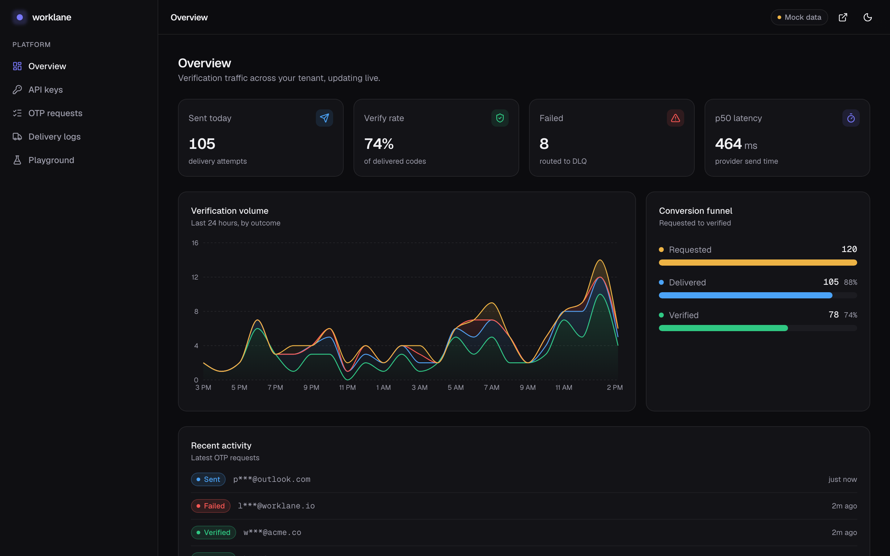
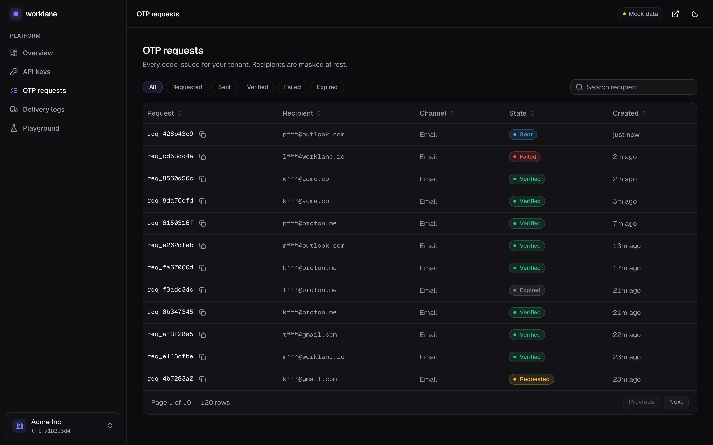
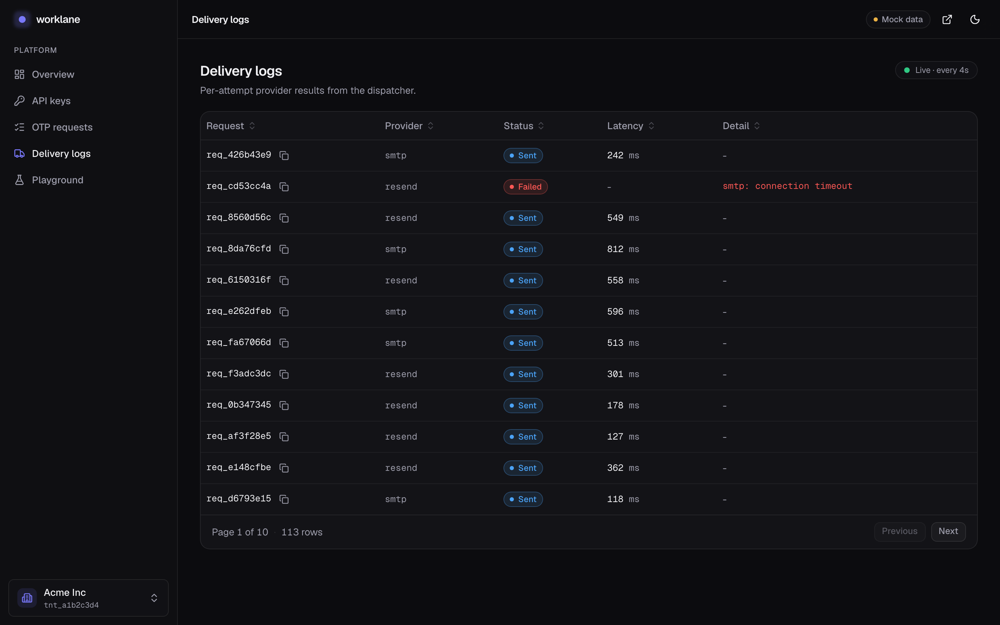
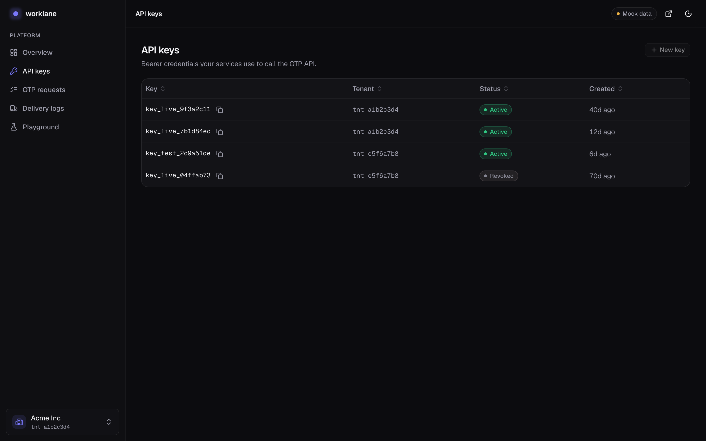
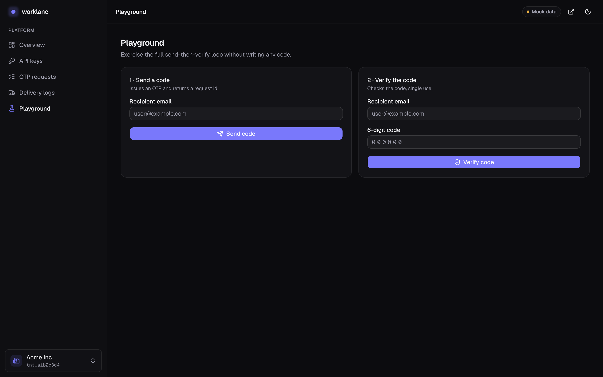

# Dashboard gallery

The `worklane` developer dashboard - a dark-first Next.js app for the OTP /
verification platform. Screens below are captured in mock-data mode; each has a
light-theme variant linked underneath. See [dashboard/README.md](../dashboard/README.md)
to run it or re-capture these images.

## Overview

KPIs (sent, verify rate, failed, p50 latency), a stacked volume chart by outcome,
a requested → delivered → verified funnel, and a live activity feed.

_Light: [overview-light.png](assets/dashboard/overview-light.png)_

## OTP requests

Full request history with state filter chips, recipient search, sortable columns,
and pagination. Recipients are masked at rest.

_Light: [requests-light.png](assets/dashboard/requests-light.png)_

## Delivery logs

Per-attempt provider results, polled every 4 seconds. Freshly-arrived rows glow
briefly; failures surface the provider error.

_Light: [logs-light.png](assets/dashboard/logs-light.png)_

## API keys

Bearer credentials with status badges and copy-to-clipboard. Self-serve
create/revoke is a Phase 2 addition.

_Light: [api-keys-light.png](assets/dashboard/api-keys-light.png)_

## Playground

Exercise the full send-then-verify loop without writing code. In mock mode the
code is revealed (as MailHog would) so you can complete the round trip.

_Light: [playground-light.png](assets/dashboard/playground-light.png)_
