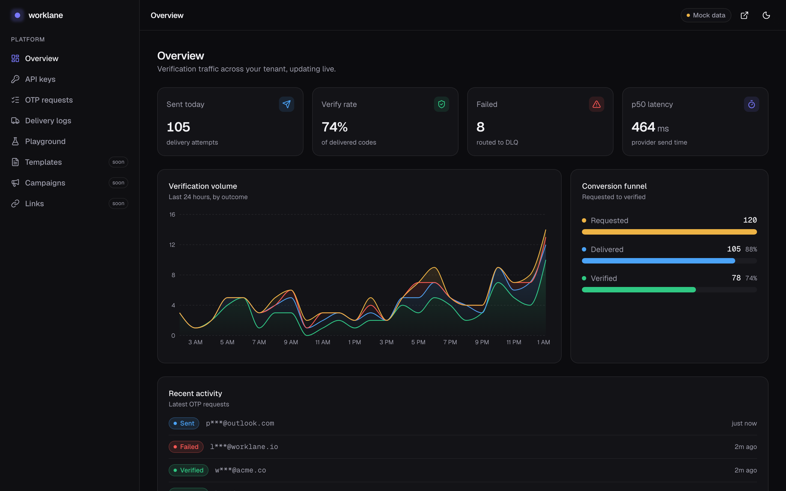
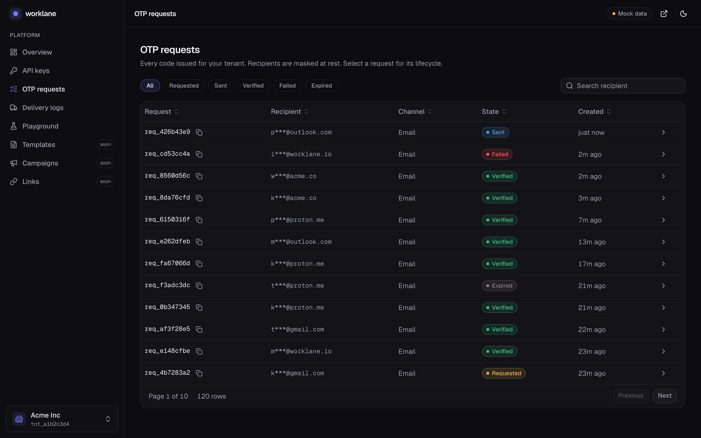
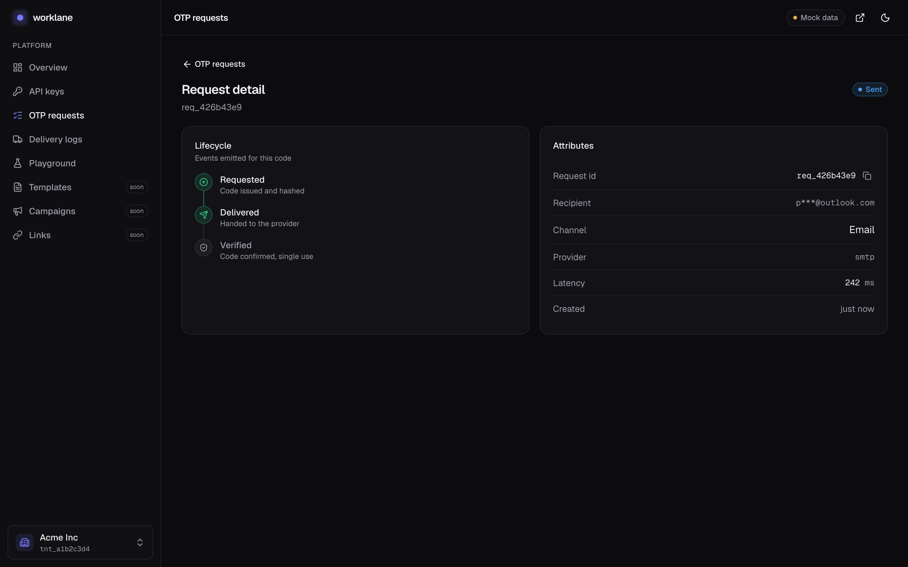
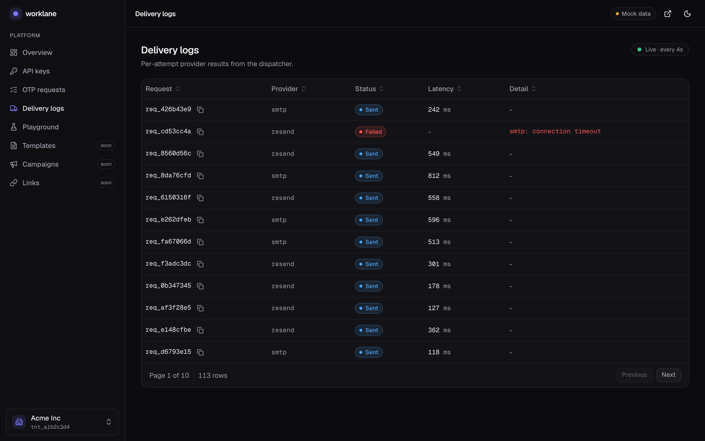
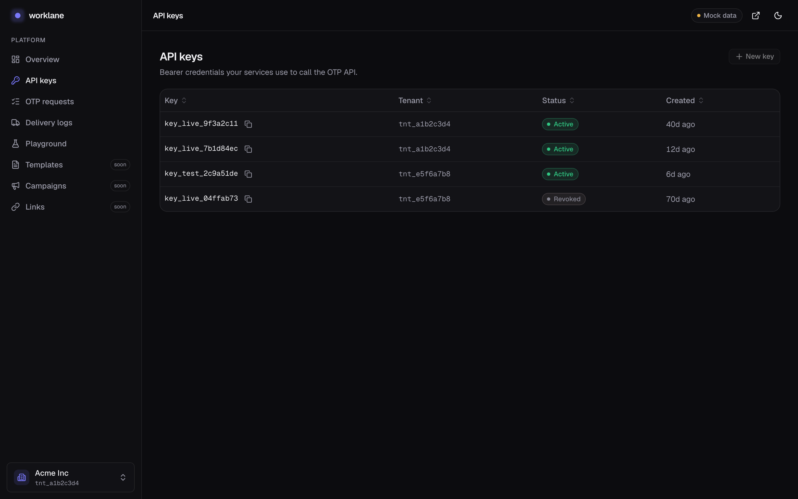
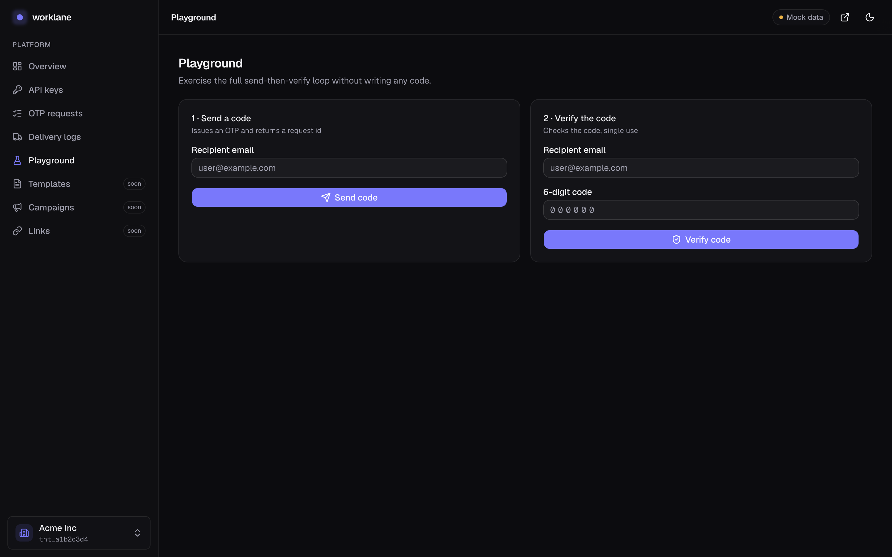
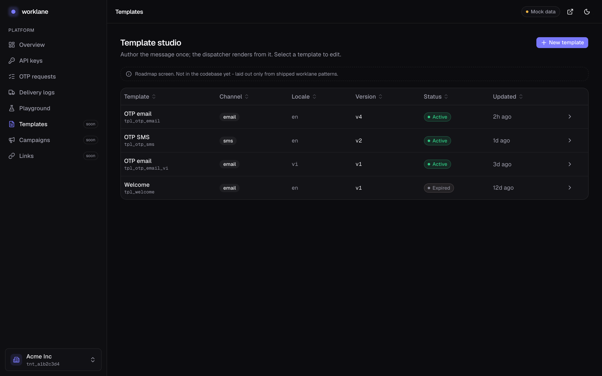
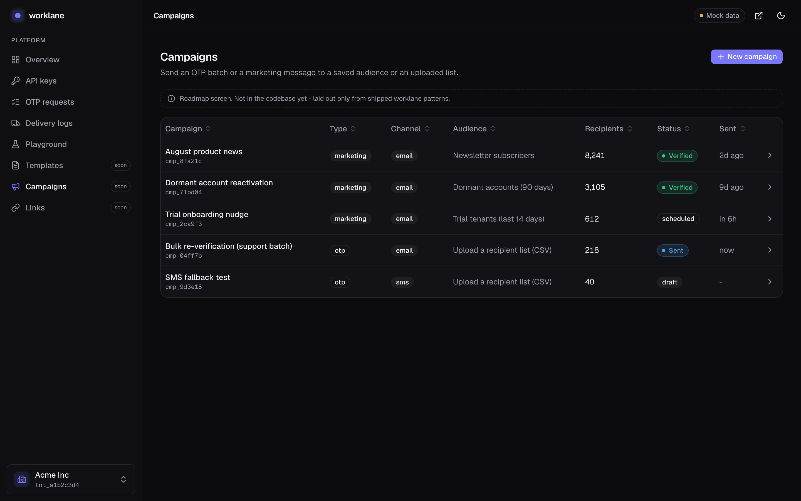
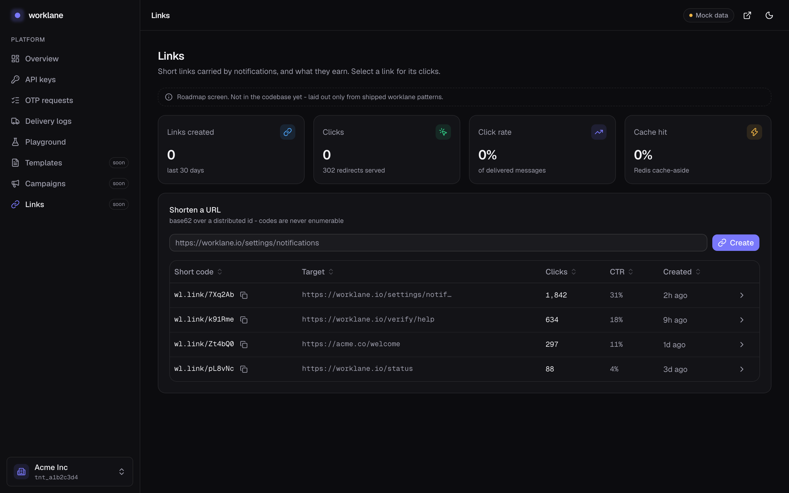
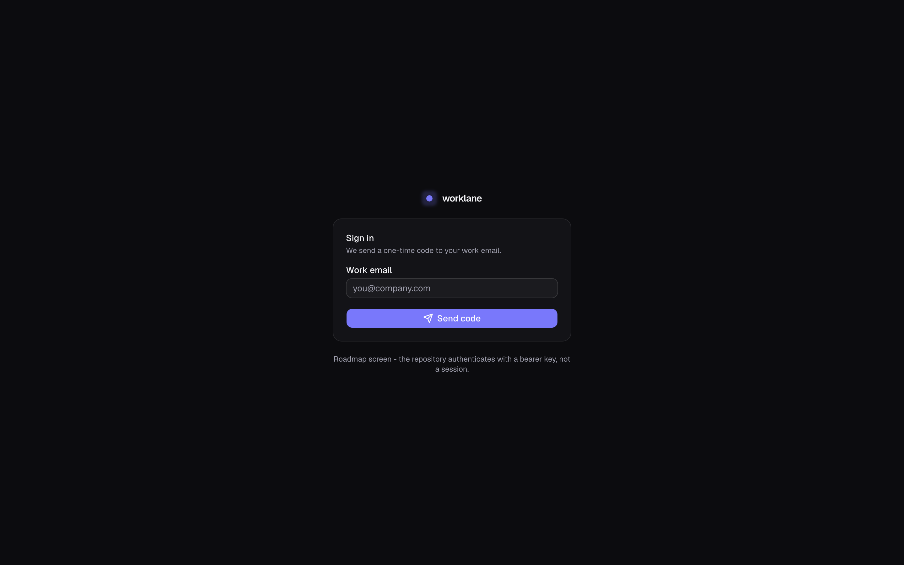

# Dashboard gallery

The `worklane` developer dashboard - a dark-first Next.js app for the OTP /
verification platform. Screens below are captured in mock-data mode; each has a
light-theme variant linked underneath. See [dashboard/README.md](../dashboard/README.md)
to run it or re-capture these images.

## Overview

KPIs (sent, verify rate, failed, p50 latency), a stacked volume chart by outcome,
a requested → delivered → verified funnel, and a live activity feed.

_Light: [overview-light.png](assets/dashboard/overview-light.png)_

## OTP requests

Full request history with state filter chips, recipient search, sortable columns,
and pagination. Recipients are masked at rest. Select a request for its lifecycle.

_Light: [requests-light.png](assets/dashboard/requests-light.png)_

## Request detail

Row opens a master → detail view: a lifecycle timeline (requested → delivered →
verified, with failed/expired stopping short) and attributes joined from the
delivery log (provider, latency, provider error).

_Light: [request-detail-light.png](assets/dashboard/request-detail-light.png)_

## Delivery logs

Per-attempt provider results, polled every 4 seconds. Freshly-arrived rows glow
briefly; failures surface the provider error.

_Light: [logs-light.png](assets/dashboard/logs-light.png)_

## API keys

Bearer credentials with status badges and copy-to-clipboard. Self-serve
create/revoke is a Phase 2 addition.

_Light: [api-keys-light.png](assets/dashboard/api-keys-light.png)_

## Playground

Exercise the full send-then-verify loop without writing code. In mock mode the
code is revealed (as MailHog would) so you can complete the round trip.

_Light: [playground-light.png](assets/dashboard/playground-light.png)_

## Roadmap screens

Proposed surfaces laid out from shipped worklane patterns and driven by local
fixtures. Each carries a dashed "not in the codebase yet" notice and appears in the
sidebar with a `soon` tag. They are UI proposals, not wired to any API.

### Templates

Author a message once; the dispatcher renders from it. Row opens an editor with
live preview, version history, and recent sends.

_Light: [templates-light.png](assets/dashboard/templates-light.png)_

### Campaigns

Send an OTP batch or a marketing message to a saved audience or an uploaded list.
The composer estimates recipient scope and send window live before a confirm step.

_Light: [campaigns-light.png](assets/dashboard/campaigns-light.png)_

### Links

Short links carried by notifications, with click KPIs, a 14-day clicks-over-time
chart, and recent-click events.

_Light: [links-light.png](assets/dashboard/links-light.png)_

### Login

The OTP loop applied to sign-in. Standalone (no shell); the real dashboard
authenticates with a bearer key, not a session.

_Light: [login-light.png](assets/dashboard/login-light.png)_
