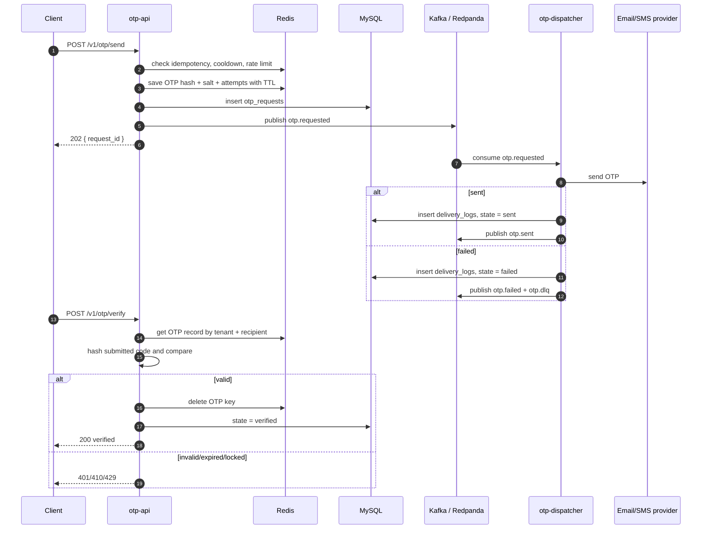
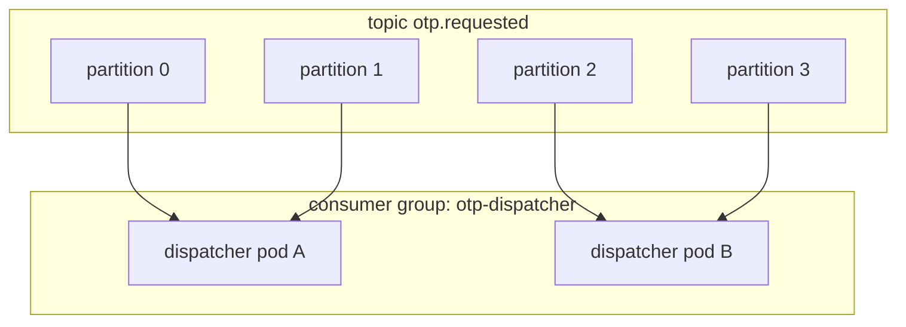
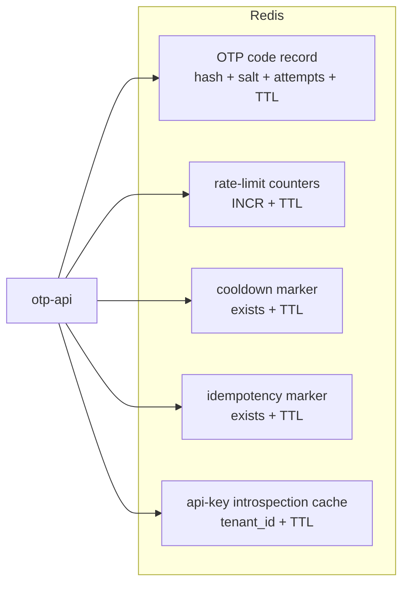

# Kafka and Redis review notes for the OTP project

This document helps you review the two easiest-to-mix-up parts of the project:

- **Kafka / Redpanda**: the asynchronous pipeline between `otp-api` and `otp-dispatcher`.
- **Redis**: the fast TTL-based state store used for active OTPs, rate limits, cooldowns, idempotency, and API-key introspection cache.

Read this together with:

- [architecture.md](../architecture.md)
- [prod-architecture-and-kafka-walkthrough.md](./prod-architecture-and-kafka-walkthrough.md)
- [go-notes.md](./go-notes.md)

---

## 1. One sentence to remember

In this project:

- `otp-api` is the **HTTP front door**: it receives requests, validates them, writes Redis/MySQL state, publishes an event to Kafka, and returns `202`.
- Kafka is the **event log / message backbone**: it stores `otp.requested` events for workers to process later.
- `otp-dispatcher` is the **consumer worker**: it reads events from Kafka, sends email/SMS, writes MySQL logs, and publishes result events.
- Redis is the **short-lived state store**: it stores data that must be fast and expire automatically.
- MySQL is the **durable audit store**: it stores long-lived request history for queries and reporting.

Short interview answer:

> The API path does not send email directly. It creates the OTP, stores the OTP hash in Redis with a TTL, writes an audit row to MySQL, publishes `otp.requested` to Kafka, and returns `202`. The dispatcher consumes that event and sends the message asynchronously. Redis stores short-lived state, Kafka stores work/events to process, and MySQL stores durable truth.

---

## 2. Overall flow



---

## 3. Kafka in this project

### 3.1 What is Kafka used for?

Kafka separates **receiving the request** from **sending the OTP** so those two operations can run at different speeds:

- `otp-api` must be fast, stable, and return a response quickly.
- Sending email/SMS can be slow, fail, or hit provider rate limits.
- `otp-dispatcher` can process work later and scale independently.

Without Kafka:

```text
Client -> otp-api -> Email provider -> Client waits
```

If the provider is slow, the API becomes slow too.

With Kafka:

```text
Client -> otp-api -> Kafka -> otp-dispatcher -> Email provider
          returns 202
```

The client does not wait for the provider.

### 3.2 What is a topic?

A **topic** is the name of an event stream.

In this project:

| Topic | Producer | Current consumer | Meaning |
|---|---|---|---|
| `otp.requested` | `otp-api` | `otp-dispatcher` | An OTP needs to be delivered |
| `otp.sent` | `otp-dispatcher` | None yet | Delivery succeeded, future webhook/analytics services can read it |
| `otp.failed` | `otp-dispatcher` | None yet | Delivery failed, future alert/report/retry workers can read it |
| `otp.dlq` | `otp-dispatcher` | No service yet | Dead-letter queue for operators or a DLQ drainer |

Important: a topic **can have no consumers**. Kafka still keeps messages until retention expires.

### 3.3 What is a producer?

A producer is the component that **writes messages to a topic**.

In this project:

- `otp-api` produces `otp.requested`.
- `otp-dispatcher` produces `otp.sent`, `otp.failed`, and `otp.dlq`.
- Producer code lives in `pkg/platform/kafka/producer.go`.
- The producer uses `SyncProducer` and `RequiredAcks = WaitForAll`, so publish succeeds only after the broker acknowledges the write.

The event contract lives in `pkg/contracts/otp/event.go`.

`RequestedEvent` contains the plaintext OTP code:

```go
type RequestedEvent struct {
    RequestID string `json:"request_id"`
    TenantID  string `json:"tenant_id"`
    Recipient string `json:"recipient"`
    Channel   string `json:"channel"`
    Code      string `json:"code"`
}
```

So `otp.requested` is more sensitive than downstream topics. `otp.sent` and `otp.failed` intentionally omit `Code`.

### 3.4 What is a consumer?

A consumer is **one instance that reads messages from Kafka**.

In this project:

- One `otp-dispatcher` pod/process = one consumer instance.
- If the deployment is scaled to 3 replicas, there are 3 consumer instances.

### 3.5 What is a consumer group?

A consumer group is **a group of consumers that share the work of reading a topic**.

In this project:

```text
group.id = otp-dispatcher
topic    = otp.requested
```

If there are 3 dispatcher pods with the same `group.id=otp-dispatcher`, Kafka treats them as one team.



Rules to remember:

- Within **the same consumer group**, each partition is assigned to **only 1 consumer** at a time.
- One consumer can process multiple partitions.
- If there are more consumers than partitions, extra consumers sit idle.
- If another consumer group is created, it reads independently from the current group and has its own offsets.

Example:

```text
Group otp-dispatcher  -> send email/SMS
Group analytics-svc   -> calculate reports
Group webhook-svc     -> call customer webhooks
```

All three groups can read `otp.sent`. Each group has its own logical view of the stream because each group tracks its own offsets.

### 3.6 What is a partition?

A partition is a **lane** inside a topic. Each partition is an ordered log.

```text
topic otp.requested

partition 0: [msg0] [msg1] [msg2]
partition 1: [msg0] [msg1] [msg2]
partition 2: [msg0] [msg1] [msg2]
```

Kafka only guarantees ordering **inside one partition**. It does not guarantee ordering across different partitions.

Why not just use 1 partition?

- 1 partition is simple and gives global ordering.
- But inside one consumer group, 1 partition can only have 1 active consumer.
- So if `otp.requested` has only 1 partition and you scale `otp-dispatcher` to 10 pods, only 1 pod can read, and the other 9 pods are idle.

Partitions are the main scaling axis for Kafka consumer parallelism.

### 3.7 Message key and partition key

A producer can attach a key to a message. Kafka uses the key to choose a partition:

```text
partition = hash(key) % number_of_partitions
```

In this project, events use:

```go
func (e RequestedEvent) PartitionKey() string { return e.RequestID }
```

Meaning:

- Same `RequestID` -> same partition.
- Events in one request lifecycle can preserve ordering by request.
- Since `RequestID` is almost random/unique, messages distribute fairly evenly.

If the key is `tenant_id`:

- All events for one tenant go to the same partition.
- Ordering is preserved per tenant.
- But a large tenant can create a hot partition.

If the key is `recipient`:

- Ordering is preserved per recipient.
- This helps if the business rule is "do not send 2 OTPs to the same recipient at the same time".
- But a hot recipient/tenant can skew load.

### 3.8 Offset and lag

Each partition is a sequence of messages with increasing offsets:

```text
partition 0:
offset 0 | offset 1 | offset 2 | offset 3 | offset 4
```

A consumer group commits offsets so Kafka knows how far that group has processed.

**Lag**:

```text
lag = latest offset - committed offset
```

If producers write faster than consumers process, lag grows.

Interview phrasing:

> High lag does not automatically mean Kafka is broken. It means the consumer group is processing slower than messages are arriving. Check consumer throughput, handler errors, provider latency, DB latency, partition count, active consumer count, and hot partitions.

### 3.9 At-least-once delivery in this project

The consumer wrapper lives in `pkg/platform/kafka/consumer.go`.

Current behavior:

- Handler succeeds -> `MarkMessage` -> offset is committed.
- Handler fails -> message is not marked -> message can be delivered again.

This is **at-least-once delivery**:

```text
A message is processed at least once, possibly more than once.
```

Consequences:

- Handlers must tolerate duplicates.
- DB writes and follow-up publishes need idempotency thinking.
- If the side effect is email/SMS delivery, duplicate sends must be considered.

In this project, failures are split:

- Terminal provider failure -> publish `otp.failed` + `otp.dlq`, return nil, and mark the message.
- Infrastructure failure such as DB or publish error -> return error so Kafka can retry.

This is a strong interview point: not all errors should be retried the same way.

### 3.10 When should partitions be scaled?

Use this process:

1. Check whether lag is growing continuously.
2. Check whether producer rate is higher than consumer rate.
3. Check whether consumers are truly busy: CPU, goroutines, provider latency, DB latency.
4. Check whether active consumers are limited by partition count.
5. Check whether lag is concentrated on one partition.

Scale partitions when:

- Lag grows steadily.
- Consumers are already at capacity.
- Adding consumer replicas does not help because there are too few partitions.
- The workload can be processed in parallel.
- Global ordering is not required.

Do not scale partitions when:

- The email/SMS provider is slow or rate-limited.
- MySQL is slow.
- The handler has a bug and retries forever.
- One hot key makes one partition overloaded.
- The business requires strict global ordering.

Notes:

- Kafka partitions can be increased, but decreasing them is very hard and usually not done directly.
- Increasing partitions can move keys to different partitions because `hash(key) % N` changes.
- More partitions increase parallelism, but also add overhead and rebalance cost.

### 3.11 Kafka replica vs partition

Remember:

| Concept | Purpose |
|---|---|
| Partition | Splits a topic into lanes for throughput and parallelism |
| Replica | Creates multiple copies of a partition for fault tolerance |
| Consumer group | Distributes partitions across consumers doing the same job |

Real production example:

```text
topic otp.requested
partitions = 6
replication factor = 3
dispatcher replicas = 3
```

Meaning:

- 6 partitions -> up to 6 active consumers in the same group.
- RF=3 -> each partition has 3 copies on different brokers.
- 3 dispatcher pods -> each pod can receive about 2 partitions.

In the current project, Redpanda is single-node, so the practical setup is:

```text
partition = 1
replication factor = 1
dispatcher replicas = 1
```

This is good for learning and demos, but it is not highly available Kafka production.

---

## 4. Redis in this project

### 4.1 What is Redis used for?

Redis is not used like Kafka here. Redis is used for short-lived state and fast access.



One sentence to remember:

> Redis stores data that must be fast and expire naturally. OTPs should not live forever in MySQL. Rate-limit counters do not need to be durable forever. Auth cache can disappear and be rebuilt.

### 4.2 Redis vs MySQL vs Kafka

| Question | Redis | MySQL | Kafka |
|---|---|---|---|
| Nature | In-memory key-value/data structure store | Relational durable database | Distributed append-only event log |
| Used for in this project | Active OTP, counters, cooldown, cache | Audit rows, request state, delivery logs | Async delivery events |
| Natural TTL? | Yes | Not the main pattern | Topic/log retention |
| Flexible querying? | Worse than MySQL | Good with SQL/indexes | Not used for application state queries |
| If data is lost? | Acceptable for cache/short-lived OTP state | Serious | Depends on retention/use case |
| Example | `otp:code:*` | `otp_requests` | `otp.requested` |

Correct mental model:

- Redis: "Is there an active OTP right now?"
- MySQL: "What happened to this request historically?"
- Kafka: "What work/event does a worker need to process?"

### 4.3 Redis keys in this project

#### 1. OTP code record

Code:

- `services/otp-api/internal/app/send.go`
- `services/otp-api/internal/app/verify.go`
- `services/otp-api/internal/adapters/outbound/redisstore/store.go`

Key:

```text
otp:code:<tenant_id>:<recipient>
```

Value is JSON:

```json
{
  "hash": "...",
  "salt": "...",
  "attempts": 0
}
```

TTL = how long the OTP stays alive.

Why store this in Redis?

- OTPs only need to live for a few minutes.
- Redis has TTL, so the key deletes itself after expiry.
- Verification needs fast reads.
- The plaintext code is not stored. Only hash + salt are stored.

Flow:

```text
send:
  generate code
  hash = HashCode(code, request_id)
  SET otp:code:<tenant>:<recipient> {hash,salt,attempts} EX <ttl>

verify:
  GET otp:code:<tenant>:<recipient>
  hash submitted code with salt
  if correct: DEL key
  if wrong: attempts++ and SET again with TTL
```

Pitfalls:

- If Redis loses the key, the OTP is treated as expired/missing.
- The current key includes the raw recipient. If production privacy requirements are stricter, hash the recipient in the key.
- `Verify` saves the record again with the full TTL after a wrong attempt, which can reset the TTL. If absolute expiry is required, preserve the remaining TTL when updating attempts.

#### 2. Idempotency marker

Key:

```text
otp:idem:<tenant_id>:<idempotency_key>
```

Used when the client retries a request after a timeout.

Without idempotency:

```text
Client timeout -> retry -> create a new OTP -> send 2 emails
```

With idempotency:

```text
First call: set marker, create request
Second call with the same Idempotency-Key: see marker, return original request_id, do not publish again
```

Redis fits because this marker only needs to live as long as the OTP TTL.

#### 3. Cooldown marker

Key:

```text
otp:cd:<tenant_id>:<recipient>
```

The value is only `"1"` with a TTL.

Used to block resend too quickly:

```text
If key exists -> ErrCooldown
If key does not exist -> allow send, then SET key with cooldown TTL
```

This is a "presence marker" pattern.

#### 4. Per-recipient rate-limit counter

Key:

```text
otp:rl:rcpt:<tenant_id>:<recipient>
```

Behavior:

```text
INCR key
if first hit n == 1 -> EXPIRE key by the window
if n > max -> rate limited
```

This is a fixed-window / rolling-from-first-hit counter.

Example:

```text
limit = 5 calls / 1 hour

request 1 -> INCR = 1, set TTL 1h
request 2 -> INCR = 2
...
request 6 -> INCR = 6 -> block
TTL expires -> key disappears -> count resets
```

#### 5. Per-tenant rate-limit counter

Key:

```text
otp:rl:tenant:<tenant_id>
```

Same idea as the recipient counter, but it limits total requests for a tenant.

Why both?

- Per-recipient prevents spamming one email/phone.
- Per-tenant prevents one tenant from sending too many OTPs overall.

#### 6. API-key introspection cache

Code:

- `services/otp-api/internal/adapters/outbound/identity/cache.go`

Key:

```text
introspect:<hash(api_key)>
```

Value:

```text
tenant_id
```

Flow:

```text
otp-api receives Authorization: Bearer <api_key>
-> hash api key into cache key
-> GET Redis
   hit: tenant_id exists, no need to call auth-svc
   miss: call auth-svc /internal/introspect
         if ok, SET Redis with TTL
```

This is the cache-aside pattern.

Why cache only success?

- Valid API keys are reused often.
- Errors from auth-svc or invalid keys should not be cached casually, because a temporary error could become sticky.

### 4.4 Redis command patterns to remember

In this project, know these commands:

| Command | Meaning | Used for |
|---|---|---|
| `SET key value EX ttl` | Write a value with expiry | OTP record, cooldown, idempotency, cache |
| `GET key` | Read a value | OTP verification, auth cache |
| `DEL key` | Delete a key | OTP single-use after successful verification |
| `EXISTS key` | Check whether a marker exists | Cooldown, idempotency |
| `INCR key` | Atomically increment a counter | Rate limiting |
| `EXPIRE key ttl` | Set TTL for the first counter hit | Rate-limit window |

Atomic means each Redis command is safe as a single operation on one Redis instance. `INCR` is a good fit for counters because 100 concurrent requests still increment correctly.

### 4.5 TTL is the center of Redis here

TTL lets the app avoid cron cleanup for short-lived state.

```text
OTP TTL            -> code expires automatically
rate-limit window  -> counter resets automatically
cooldown TTL       -> resend unlocks automatically
idempotency TTL    -> retry marker expires automatically
auth cache TTL     -> tenant lookup refreshes automatically
```

If TTL is forgotten:

- OTPs can live forever.
- Counters never reset.
- Cooldown never ends.
- Auth cache can stay stale too long.
- Redis memory grows without control.

### 4.6 Redis does not replace Kafka here

Redis has Pub/Sub and Streams, but this project uses Kafka for async events.

Why that makes sense:

- Kafka is a better fit for event logs, consumer groups, replay, lag monitoring, and partition scaling.
- Redis is a better fit here for TTL key-value data, counters, and cache.
- Redis Pub/Sub would be weaker for OTP delivery because it is fire-and-forget, so offline consumers can miss messages.
- Redis Streams can work as a small queue, but this project is meant to teach Kafka/microservices, and Kafka makes partition, consumer group, lag, and replay concepts clearer.

---

## 5. How to explain this in interviews

### Question 1: Why use Kafka?

Sample answer:

> To decouple API latency from provider latency. `otp-api` only validates, stores the OTP hash in Redis, writes an audit row to MySQL, publishes `otp.requested`, and returns `202`. `otp-dispatcher` consumes and sends email/SMS later. This gives back-pressure, retry behavior, independent worker scaling, and lower coupling between the API and delivery provider.

### Question 2: What is a consumer group?

Sample answer:

> A consumer group is a set of consumers with the same `group.id` that share the partitions of a topic. Within one group, a partition is assigned to only one consumer at a time, so each message in that partition is handled by one worker in the group. Offsets are tracked per group. If another service wants to read the same topic for a different purpose, it should use a different group id.

### Question 3: Why do we need partitions?

Sample answer:

> A partition is the unit of ordering and parallelism. Kafka guarantees order only within one partition. Multiple partitions allow multiple consumers in the same group to process messages in parallel. If there is only one partition, only one consumer in the group can be active, so scaling worker replicas does not increase throughput.

### Question 4: What do you do when lag is high?

Sample answer:

> First check which partitions have lag, producer rate vs consumer rate, error logs, provider latency, and DB latency. If the consumer is failing, fix the error first. If the provider is slow, use rate limiting/backoff or increase provider capacity. If consumers are CPU/IO saturated and lag is evenly distributed, increase dispatcher replicas. But replicas only help if the topic has enough partitions, so you may need to create or increase partitions.

### Question 5: What is Redis used for?

Sample answer:

> Redis is used for short-lived state with TTL: active OTP records, failed attempt count, resend cooldown, idempotency markers, rate-limit counters, and auth introspection cache. These need fast reads/writes and automatic expiry. MySQL stores audit/history, and Kafka stores events for workers to process.

### Question 6: How does Redis rate limiting work?

Sample answer:

> Each request calls `INCR` on a counter key. If it is the first hit in the window, the code sets `EXPIRE`. When the count exceeds the max, the request is blocked. Since `INCR` is atomic, concurrent requests are counted correctly. TTL resets the counter when the window ends.

---

## 6. Self-review exercises

### Exercise 1: Rewrite the flow in your own words

Write 5 lines:

```text
1. Client calls ...
2. otp-api stores ...
3. otp-api publishes ...
4. otp-dispatcher consumes ...
5. verify reads ...
```

If your answer does not use `Redis TTL`, `MySQL audit`, `Kafka event`, and `consumer group`, you do not fully own the flow yet.

### Exercise 2: Calculate consumer assignment

Calculate:

| Partitions | Consumers in the same group | Active consumers | Idle consumers |
|---:|---:|---:|---:|
| 1 | 3 | ? | ? |
| 4 | 2 | ? | ? |
| 6 | 6 | ? | ? |
| 6 | 10 | ? | ? |

Answer:

| Partitions | Consumers | Active | Idle |
|---:|---:|---:|---:|
| 1 | 3 | 1 | 2 |
| 4 | 2 | 2 | 0 |
| 6 | 6 | 6 | 0 |
| 6 | 10 | 6 | 4 |

### Exercise 3: Choose a key

Question: if you want ordering per recipient, what partition key should you use?

Answer: `recipient` or a hash of `recipient`. The tradeoff is that a hot recipient/tenant can create a hot partition.

Question: if you want even distribution for independent OTP requests, is the current key good?

Answer: yes. `RequestID` is almost unique/random, so it distributes well.

### Exercise 4: Which Redis key does what?

Fill in:

```text
otp:code:<tenant>:<recipient>      -> ?
otp:idem:<tenant>:<idempotency>    -> ?
otp:cd:<tenant>:<recipient>        -> ?
otp:rl:rcpt:<tenant>:<recipient>   -> ?
otp:rl:tenant:<tenant>             -> ?
introspect:<hash_api_key>          -> ?
```

Answer:

```text
otp:code:*       -> active OTP hash/salt/attempts
otp:idem:*       -> prevents client retry from creating duplicate OTP
otp:cd:*         -> resend cooldown
otp:rl:rcpt:*    -> rate limit per recipient
otp:rl:tenant:*  -> rate limit per tenant
introspect:*     -> cache api_key -> tenant_id
```

---

## 7. Commands to observe the system

Local compose has Redpanda Console:

```bash
open http://localhost:8085
```

In k8s/prod, use `rpk` inside the Redpanda pod:

```bash
kubectl -n worklane exec redpanda-0 -- rpk topic list
kubectl -n worklane exec redpanda-0 -- rpk topic describe otp.requested
kubectl -n worklane exec redpanda-0 -- rpk group describe otp-dispatcher
kubectl -n worklane exec redpanda-0 -- rpk topic consume otp.dlq -n 5
```

View local Redis with RedisInsight if compose is running, or use CLI:

```bash
redis-cli KEYS 'otp:*'
redis-cli GET 'otp:code:<tenant>:<recipient>'
redis-cli TTL 'otp:code:<tenant>:<recipient>'
```

In production, avoid `KEYS *` on large datasets because it blocks Redis. Use `SCAN`:

```bash
redis-cli --scan --pattern 'otp:*'
```

---

## 8. Understanding checklist

You understand this section if you can answer:

- Why does `otp-api` not send email directly?
- How is `otp.requested` different from `otp.sent` and `otp.failed`?
- What are producer, consumer, consumer group, partition, offset, and lag?
- Why can active consumer parallelism not exceed partition count?
- When should you scale dispatcher replicas, when should you scale partitions, and when should you not scale?
- How is a Kafka replica different from a service replica and a DB replica?
- What Redis keys are used by this project?
- Why is the OTP code stored in Redis with TTL instead of MySQL?
- How does Redis rate limiting use `INCR` + `EXPIRE`?
- How is Redis auth introspection cache different from a Kafka event?

