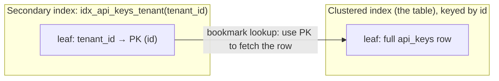

# MySQL & indexing - a from-scratch deep dive

Written for someone new to backend Go and databases, but grounded entirely in **this project's real
schema and queries**. We build the theory first (what an index *is*, the data structure underneath,
how InnoDB lays out a table), then walk every index and query we actually ship and read what MySQL
does with `EXPLAIN`.

Read alongside:
- [go-notes.md](./go-notes.md) - concept-by-concept Go notes (the code side).
- [walkthrough-phase2-3.md](./walkthrough-phase2-3.md) - how the MySQL adapter plugs into the hexagon.
- [prod-architecture-and-kafka-walkthrough.md](./prod-architecture-and-kafka-walkthrough.md) - the running system.

Every claim points at a real file. The schema lives in
[`db/otp/migrations/0001_init.up.sql`](../../db/otp/migrations/0001_init.up.sql) and
[`db/identity/migrations/0001_init.up.sql`](../../db/identity/migrations/0001_init.up.sql); the
queries live in the `mysqlrepo` adapters.

> How to use this: Part A is pure theory - read it once, top to bottom. Part B teaches you to *see*
> what the database does. Part C maps all of it onto our code, and Part D gives you commands to run
> yourself so the ideas become muscle memory.

---

## Part A - Foundations

### 1. What an index actually is (and is not)

A table is a pile of rows. Without an index, the only way to answer `WHERE hashed_key = 'abc'` is to
read **every row** and compare - a *full table scan*, O(n). With a million API keys that is a million
comparisons for one lookup, on every incoming request.

An **index is a second, sorted copy of one or more columns**, kept in a structure that supports fast
lookup and range scans. Think of the index at the back of a textbook: the book's pages are unsorted
by topic, but the index lists topics alphabetically with page numbers. You binary-search the index
(fast), then jump to the page (one hop) instead of reading the whole book.

Two things follow immediately, and beginners miss both:

1. **An index is redundant data.** It duplicates the indexed columns and must be kept in sync on every
   `INSERT`/`UPDATE`/`DELETE`. Indexes speed up reads and *slow down writes*. They are a trade, never free.
2. **An index only helps if the query can use its sort order.** An index on `email` does nothing for
   `WHERE email LIKE '%@gmail.com'` (the wildcard is on the left, so the sorted order is useless), the
   same way a book's alphabetical index cannot help you find "every topic ending in -tion".

### 2. The B+Tree - the structure under (almost) every index

MySQL's default storage engine, **InnoDB**, stores indexes as a **B+Tree**. You do not have to
implement one, but you must understand its shape, because it explains every performance rule below.

Why a tree at all, and why *this* tree?

- Disks (and even SSDs) read in fixed **pages** (InnoDB pages are 16 KB). The expensive thing is the
  number of pages you touch, not comparisons in RAM. A structure that minimizes page reads wins.
- A **binary** tree has fan-out 2, so a million rows is ~20 levels deep = ~20 page reads. A **B+Tree**
  packs *hundreds* of keys per 16 KB node, so fan-out is in the hundreds. A million rows fits in **3-4
  levels**. That is why a point lookup in a huge table is only a handful of page reads.
- In a **B+**Tree (note the plus), only the **leaf** nodes hold the actual data/pointers, and the
  leaves are linked in a sorted chain. That chain is what makes **range scans and `ORDER BY` cheap**:
  find the start, then walk the linked leaves in order - no jumping around the tree, no sorting.

```mermaid
flowchart TD
    R["Root node<br/>(keys: split points)"] --> B1["Branch"]
    R --> B2["Branch"]
    B1 --> L1["Leaf: rows 1..k<br/>(sorted)"]
    B1 --> L2["Leaf: rows k..m"]
    B2 --> L3["Leaf: rows m..p"]
    B2 --> L4["Leaf: rows p..z"]
    L1 -. linked, in order .-> L2 -. .-> L3 -. .-> L4
```

Two operations the shape gives you for free:
- **Point lookup** (`= value`): walk root → branch → leaf, ~3-4 page reads.
- **Range / ordered scan** (`>`, `<`, `BETWEEN`, `ORDER BY`): find one leaf, then follow the linked
  chain. No separate sort step.

### 3. The clustered index: in InnoDB, the table *is* a B+Tree

This is the single most important InnoDB fact, and it is not obvious coming from mental models of
"rows in a file".

**InnoDB stores the entire table as one B+Tree keyed by the primary key.** The leaves of that tree
*are* the full rows. This is called the **clustered index**. There is no separate "heap" of rows plus
a PK index pointing at it - the PK index and the row storage are the same tree. Consequences:

- Rows are physically ordered on disk by primary key.
- Looking up by primary key lands you directly on the full row - the fastest possible access.
- Every table needs a clustered key. If you do not declare a `PRIMARY KEY`, InnoDB invents a hidden one.

Now, **secondary indexes** (any index that is not the PK). A secondary index is its own B+Tree, keyed
by the indexed columns, and its leaves store **the primary key value** of the matching row - *not* a
disk pointer. So a query filtered by a secondary index does two tree walks:

1. Walk the secondary index B+Tree → find the matching **primary key(s)**.
2. Walk the clustered index B+Tree with that PK → fetch the **full row**.

Step 2 is called a **bookmark lookup** (or "back to the table"). It is why a secondary-index read is
strictly more work than a PK read, and it is the reason *covering indexes* (§7) are so valuable - they
let you skip step 2 entirely.



### 4. Primary key choice: why our `CHAR(36)` UUIDs are a real trade-off

Look at our schema and you will spot a deliberate inconsistency:

- `tenants`, `api_keys`, `otp_requests`, `users`, `templates` use `id CHAR(36) PRIMARY KEY` - a **UUID
  string**.
- `delivery_logs` uses `id BIGINT AUTO_INCREMENT PRIMARY KEY` - a **sequential integer**.

Because the PK *is* the clustered index (§3), the PK's shape has outsized cost. Two problems with a
random UUID as the clustered key:

1. **Insert locality / page splits.** A sequential key (`AUTO_INCREMENT`) always appends to the
   "rightmost" leaf - tight, full pages, minimal work. A **random** UUID inserts into the *middle* of
   the tree at a random spot every time, forcing InnoDB to split pages and leaving them half-empty.
   Under write load this fragments the clustered index and wastes buffer-pool memory.
2. **Size cascade.** `CHAR(36)` is 36 bytes; `BIGINT` is 8. And remember: **every secondary index
   leaf stores the PK** (§3). So a fat PK inflates *every* secondary index on that table, on disk and
   in memory. Our `idx_requests_tenant` secretly carries the 36-byte `otp_requests.id` in every entry.

So why did we still use UUIDs for most tables? Honest answer, the kind an interviewer wants: UUIDs are
**generated by the application before the insert** (no round-trip to learn the id), they **do not leak
volume** ("we've sent 4,001 OTPs" is visible in an auto-increment id), and they are **safe to expose**
in URLs/APIs. For an OTP audit table at our volume the write cost is negligible, so the operational
and security wins are worth it. `delivery_logs` is the one **append-heavy, never-exposed** table, so
it takes the sequential `BIGINT` and gets the insert-locality win where it actually matters. That
split is the lesson: **match the PK type to the table's job**, don't apply one rule everywhere. (If
UUID volume ever became a write bottleneck, the standard fix is a time-ordered UUID like UUIDv7, which
restores sequential insert locality while keeping the other UUID benefits.)

### 5. Composite indexes and the left-prefix rule

An index can cover **several columns in order** - a *composite* (or compound) index. Ours:

```sql
INDEX idx_requests_tenant (tenant_id, created_at)
```

The B+Tree is sorted by `tenant_id` **first**, and *within each tenant* by `created_at`. Picture a
phone book sorted by (last name, then first name). This ordering is the whole game:

- **Left-prefix rule.** The index can serve any query that uses a **prefix** of its columns, left to
  right: `(tenant_id)` alone ✅, `(tenant_id, created_at)` ✅. But `(created_at)` **alone ❌** - you
  cannot use "first name" to search a book sorted by last name. Column order is a design decision, not
  a detail.
- **Equality first, then the range/sort column.** The rule of thumb: put columns used with `=` first,
  and the column you **range-scan or sort by** last. Our query is
  `WHERE tenant_id = ? ORDER BY created_at DESC` - equality on `tenant_id`, sort on `created_at`. The
  index order `(tenant_id, created_at)` matches exactly: MySQL jumps to the tenant's slice, and that
  slice is *already sorted by `created_at`*, so the `ORDER BY` is free (see filesort, §6).

### 6. Filesort - what "Using filesort" means, and when to care

If a query needs rows in an order that **no usable index provides**, MySQL sorts them itself, in a
buffer (spilling to a temp file if large). `EXPLAIN` shows `Using filesort` in the `Extra` column.

`filesort` is **not an error** and not always bad - sorting 20 rows in memory is trivial. It becomes a
problem when the set is large, or the query runs on a hot path, because the work is O(n log n) *per
query* and cannot be cached. The fix is an index whose order already matches the `ORDER BY` - then the
sort step disappears.

This project has a perfect **matched pair** to feel the difference (Part C nails it down):
- `ListRequests`: `WHERE tenant_id=? ORDER BY created_at DESC` **with** `idx_requests_tenant(tenant_id,
  created_at)` → **no filesort**. The index supplies the order.
- `ListAPIKeys`: `WHERE tenant_id=? ORDER BY created_at DESC` **with only** `idx_api_keys_tenant(tenant_id)`
  → the index positions the tenant slice but does **not** carry `created_at`, so MySQL adds a
  **filesort**. Same query shape, different index, different plan.

### 7. Covering index - "Using index" (skipping the bookmark lookup)

Recall the two-step secondary read (§3): find PK in the secondary index, then fetch the row from the
clustered index. If **every column the query needs is already in the secondary index**, MySQL can
answer from the index alone and **skip step 2 entirely**. `EXPLAIN` shows `Using index` in `Extra`.
The index is said to *cover* the query.

Example: `SELECT tenant_id, created_at FROM otp_requests WHERE tenant_id = ?` is covered by
`idx_requests_tenant(tenant_id, created_at)` - both selected columns live in the index, plus the PK is
implicitly there too. But our real `ListRequests` selects `recipient_masked`, `channel`, `state` as
well, which are **not** in the index, so it must do the bookmark lookup. That is fine here; the point
is to know the lever exists. Covering indexes are a deliberate tool: when a hot query needs only a few
columns, adding them to the index can turn two tree walks into one.

### 8. Selectivity and cardinality - why you should NOT index some columns

**Cardinality** = number of distinct values in a column. **Selectivity** = how well a value narrows
the result (roughly, distinct values ÷ total rows). An index earns its keep only when it is
**selective** - when matching one value eliminates most rows.

- `hashed_key` (unique per key), `email` (unique), `id` (unique): maximum selectivity. A lookup lands
  on ~1 row. **Index-worthy** - and indeed all three are `UNIQUE`.
- `status VARCHAR(16)` (`'active'`/`'revoked'`), `channel` (`'email'`/`'sms'`), `state`: **low**
  cardinality, a handful of values. An index on `status` alone would match ~half the table; MySQL will
  usually **ignore it and scan anyway**, because a full scan beats "index → thousands of bookmark
  lookups". This is why our schema **does not** index `status`, `channel`, or `state` on their own.
- The useful move for a low-cardinality column is to make it the **trailing** part of a composite
  behind a selective column (e.g. `(tenant_id, status)`), so it refines an already-narrow slice - not
  a standalone index.

### 9. The cost side - indexes are a liability too

Before adding any index, remember the bill:
- **Write amplification:** every `INSERT`/`UPDATE`/`DELETE` must update every affected index B+Tree.
- **Storage & memory:** each index is a full B+Tree that competes for the InnoDB buffer pool (the
  in-RAM cache). Unused indexes evict hot data from cache.
- **Optimizer overhead:** more indexes = more plans to weigh.

Rule: **index for the queries you actually run**, verify with `EXPLAIN`, and delete indexes nothing
uses. Our schema is deliberately minimal - one index per real access path, no speculative ones.

---

## Part B - EXPLAIN: seeing what MySQL actually does

`EXPLAIN` prints the optimizer's *plan* without running the query. It is the only way to move from
"I think this uses the index" to "I verified it". Prefix any `SELECT` (or use `EXPLAIN ANALYZE` on
MySQL 8 to also *run* it and show real timings):

```sql
EXPLAIN SELECT * FROM otp_requests WHERE tenant_id = 'demo' ORDER BY created_at DESC LIMIT 20;
```

The columns that matter for us:

| Column  | Read it as | What you want to see |
|---------|------------|----------------------|
| `type`  | Access method, from best to worst: `const` → `eq_ref` → `ref` → `range` → `index` → `ALL` | `ref`/`const`/`eq_ref`. **`ALL` = full table scan** = red flag on a big table. |
| `key`   | Which index was chosen (`NULL` = none) | The index you expected, not `NULL`. |
| `rows`  | Estimated rows examined | As small as possible. |
| `Extra` | Notes | `Using index` (covering, great), `Using where` (normal). **`Using filesort`** / `Using temporary` = a sort/temp step - fine if `rows` is small, investigate if large. |

> **Pitfall specific to this repo:** you cannot see the SQL GORM generates by default. In
> [`pkg/platform/mysql/mysql.go`](../../pkg/platform/mysql/mysql.go) the GORM logger is set to
> `logger.Silent` on purpose (we do our own structured logging). To watch the real SQL while learning,
> temporarily switch it to `logger.Default.LogMode(logger.Info)`, run a request, read the SQL, then
> **revert it**. Or skip GORM entirely and run the `EXPLAIN` statements directly in a `mysql` shell -
> that is what Part D does.

---

## Part C - This project's indexes, query by query

Now the payoff: every index we ship, the exact query that uses it, and the plan you should expect.
The GORM calls are in the `mysqlrepo` adapters
([`services/otp-api/.../mysqlrepo/repo.go`](../../services/otp-api/internal/adapters/outbound/mysqlrepo/repo.go),
[`services/auth-svc/.../mysqlrepo/repo.go`](../../services/auth-svc/internal/adapters/outbound/mysqlrepo/repo.go)).

| Index (migration) | Query (Go method) | Equivalent SQL | Expected plan |
|---|---|---|---|
| `PRIMARY (id)` on `otp_requests` | `UpdateState` | `WHERE id = ?` | `type=const/eq_ref`, `key=PRIMARY` - clustered PK point write. |
| `idx_requests_tenant (tenant_id, created_at)` | `ListRequests` | `WHERE tenant_id=? ORDER BY created_at DESC LIMIT n` | `type=ref`, `key=idx_requests_tenant`, **no filesort** (index supplies the order). ✅ the model case. |
| `idx_logs_tenant (tenant_id, created_at)` on `delivery_logs` | `ListDeliveryLogs` | `WHERE tenant_id=? ORDER BY created_at DESC LIMIT n` | same as above - composite covers the sort. |
| `UNIQUE (hashed_key)` on `api_keys` | `FindAPIKeyByHash` | `WHERE hashed_key = ?` | `type=const`, `key=hashed_key`. **Hot path** - runs on *every* authenticated request. |
| `UNIQUE (email)` on `users` | `FindUserByEmail` | `WHERE email = ?` | `type=const`, `key=email` - login lookup. |
| `idx_api_keys_tenant (tenant_id)` | `ListAPIKeys` | `WHERE tenant_id=? ORDER BY created_at DESC` | `type=ref`, `key=idx_api_keys_tenant`, **`Using filesort`** - index has no `created_at`. ⚠️ the contrast case. |
| `PRIMARY (id)` on `api_keys` | `RevokeAPIKey` | `WHERE id=? AND tenant_id=?` | `type=const`, `key=PRIMARY`. `id` alone is unique; `tenant_id` is a **tenant-ownership guard** so one tenant can't revoke another's key - a cheap `Using where` filter after the PK hit, not an index need. |

### The one comparison to internalize: `ListRequests` vs `ListAPIKeys`

These two methods have the **same query shape** yet **different plans**, purely because of index design.

```go
// otp-api mysqlrepo/repo.go - ListRequests
r.db.WithContext(ctx).Where("tenant_id = ?", tenantID).
    Order("created_at DESC").Limit(limit).Find(&rows)     // idx_requests_tenant(tenant_id, created_at) → NO filesort

// auth-svc mysqlrepo/repo.go - ListAPIKeys
r.db.WithContext(ctx).Where("tenant_id = ?", tenantID).
    Order("created_at DESC").Find(&rows)                  // idx_api_keys_tenant(tenant_id) → filesort
```

- `idx_requests_tenant` includes `created_at`, so after seeking to the tenant's slice the rows are
  **already in `created_at` order** - the `ORDER BY` costs nothing.
- `idx_api_keys_tenant` stops at `tenant_id`, so MySQL finds the tenant's keys, then **sorts them** to
  satisfy `ORDER BY created_at DESC` → `Using filesort`.

**Is that a bug?** No - and knowing *why not* is the senior-engineer part. A tenant has a handful of
API keys; sorting ~5 rows in memory is free, and adding `created_at` to that index would cost writes
on every key insert for no measurable read gain (§9). We index `otp_requests` for the sort because a
tenant can have **thousands** of OTP requests and that list is paginated and read constantly. The rule
is not "always add `created_at` to the index" - it is **"add it where the sorted set is large and the
query is hot"**. Same shape, different data profile, different decision.

---

## Part D - Run it yourself (the part that makes it stick)

Bring up the local stack (see the compose setup under `deploy/compose/`), get a shell into MySQL, and
watch the plans change. Reading about `filesort` is nothing next to *seeing* it appear and disappear.

```sql
-- 1. Confirm the indexes exist as the migrations declared them:
SHOW INDEX FROM otp_requests;      -- expect PRIMARY and idx_requests_tenant(tenant_id, created_at)
SHOW INDEX FROM api_keys;          -- expect PRIMARY, UNIQUE hashed_key, idx_api_keys_tenant(tenant_id)

-- 2. The model case - composite index supplies the order (look for NO "Using filesort"):
EXPLAIN SELECT * FROM otp_requests
  WHERE tenant_id = 'demo' ORDER BY created_at DESC LIMIT 20;

-- 3. The contrast case - same shape, index lacks created_at (look for "Using filesort" in Extra):
EXPLAIN SELECT * FROM api_keys
  WHERE tenant_id = 'demo' ORDER BY created_at DESC;

-- 4. The hot-path point lookup (expect type=const, key=hashed_key, rows=1):
EXPLAIN SELECT * FROM api_keys WHERE hashed_key = 'whatever';

-- 5. Prove selectivity matters - index-less low-cardinality filter falls back to a full scan (type=ALL):
EXPLAIN SELECT * FROM otp_requests WHERE state = 'verified';
```

**Experiment that teaches the whole lesson in 30 seconds** - add the missing index on a throwaway
basis and watch the filesort vanish, then roll it back:

```sql
EXPLAIN SELECT * FROM api_keys WHERE tenant_id='demo' ORDER BY created_at DESC;  -- Extra: Using filesort
CREATE INDEX tmp_idx ON api_keys (tenant_id, created_at);
EXPLAIN SELECT * FROM api_keys WHERE tenant_id='demo' ORDER BY created_at DESC;  -- Extra: (filesort gone)
DROP INDEX tmp_idx ON api_keys;   -- clean up; this was only to see the optimizer switch plans
```

Any real index change belongs in a **migration** under `db/*/migrations/`, never typed into prod by
hand - migrations are our source of truth (`AutoMigrate` is deliberately off, see `mysql.go`). The
`CREATE INDEX` above is a *learning* experiment on a throwaway local DB only.

---

## Part E - Pitfalls cheat-sheet

- **Function/expression on the indexed column kills the index.** `WHERE DATE(created_at) = ...` or
  `WHERE LOWER(email) = ...` cannot use a plain index - MySQL would have to compute the function for
  every row. Index the raw column and pass a raw value (or use a generated column / functional index).
- **Leading wildcard kills the index.** `LIKE 'abc%'` can use an index; `LIKE '%abc'` cannot (§1).
- **Implicit type mismatch kills the index.** Comparing an indexed `CHAR` column to a number, or a
  `VARCHAR` under a different collation, can force a scan. Keep types aligned - our ids are `CHAR(36)`,
  so bind strings.
- **Only a left-prefix works** on a composite index (§5). `(a, b)` helps `WHERE a=?` and `WHERE a=? AND
  b=?`, never `WHERE b=?` alone.
- **`ORDER BY` needs the index in the *right column order*** to avoid filesort - the `ListAPIKeys`
  lesson (§6, Part C).
- **Don't index low-cardinality columns standalone** (§8) - `status`, `channel`, `state` here.
- **Verify, never assume.** `EXPLAIN` every new query on a hot path. The optimizer, not your intuition,
  decides whether an index gets used.

---

### Where this connects

- The MySQL rows are the **durable audit trail**; the *live* OTP code and rate-limit counters live in
  Redis with TTLs (next learning doc). MySQL answers "what happened" (history, dashboards); Redis
  answers "what's true right now" (is this code still valid, has this tenant hit its quota).
- The adapter that runs all these queries sits behind the `app.Repo` port - the domain never sees GORM
  or SQL, which is why we could change any index here without touching a line of business logic. That
  seam is the subject of [walkthrough-phase2-3.md](./walkthrough-phase2-3.md).
