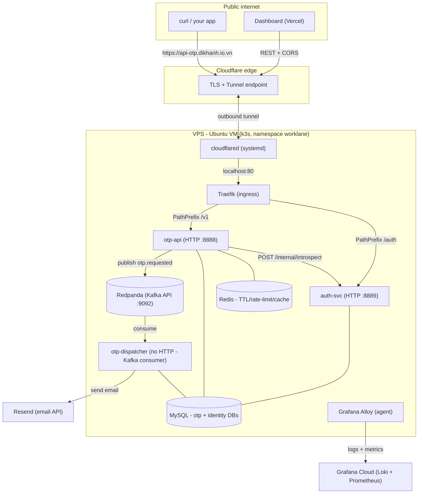

# Walkthrough: production architecture, otp-api / otp-dispatcher, and Kafka in depth

A tech-lead-style tour of the **running production system** (self-hosted k3s on a VPS) and the
async OTP pipeline that drives it. Written to be re-read: every claim points at a real file, and the
last third is a deep dive on Kafka partitions / consumer groups - including an honest account of what
this project does *today* versus how you would scale it (the exact thing interviewers probe).

Read alongside:
- [go-notes.md](./go-notes.md) - concept-by-concept Go notes.
- [walkthrough-phase2-3.md](./walkthrough-phase2-3.md) - how the hexagon + adapters were assembled.
- [vps-bringup runbook](../runbooks/vps-bringup.md) - how prod was stood up.

---

## 1. The big picture (what is deployed)



Two ideas carry the whole design:

1. **Synchronous front door, asynchronous work.** The HTTP request that asks for an OTP does *not*
   send the email. It validates, stores the code, writes an audit row, drops a message on Kafka, and
   returns immediately. A separate worker sends the email later. This is the single most important
   architectural decision - section 3 explains why.
2. **Everything stateful is in-cluster** (MySQL, Redpanda, Redis) so the whole distributed shape is
   visible on one node - the point of the project. TLS terminates at Cloudflare; nothing listens for
   inbound connections on the box (the tunnel dials out).

---

## 2. The two services

### 2.1 otp-api - the synchronous front door
`services/otp-api` (entrypoint `services/otp-api/main.go`). An HTTP API (Gin) that:

- Authenticates the caller. Two identities: **machine** callers use an API key
  (`Authorization: Bearer <key>`, resolved by calling auth-svc's `/internal/introspect`); **human**
  callers use a JWT from `/auth/login`.
- **Rate-limits** and validates input at the boundary.
- On `POST /v1/otp/send` (`services/otp-api/internal/app/send.go`): an **idempotency** check (a
  repeated `Idempotency-Key` returns the prior request without re-sending), a **rate-limit** check,
  then it generates the code, stores a **salted hash** of it in Redis with a TTL - the plaintext code
  never rests on the server; it travels only inside the Kafka event to the dispatcher - inserts an
  audit row in MySQL (`otp` DB), and **publishes `otp.requested`** to Kafka. Then returns
  `202 Accepted`. It never talks to Resend.
- On `POST /v1/otp/verify`: re-hashes the submitted code with the stored salt and compares against the
  Redis record, then marks the request used. (Storing only the hash means a Redis leak does not expose
  live codes - same reason you never store plaintext passwords.)

The key line is `send.go:92` - `s.d.Pub.Publish(ctx, s.cfg.RequestedTopic, evt)`. After that publish
succeeds, otp-api's job is done.

### 2.2 otp-dispatcher - the asynchronous worker
`services/otp-dispatcher` (entrypoint `services/otp-dispatcher/main.go`). **No HTTP server** - it is a
Kafka consumer. It:

- Joins consumer group `otp-dispatcher` and reads topic `otp.requested` (`main.go:35-37`).
- For each event (`services/otp-dispatcher/internal/app/handler.go`): sends the email via Resend,
  records the delivery in MySQL (`delivery_logs`), and publishes a follow-up event:
  - success -> `otp.sent`
  - provider failure -> `otp.failed` **and** `otp.dlq` (dead-letter queue).

### 2.3 Why split them? (the async pattern)
If otp-api sent the email inline, every OTP request would block on Resend's latency and fail if Resend
had a blip. By handing the work to Kafka:

- **Fast, predictable API latency** - the caller waits for a DB write + a Kafka ack, not for an email.
- **Resilience** - if Resend is down, messages queue in Kafka and are retried; the API keeps accepting.
- **Back-pressure & scaling** - the dispatcher consumes at its own pace; you scale it independently.
- **Decoupling** - otp-api and otp-dispatcher share only the DB schema and the Kafka **contracts**
  (`pkg/contracts/otp/event.go`), never each other's code.

This is the classic **producer / queue / consumer** shape. Kafka (here Redpanda, a Kafka-compatible
broker with no JVM/ZooKeeper) is the queue.

---

## 3. The event backbone (Kafka / Redpanda)

### 3.1 Envelope + topics
Every message is a small JSON **envelope** (`pkg/platform/kafka/envelope.go`):

```json
{ "msg_type": "otp.RequestedEvent", "data": { "request_id": "...", "recipient": "...", "code": "..." } }
```

`msg_type` is a discriminator (the Go type name) so a consumer can switch before decoding `data`.
Topics (all config-driven, defaults in `main.go`):

| Topic | Produced by | Consumed by | Meaning |
|---|---|---|---|
| `otp.requested` | otp-api | otp-dispatcher | "please deliver this code" |
| `otp.sent` | otp-dispatcher | (future) | delivery succeeded |
| `otp.failed` | otp-dispatcher | (future) | delivery failed (terminal) |
| `otp.dlq` | otp-dispatcher | a human / drainer | dead-letter for inspection |

### 3.2 The producer - `pkg/platform/kafka/producer.go`
- **`SyncProducer` with `RequiredAcks = WaitForAll`** - `Publish` waits until the broker confirms the
  write before returning. Slower than fire-and-forget, but the caller gets a real error if the write
  failed (so otp-api can react). Async batching is a later optimization, noted in the code.
- **Keyed messages.** If an event implements `PartitionKey() string`, that string becomes the Kafka
  message **key**. `RequestedEvent.PartitionKey()` returns the **`RequestID`**
  (`pkg/contracts/otp/event.go:19`). The key decides the partition (section 4) - remember this.

### 3.3 The consumer group - `pkg/platform/kafka/consumer.go`
- Uses a **sarama consumer group** (`group = "otp-dispatcher"`), starting at `OffsetOldest` so a brand-
  new group replays existing messages.
- **`Consume` runs in a loop** because it returns every time the group *rebalances* (a member joins or
  leaves); the loop rejoins until shutdown (`consumer.go` `Start`).
- **At-least-once delivery.** In `ConsumeClaim`, the offset is committed (`MarkMessage`) **only after**
  the handler returns nil. If the handler returns an error, the message is *not* marked, so Kafka
  redelivers it later. Meaning: a message is processed **one or more times, never zero** - so handlers
  must tolerate reprocessing (be idempotent).

### 3.4 Failure handling & the DLQ - `handler.go`
The handler is deliberate about *which* failures redeliver:

- **Provider failure** (Resend rejected the send) is treated as **terminal**: publish `otp.failed` +
  `otp.dlq`, then **return nil** (mark it) so Kafka does *not* redeliver - retrying a rejected send
  would just spam. The DLQ keeps the poison message for later inspection.
- **Infrastructure error** (DB write or the follow-up publish failed) **returns the error** so the
  message is redelivered and retried - these are transient.

This distinction (retry transient, DLQ terminal) is what keeps an at-least-once pipeline from either
losing messages or looping forever on a bad one.

---

## 4. Kafka deep dive - partitions, keys, consumer groups

This is the part worth understanding cold. First the concepts, then **what this repo actually does
today**, then how you would scale it.

### 4.1 Concepts in one screen
- A **topic** is a named log. It is split into **partitions** - each partition is an *ordered,
  append-only* sequence. **Ordering is guaranteed only within a partition**, never across partitions.
- A message's **partition is chosen by its key**: `partition = hash(key) % numPartitions`. Same key ->
  same partition -> those messages stay in order relative to each other. No key -> round-robin.
- A **consumer group** is a set of consumers sharing a `group.id`. Kafka assigns **each partition to
  exactly one consumer in the group**. So:
  - **parallelism is capped by partition count** - N partitions allow at most N active consumers in a
    group; extra consumers sit idle.
  - adding/removing a consumer triggers a **rebalance** (partitions reassigned).
- Each group tracks a committed **offset** per partition (how far it has read). **Consumer lag** =
  latest offset - committed offset = how far behind the consumer is. Lag is the #1 health signal for an
  async pipeline (it is observability signal #3 in the hardening spec).
- **Partition != replica.** Partitions are for *parallelism / sharding*. **Replication factor** is
  separate: it is how many copies of each partition live on different brokers, for *fault tolerance*.

### 4.2 What THIS project does today (the honest version)
- Redpanda runs **single-node** (`--smp=1`, `deploy/k8s/base/redpanda/statefulset.yaml`) and topics
  are **auto-created on first produce** - the code never calls "create topic". Redpanda's default for
  an auto-created topic is **1 partition, replication factor 1**.
- otp-dispatcher runs **`replicas: 1`**.
- The producer keys every message by **`RequestID`** (unique per OTP request).

Put together: **`otp.requested` has one partition, one consumer, one replica.** Consequences:

- **No parallelism** - a single consumer drains a single partition. Fine for a demo's volume; it does
  not scale horizontally as-is (scaling the Deployment to `replicas: 2` would leave the 2nd pod idle,
  because there is only one partition to assign).
- **No fault tolerance at the broker** - RF=1 on one node; if that node's disk dies, the log is gone.
  Acceptable here because the messages are short-lived (retention is 10 min / 256 MB) and regenerable.
- **Total ordering** - with one partition, *every* message is globally ordered (a stronger guarantee
  than you usually need).
- **The key barely matters yet** - with one partition, all keys map to the same partition. But the key
  is already *correct*: all events of one request share its `RequestID`, so once you add partitions,
  a request's lifecycle events stay on one partition, in order.

So "partitions, consumer groups scaling out" is **designed for but not exercised** here. That is a
legitimate MVP choice - and a great thing to be able to explain.

### 4.3 How you would scale it
1. **Create the topic with N partitions** instead of relying on the 1-partition auto-create, e.g.
   `rpk topic create otp.requested -p 6 -r 1` (or `rpk topic add-partitions otp.requested --num 5` on
   the existing one). Pick N from your target throughput / consumer count.
2. **Scale the dispatcher** to up to N replicas (`kubectl -n worklane scale deploy/otp-dispatcher
   --replicas=3`). They share `group.id=otp-dispatcher`; Kafka assigns the 6 partitions across the 3
   pods (~2 each). Now delivery runs in parallel.
3. **Choose the key deliberately** - this is the real design decision:
   - key = `RequestID` (today): even spread, and a single request's events stay ordered. No ordering
     *between* different requests (fine - they are independent).
   - key = `recipient` or `tenant_id`: all messages for one recipient/tenant land on one partition, so
     they are processed **in order per recipient** - useful if ordering per user matters, at the cost
     of a possible hot partition if one tenant dominates.
4. **Multi-broker for fault tolerance** - a real cluster runs 3 brokers and RF=3, so a partition
   survives a broker loss. That is a separate axis from partition count.

**Gotchas to name in an interview:**
- Partition count can be *increased* but not decreased, and increasing it **changes `hash(key) %
  N`** for existing keys - so a key can move to a new partition, breaking the "same key, same
  partition" ordering for keys in flight. Plan partition count up front.
- More partitions = more parallelism but more overhead (open file handles, rebalance cost, end-to-end
  latency). It is a tradeoff, not "bigger is better".
- Consumer count > partition count wastes consumers (idle). Size them together.

---

## 5. Operating it: how to view logs

Two layers - reach for the first when you are SSH'd in, the second for search/history/alerting.

### 5.1 Live, on the box (`kubectl logs`)
```bash
# one service, follow, last 100 lines
kubectl -n worklane logs deploy/otp-dispatcher -f --tail=100
kubectl -n worklane logs deploy/otp-api --tail=100
# a specific pod
kubectl -n worklane get pods
kubectl -n worklane logs <pod> --previous   # logs from the last crash, if it restarted
```

### 5.2 Central, searchable (Grafana Cloud -> Loki)
Grafana Alloy ships every pod's logs to Grafana Cloud (see the bring-up runbook). In Grafana ->
**Explore** -> datasource `grafanacloud-...-logs`:

```logql
{namespace="worklane"}                          # everything in the app
{namespace="worklane", app="otp-api"}           # one service (label added by our relabel fix)
{namespace="worklane", container="otp-dispatcher"} |= "error"   # filter text
```

Use `kubectl logs` for "what is this pod doing right now"; use Loki for "what happened at 3am / across
restarts / show me all errors".

---

## 6. Operating it: how to inspect Kafka / Redpanda

Redpanda ships **`rpk`**, its CLI, *inside* the pod. It talks to the local broker, so run it via exec:

```bash
# list topics (you'll see otp.requested, otp.sent, otp.failed, otp.dlq once produced)
kubectl -n worklane exec redpanda-0 -- rpk topic list

# describe a topic: partitions, replicas, leader, high watermark
kubectl -n worklane exec redpanda-0 -- rpk topic describe otp.requested

# CONSUMER LAG - the health signal. Shows, per partition, current-offset vs end-offset:
kubectl -n worklane exec redpanda-0 -- rpk group describe otp-dispatcher

# peek at actual messages (envelopes) without disturbing the group's offsets:
kubectl -n worklane exec redpanda-0 -- rpk topic consume otp.requested -n 3
kubectl -n worklane exec redpanda-0 -- rpk topic consume otp.dlq -n 5   # inspect dead letters
```

What each tells you:
- `topic describe` -> **PARTITIONS** column proves the "1 partition today" point in section 4.2.
- `group describe` -> the **LAG** column. 0 = the dispatcher is caught up. A growing number = the async
  path is backing up (dispatcher down / Resend slow). This is scraped into Grafana too (Redpanda
  exposes `/metrics` on `:9644`, which Alloy remote-writes - see `alloy-config.yaml`).
- `topic consume otp.dlq` -> read the poison messages the handler dead-lettered.

**In dev (docker-compose)** you also get a GUI: **Redpanda Console at http://localhost:8085**
(`deploy/compose/docker-compose.yml`) - browse topics, messages, and consumer groups in a browser.
Prod does not run the Console (kept light); `rpk` covers it.

---

## 7. Interview cheat-sheet

- **"How does the OTP get sent?"** otp-api validates + stores the code + publishes `otp.requested`
  and returns 202; otp-dispatcher consumes it, sends via Resend, records `delivery_logs`, emits
  `otp.sent`/`otp.failed`. Sync front door, async delivery.
- **"Why Kafka and not just send inline?"** decouple latency & failure of the email provider from the
  API; retry + back-pressure + independent scaling; at-least-once delivery.
- **"Delivery guarantee?"** At-least-once: offset committed only after the handler succeeds; failures
  redeliver -> handlers must be idempotent. Terminal (provider) failures go to a DLQ instead of looping.
- **"How do partitions work here?"** Key = RequestID -> `hash(key) % partitions`. Today 1 partition /
  1 consumer / 1 replica (auto-created topic). Scale by creating N partitions + N dispatcher replicas
  in the same group; choose the key (RequestID vs recipient/tenant) for the ordering you need.
- **"How do you know it's healthy?"** Consumer **lag** (`rpk group describe` / Grafana), delivery
  success rate, p95 latency, and disk% (the node killer). See the hardening spec's 4 signals.
- **"How do you back up / recover?"** Nightly `mysqldump` of `otp`+`identity` -> Cloudflare R2, with a
  tested restore drill. Redis/Redpanda are regenerable, not backed up.
