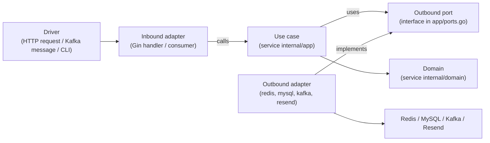

# Architecture & Repository Layout (Gin microservices monorepo)

- **Date:** 2026-08-15
- **Type:** Reference - the canonical structure this side project is built in
- **Companion to:** [goframe-backend-conventions.md](./goframe-backend-conventions.md) (the production stack this project learns from)

> Purpose: define **one** repository structure that is a **monorepo of true microservices** - each
> service independently deployable and network-isolated - while still sharing infrastructure code and
> event contracts. OTP is only the first module; the production backend this project mirrors hosts
> many (`chat`, `crm`, notifications, ...), and this layout must absorb them without a rewrite.

## 1. Two decisions this document encodes

1. **Framework = Gin, not GoFrame.** The project owner is new to Go and wants the architecture to be
   *visible*, not hidden behind codegen. Gin is a thin HTTP router: every layer, every dependency,
   every Kafka/Redis call is wired by hand and therefore readable. The distributed-systems design
   (microservices split, event-driven Kafka, Redis cache, rate limiting, DLQ) is **framework-neutral**
   and is preserved in full - only the HTTP transport library changes. See the concept mapping in §8.

2. **Monorepo of microservices, each internally hexagonal (Ports & Adapters).** One repository holds
   many services. Each service is an independently deployable process with its **own** `main.go`,
   `Dockerfile`, and Kustomize base, and its **own private** `internal/` tree shaped as a hexagon
   (`domain` → `app` → `adapters`). Services never call each other in-process - they communicate only
   over the network (Kafka events; HTTP/gRPC only if a synchronous call is ever needed). They share
   *libraries* (`pkg/`) and *event contracts* (`pkg/contracts`), nothing else.

## 2. The layout

Single Go module at the root (`go.mod`). One module keeps imports simple for a beginner, yet Go's
`internal/` visibility rule **already enforces real service isolation** (see §4). Splitting a service
into its own module / `go.work` is deferred until a service genuinely needs independent dependency
versions or its own repo.

```text
worklane/
├── go.mod                          # module: github.com/duykhanh/worklane
│
├── services/                       # each subfolder = ONE independently deployable microservice
│   ├── otp-api/                    # ── sync HTTP microservice (Gin) ──
│   │   ├── main.go                 #   composition root: wire adapters → use cases → Gin
│   │   ├── Dockerfile
│   │   └── internal/               #   PRIVATE to otp-api (Go forbids other services importing this)
│   │       ├── domain/             #     pure OTP business rules - imports nothing external
│   │       │   ├── code.go         #       crypto-random numeric code
│   │       │   ├── hash.go         #       salted hash + constant-time verify
│   │       │   ├── state.go        #       request state machine
│   │       │   ├── request.go      #       OTPRequest entity, MaskRecipient
│   │       │   ├── ratelimit.go    #       4-layer rate limit (pure, over Counter port)
│   │       │   └── errors.go
│   │       ├── app/                #     use cases + outbound port interfaces
│   │       │   ├── ports.go        #       CodeStore, Counter, Repo, Publisher, Clock
│   │       │   ├── send.go         #       SendOTP use case
│   │       │   └── verify.go       #       VerifyOTP use case
│   │       └── adapters/
│   │           ├── inbound/http/   #     Gin handlers, DTOs, API-key middleware
│   │           └── outbound/
│   │               ├── redisstore/ #       CodeStore + Counter (Redis)
│   │               ├── mysqlrepo/  #       Repo (GORM models + queries)
│   │               └── kafkabus/   #       Publisher (otp.requested)
│   │
│   ├── otp-dispatcher/             # ── async Kafka-consumer microservice (sarama) ──
│   │   ├── main.go
│   │   ├── Dockerfile
│   │   └── internal/
│   │       ├── app/                #     dispatch use case (render + send + log)
│   │       └── adapters/
│   │           ├── inbound/kafka/  #     consumer (driving adapter)
│   │           └── outbound/
│   │               ├── resendmail/ #       EmailProvider (Resend HTTP)
│   │               ├── mysqlrepo/  #       delivery-log writes
│   │               └── kafkabus/   #       Publisher (otp.sent / otp.failed / otp.dlq)
│   │
│   ├── seed/                       # CLI (create tenant + API key) - short-lived, not a server
│   │   └── main.go
│   # future services: chat-api/, chat-worker/, crm-api/ ...
│
├── pkg/                            # SHARED code, importable by ANY service
│   ├── platform/                   #   infra wrappers (mirror prod "internal shared module")
│   │   ├── config/                 #     typed config loader (env + file)
│   │   ├── httpserver/             #     Gin engine bootstrap, common middleware, error→HTTP mapping
│   │   ├── kafka/                  #     sarama producer/consumer wrapper + typed envelope
│   │   ├── redis/                  #     client + typed key builders
│   │   ├── mysql/                  #     pool + migration runner
│   │   └── logger/                 #     structured JSON logger
│   └── contracts/                  #   SHARED KERNEL: cross-service event schemas + shared enums
│       └── otp/                    #     otp.requested / otp.sent / otp.failed payload types, State
│
├── db/                             # per-service SQL migrations (golang-migrate .up/.down files)
│   └── otp/migrations/
├── deploy/
│   ├── compose/docker-compose.yml  # local stack: traefik, redis, mysql, redpanda, otp services
│   ├── traefik/                    # dynamic config: routers + middlewares (ratelimit, cors)
│   └── kustomize/
│       ├── base/
│       │   ├── otp-api/            # per-service manifests (Deployment, Service, ...)
│       │   └── otp-dispatcher/
│       └── overlays/develop/       # k3s develop overlay
├── dashboard/                      # Next.js app (deployed separately to Vercel)
└── docs/
```

## 3. Inside one service: the hexagon (dependency rule)

Each service is internally hexagonal. Dependencies point **inward only**; no inner ring imports an
outer ring.



| Layer | May import | Must NOT import |
|-------|-----------|-----------------|
| `domain` | only `domain` + stdlib | app, adapters, `pkg`, any driver/framework |
| `app` | `domain`, its own `ports.go`, `pkg/contracts` | any adapter, Gin, redis, sarama, gorm |
| `adapters/*` | `app` (ports), `domain`, `pkg/*` | **another service's `internal/*`** |
| `main.go` | everything in this service + `pkg/*` | another service's `internal/*` |

Two rules a beginner should memorize:

1. **Business logic never imports infrastructure.** `app` and `domain` speak only in interfaces
   (`ports.go`). A fake implementation of each port unit-tests the whole use case with no Redis, no
   DB, no Kafka - which is why the domain reaches 80% coverage cheaply.
2. **The composition root is the only omniscient file.** `services/<svc>/main.go` constructs the
   concrete adapters and injects them into the use cases. Wiring lives in exactly one auditable place;
   no hidden global singletons.

## 4. What makes these real microservices (not a monolith)

- **Independently deployable.** Each `services/<svc>` builds its own image from its own `Dockerfile`
  and ships as its own Deployment. Scale, restart, and release each one separately.
- **Compile-time isolation, enforced by the language.** Go forbids importing a package under another
  package's `internal/` directory. So `otp-dispatcher` **cannot** `import` anything from
  `services/otp-api/internal/...` even by accident. The microservice boundary is checked by the
  compiler, not by discipline alone. This is the key reason a single Go module is enough - you get
  hard isolation without multi-module ceremony.
- **Network-only communication.** Services share **zero runtime state**. The only things they hold in
  common are compiled-in libraries (`pkg/platform`) and event schema types (`pkg/contracts`). Actual
  inter-service traffic is **Kafka events**. `otp-api` publishes `otp.requested`; `otp-dispatcher`
  consumes it. Neither imports the other.
- **`pkg/contracts` is the integration seam.** Both sides marshal/unmarshal the same event payload
  types defined once in `pkg/contracts/otp`. Changing an event is a deliberate contract change visible
  to every consumer - exactly how you want cross-service coupling to behave.

## 5. How OTP maps onto this

OTP is delivered as **two cooperating microservices**, which is the spec's core decision (keep the
synchronous request path separate from the asynchronous delivery path):

| Service | Kind | Drives via | Publishes | Consumes |
|---------|------|-----------|-----------|----------|
| `otp-api` | Gin HTTP | client requests through Traefik | `otp.requested` | - |
| `otp-dispatcher` | sarama consumer | Kafka messages | `otp.sent` / `otp.failed` / `otp.dlq` | `otp.requested` |

`otp-api` owns OTP generation/verification (its `internal/domain`). `otp-dispatcher` owns delivery. The
only thing they agree on is the **event contract** in `pkg/contracts/otp` (payload shape + `State`
enum). `seed` is a one-shot CLI, not a long-running service.

## 6. Adding a new microservice later (chat, crm, ...)

Purely additive - no existing service changes:

1. `services/chat-api/` - new `main.go`, `Dockerfile`, and a private `internal/{domain,app,adapters}`
   in the same hexagonal shape.
2. `db/chat/migrations/` - chat's own SQL migrations + GORM models (its own tables; **no** foreign keys across services).
3. `pkg/contracts/chat/` - any events chat publishes/consumes.
4. `deploy/` - add a `chat-api` service to compose and a Kustomize base under `base/chat-api/`.

Reuse `pkg/platform/*` as-is. Cross-context flows (e.g. "CRM reacts to a verified OTP") happen by
**subscribing to Kafka events** published by another service - never by importing its code.

## 7. When to split the monorepo

Keep everything in one repo/module until a concrete pressure forces a split (a service needs its own
dependency versions, a separate team owns it, or it needs an independent release pipeline). Because
each service is already network-isolated and code-isolated, extraction into its own repo is
mechanical: move `services/<svc>` out, vendor or publish the `pkg/*` it uses, keep the same Kafka
topics as the contract. Being able to justify **when** to pay that cost - instead of paying it on day
one - is itself strong interview material.

## 8. Concept mapping: production (GoFrame) → this project (Gin + hexagonal)

This project deliberately mirrors the production architecture in
[goframe-backend-conventions.md](./goframe-backend-conventions.md). Same concepts, lighter tools. Being
able to speak both columns - and explain the mapping - is more valuable in an interview than either
alone.

| Concern | Production (GoFrame) | This project (Gin microservice) |
|---------|----------------------|----------------------------------|
| HTTP transport | GoFrame server + thin `controller` | Gin handler in `internal/adapters/inbound/http` |
| Request/response DTOs | `api/<module>` (`gf gen ctrl`) | `api/<ctx>` + DTO structs in the inbound adapter |
| Service interface | `internal/service` (`gf gen service`, generated) | inbound use-case interfaces in `internal/app` (hand-written) |
| Business logic impl | `internal/logic`, self-registers in `init()` | `internal/app` use-case structs, wired in `main.go` |
| Data access | `dao/model/entity` (`gf gen dao`) | **GORM** models + queries in `internal/adapters/outbound/mysqlrepo` |
| Shared code module | internal shared Go module (kafka, middleware, metrics) | `pkg/platform/*` |
| Typed Redis keys | `consts.RedisKeyXxx.Key(...)` | typed key builders in `pkg/platform/redis` |
| Kafka | `kafka.IKafkaProducer` + `producerv2` (sarama), typed envelope, config-driven topics | `pkg/platform/kafka` over sarama, typed envelope, config-driven topics |
| Event contract | shared `model` payloads with `MsgType` discriminator | `pkg/contracts/<ctx>` payload types |
| Composition | `cmd` bootstrap wires producers + controllers | `services/<svc>/main.go` composition root |
| Gateway | APISIX | **Traefik** (k3s default ingress; see infra spec) |
| Deploy | Kustomize base + overlays | Kustomize base per service + `develop` overlay |

**Data-access note:** the chosen ORM is **GORM** (`gorm.io/gorm`) - the most popular Go ORM and the
friendliest for someone new to the language. Schema changes ship as explicit SQL migrations
(`golang-migrate`, under `db/<ctx>/migrations`) rather than GORM `AutoMigrate`, which keeps schema
evolution reviewable and production-like. Because all persistence is sealed behind the `Repo` port,
GORM is swappable later (e.g. to sqlc for codegen/type-safety, closer to production's `gf gen dao`)
without touching `domain` or `app`.
