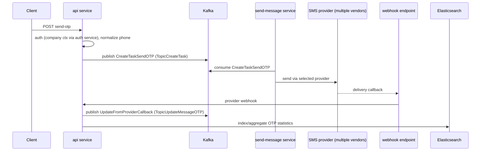

# GoFrame Backend Conventions (reference)

- **Date:** 2026-08-07
- **Type:** Reference - conventions from the author's work backend, mirrored in this side project
- **Source:** a private internal backend (local checkout only; not part of this repo, not linked here)

> Purpose: the OTP side project intentionally mirrors the author's real production "muscle memory" so it doubles as interview material. This doc records the **architecture, layout, and conventions only** - no proprietary business logic, no internal names, URLs, or paths.

> **Scope note (read first):** this document describes the **production** stack (GoFrame v2). The
> side project itself is now built with **Gin + hexagonal (ports & adapters)** instead of GoFrame,
> because the author is new to Go and wants the architecture *visible* rather than hidden behind
> codegen. This file stays as the **production reference** the project learns from; the concept-by-concept
> mapping (GoFrame → Gin) and the actual repo layout live in
> [architecture-and-layout.md](./architecture-and-layout.md). Everything below still holds as a description
> of production - only the side project's *implementation tools* differ.

## 1. Stack (actual)

| Concern | Uses |
|---------|------|
| Language | Go |
| Framework | **GoFrame v2** (`github.com/gogf/gf/v2`) |
| DB | **MySQL** (`gf/contrib/drivers/mysql/v2`) |
| Cache | **Redis** (`gf/contrib/nosql/redis/v2`) |
| Kafka | **IBM/sarama**, wrapped in an internal shared module (`producerv2`) |
| Search/stats | **Elasticsearch** (`elastic/go-elasticsearch/v7`) for OTP statistics |
| Auth | a separate **auth service**, called over HTTP; JWT via `golang-jwt/jwt/v5` |
| Logging | GoFrame `glog` with **JSON handler** |
| Deploy | **Kustomize** (`manifest/deploy/kustomize/base` + `overlays/<env>`) |
| CI | **GitLab CI** (`.gitlab-ci.yml`) |
| Shared code | an internal shared Go module: `kafka`, `common/middleware`, `metrics`, dao helpers, `protobuf`, `translation` |

This table describes **production**. The side project mirrors production's *architecture* (MySQL, Redis, Kafka-via-sarama, Kustomize, k3s, Cloudflare) but swaps two implementation tools for beginner-friendliness: **Gin** in place of the GoFrame framework, and **Traefik** in place of APISIX. See [architecture-and-layout.md](./architecture-and-layout.md) §8 for the full mapping. (An even earlier draft had assumed go-zero + Postgres; that was dropped entirely.)

## 2. Service layout (GoFrame, per service)

Each microservice repo follows the GoFrame CLI (`gf gen`) layout:

```
api/<module>/                 # request/response DTOs, versioned (gf gen ctrl source)
internal/
  controller/<module>/        # thin controllers: bind api DTO -> service interface
  logic/<module>/             # business logic implementing service.IXxx; self-registers
  service/                    # GENERATED interface definitions (IXxx) + registry
  dao/ , dao/internal/        # GENERATED data access objects (gf gen dao)
  model/ , model/do/ , model/entity/   # DTOs, data objects, generated entities
  consts/                     # consts.go, errors.go, redis_keys.go
  config/                     # typed config: config.InitConfig(ctx), config.GetConfig()
  cmd/                        # gcmd.Command bootstrap: wires producers, controllers, http
  boot/ , packed/             # GoFrame boot hooks + packed resources
manifest/                     # config templates, sql, i18n, deploy (kustomize), docker
hack/                         # gf codegen config (config.yaml, hack.mk)
pkg/ , utility/               # non-domain helpers
resource/                     # static resources, i18n
main.go                       # blank-imports boot/logic/packed, runs cmd.Main
```

**The layered dependency direction:** `controller → service (interface) ← logic (impl)`. Controllers depend on the **interface** in `internal/service`, never on `logic` directly. This is GoFrame's take on dependency inversion - the same spirit as ports & adapters, just codegen-driven.

## 3. Interface + registry pattern

`internal/service/<x>.go` is **generated** and holds only the interface:

```go
// generated - DO NOT EDIT
type IOTP interface {
    SendMessageCreateTask(ctx context.Context, in model.MsgKafkaCreateTaskSendOTP) error
    SendMessageUpdateFromProvider(ctx context.Context, in model.KafkaMsgUpdateTaskCallbackMessage) error
    // ...
}
```

`internal/logic/<x>/<x>.go` implements it and registers the impl:

```go
type sOTP struct { kafkaProducer kafka.IKafkaProducer }
func New(kafkaProducer kafka.IKafkaProducer) service.IOTP { return &sOTP{kafkaProducer} }
// dependency-free logic self-registers in init(): service.RegisterAuth(New())
```

Dependencies that need runtime config (Kafka producers) are constructed in `cmd` and passed into `New(...)`; dependency-free logic self-registers in `init()`. Consumers call `service.OTP().SendMessageCreateTask(...)`.

## 4. Kafka conventions

- Interface `kafka.IKafkaProducer` from the shared module; concrete `producerv2` (sarama).
- **Typed envelope** with a discriminator: `producer.WrapWithType(msgType string, data any)` or `model.MsgKafkaPayload{MsgType, Data}`. Consumers switch on `MsgType`.
- **Topics come from typed config**, never string literals at call sites: `config.GetConfig().KafkaOtp.TopicCreateTask`, `TopicUpdateMessageOTP`, `TopicActivitiesLog`.
- Producers are initialized once in `cmd` bootstrap: `initProducer(ctx, cfg.KafkaConfig, cfg.ProducerConfig)`, closed on shutdown.
- Fire-and-forget sends use a goroutine with `context.WithoutCancel(ctx)` so the request can return while the publish completes.

## 5. Real OTP flow (what production actually does)



Notable production details (mirror selectively, most are beyond MVP):
- **Multi-provider** with per-provider webhook handlers (several SMS vendors).
- **Delivery status via provider webhooks** (push), not polling - plus a **backfill** path for reconciliation.
- **Sharded audit tables** per company/date (`otp_<cid>_task_info_<yyyymmdd>`), existence cached in Redis.
- **OTP statistics in Elasticsearch**, aggregated for reporting.
- **Short links**: a separate url-shortener service embeds tracked short URLs in messages (out of OTP MVP scope).

## 6. Redis conventions

- Access through a service wrapper: `service.Redis().Get / SetEx / CheckKeyExist`.
- **Typed key builders**, not ad-hoc strings: `consts.RedisKeyTableExist.Key(name)`.
- TTLs are named consts: `consts.RedisTTLCacheKV`.
- Sentinel errors: `consts.ErrorRedisKeyNotFound`, etc.

## 7. What the side project mirrors vs simplifies

| Mirror (for CV authenticity) | Simplify for MVP |
|------------------------------|------------------|
| GoFrame v2 layout (api/controller/logic/service/dao/model/consts/config/cmd) | Single api service + one dispatcher (no create-task/delay-queue split) |
| MySQL + `gf` DAO/entity codegen | No per-company/date sharded tables - one `otp_requests` table |
| Kafka via sarama with typed envelope + config-driven topics | Fewer topics: `otp.requested`/`otp.sent`/`otp.failed` |
| Redis typed key builders + service wrapper | - |
| Kustomize deploy (base + overlays) | Single `develop` overlay on k3s |
| Separate auth concept | Seed CLI issues API keys; no live auth service |
| Provider abstraction + webhooks | Email-only (Resend); polling for status first, webhooks later |
| ES OTP statistics | Deferred (Phase 2+) |

## 8. Codegen & tooling

- `gf gen service` regenerates `internal/service/*.go` from `logic` - never hand-edit those files.
- `gf gen dao` generates `dao/`, `model/do/`, `model/entity/` from the MySQL schema.
- `hack/config.yaml` + `hack/hack.mk` drive the generators.
- `main.go` blank-imports `internal/boot`, `internal/logic`, `internal/packed` and the mysql/redis drivers, then runs `cmd.Main`.
```
