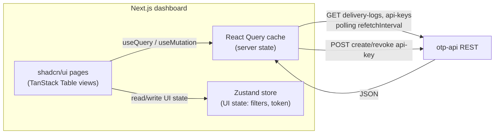

# OTP Verification Platform — Design Spec

- **Date:** 2026-08-06
- **Status:** Draft (approved for planning)
- **Author:** duykhanh
- **Type:** Personal side project (deployable product + CV showcase)

## 1. Purpose & Positioning

A **Verification-as-a-Service** platform (a scaled-down Twilio Verify): a public API that lets
client applications **send** and **verify** one-time passwords (OTP) over **email and SMS**.

This is a real, deployed product running on the author's own domain. It serves a dual goal:

1. **A working product** usable via API + a developer dashboard.
2. **A CV showcase** that intentionally mirrors the author's target production stack
   (GoFrame microservices, MySQL, APISIX gateway, Kafka event-driven via sarama, Redis, workers,
   k8s), so the author can speak about it confidently in interviews.

Scope is deliberately narrow (**OTP first**) but the architecture is designed to be **extended
later** to other channels (push, in-app) and other notification types without a rewrite.

### Non-goals (for the first release)

- No billing / paid plans / usage metering UI.
- No general multi-channel campaign/notification features (that is a later product).
- No end-user account system beyond API-key based tenant auth.
- floci / AWS-shaped services are **not** part of the product architecture (see §12).

## 2. Success Criteria

- A client can obtain an API key, call `POST /v1/otp/send`, receive a real email/SMS with a code,
  then call `POST /v1/otp/verify` and get a correct accept/reject result.
- The full path runs as **separate microservices** behind **APISIX**, communicating through
  **Kafka**, deployed to a **k3s** cluster reachable on the author's domain over HTTPS.
- Core domain logic (OTP generation, verification, rate limiting) has unit tests; infra
  integration and the end-to-end send→verify flow are covered by tests. Target **80%** coverage.
- The author can explain, on a whiteboard, every component and every failure/retry path.

## 3. Architecture Overview

```
Client ──HTTPS──► APISIX (edge gateway)
                    │   • TLS termination
                    │   • API-key authentication
                    │   • edge rate limiting
                    │
                    ▼
                 otp-api  (GoFrame HTTP service)
                    │   • validate request
                    │   • business rate limiting (per recipient / per tenant / cooldown)
                    │   • generate OTP, store HASH + TTL in Redis
                    │   • persist audit row in MySQL
                    │   • publish event → Kafka (otp.requested)
                    │
        Kafka topics: otp.requested / otp.sent / otp.failed / otp.dlq
                    │
                    ▼
                dispatcher  (GoFrame, Kafka consumer via sarama)
                    │   • render message from template
                    │   • select provider (email / SMS) via Provider abstraction
                    │   • send; on failure → retry / failover / DLQ
                    │   • write delivery_logs (MySQL)
                    │   • publish otp.sent / otp.failed
                    │
                worker / cron  (GoFrame)
                        • drain otp.dlq with backoff retry
                        • scheduled cleanup of expired OTP + stale audit rows

Dashboard (Next.js + shadcn/ui) ──► otp-api REST (delivery-logs, api-keys) [React Query polling]
```

### Component responsibilities

| Component    | Type                     | Responsibility |
|--------------|--------------------------|----------------|
| **APISIX**   | Gateway                  | TLS, API-key auth plugin, coarse edge rate limiting, routing to `otp-api`. |
| **otp-api**  | GoFrame HTTP service     | The synchronous request path: validation, business rate limiting, OTP generation + storage, verification, publishing events, serving read APIs for the dashboard. |
| **dispatcher** | GoFrame Kafka consumer (sarama) | The asynchronous delivery path: templating, provider selection, sending, retry/failover, delivery logging. |
| **worker/cron** | GoFrame              | Background reliability: DLQ draining with backoff, scheduled cleanup jobs. |

Keeping the **synchronous request path** (`otp-api`) separate from the **asynchronous delivery
path** (`dispatcher`) is the core architectural decision: the API stays fast and available even
when a downstream provider is slow or failing, and delivery becomes independently retryable.

## 4. OTP Core Domain Logic (the most important part)

- **Generation:** cryptographically random numeric code (configurable length, default 6 digits).
- **Storage:** only a **hash** of the code is stored in Redis with a TTL (default 5 minutes).
  The plaintext code is never persisted anywhere.
- **Verification:** constant-time comparison of the submitted code's hash against the stored hash.
- **Rate limiting (multi-layer):**
  - per recipient (address/phone) — max sends per rolling window,
  - per API key / tenant — global quota,
  - **resend cooldown** — minimum interval between two sends to the same recipient,
  - **verify-attempt limit** — lock verification after N wrong attempts (anti brute-force).
- **Idempotency:** an `Idempotency-Key` header on send collapses duplicate requests.
- **State model:** `requested → sent | failed`, then `verified | expired`. All transitions are
  recorded for audit.

All of the above is pure, dependency-light domain code and is the primary target for unit tests.

## 5. Provider Abstraction & Failover

A single `Provider` interface abstracts every delivery backend:

```
type Provider interface {
    Channel() Channel          // email | sms
    Send(ctx, Message) (ProviderResult, error)
    Name() string
}
```

- **Email (real):** SMTP or a transactional API (Resend / SES-compatible). Real, free-tier friendly.
- **SMS (real):** a Vietnamese provider (eSMS / SpeedSMS) as primary; **Twilio as a real failover**
  in Phase 2.
- **Delivery reliability:** retry with exponential backoff; on exhausted retries the message is
  routed to a **dead-letter queue** (`otp.dlq`) with the failure reason recorded. Failover selects
  the next healthy provider for the channel.

This provider/failover story is the strongest "distributed systems" narrative for interviews and
must be implemented for real, not mocked.

## 6. Data & Infrastructure

### MySQL (source of truth / audit)

Accessed via GoFrame `gf gen dao` DAOs (`dao` / `model/do` / `model/entity`).

- `tenants` — owning account of an API key.
- `api_keys` — hashed key, tenant, scopes, status.
- `otp_requests` — audit of every send request (recipient hashed/masked, channel, state, timestamps).
- `delivery_logs` — per-attempt provider results (provider, status, latency, error).
- `templates` — message templates per channel/locale.

### Redis (hot state, TTL-bound)

- OTP code **hash** + TTL.
- rate-limit counters (per recipient / per tenant).
- resend cooldown markers.
- verify-attempt counters.

### Kafka (event backbone)

- Topics: `otp.requested`, `otp.sent`, `otp.failed`, `otp.dlq`.
- Decouples `otp-api` (produce) from `dispatcher` / `worker` (consume).

## 7. Security

- **API-key auth** at APISIX + revalidated in `otp-api`; keys stored hashed, never in plaintext.
- Request signing via HMAC for sensitive endpoints (optional, Phase 2).
- **TLS everywhere** (edge termination at APISIX).
- OTP codes stored only as hashes; constant-time verification.
- Rate limiting at both edge (coarse) and application (fine, business rules).
- Recipient PII (phone/email) masked in logs and audit output.

## 8. Dashboard (frontend)

The author's **existing admin web is Vue**, but it is **not reused** here. For the fastest MVP and
a clean separation from that codebase, the OTP dashboard is a **new Next.js application**,
bootstrapped from a **shadcn/ui dashboard block** (https://ui.shadcn.com/blocks) so most of the
layout, sidebar, and table scaffolding comes ready-made.

### Stack (MVP)

| Concern | Choice | Why |
|---------|--------|-----|
| Framework | **Next.js (App Router, TypeScript)** | Fast scaffolding, file-based routing, large ecosystem; can start as a pure SPA-style client and add SSR later without a rewrite. |
| UI components | **shadcn/ui** (Radix + Tailwind) | Copy-in components the project *owns* (no runtime UI-lib lock-in), accessible by default; the ready **blocks** template removes most boilerplate. |
| Server state | **TanStack Query (React Query)** | Caching, request dedup, retries, and **`refetchInterval` polling** — a natural fit for live delivery-log status without building WebSockets. |
| Client/UI state | **Zustand** | Lightweight store for UI-only state (filters, selected tenant, modal state, in-memory API token) with no Redux boilerplate. |
| Forms & validation | **React Hook Form + Zod** | Minimal re-renders, schema-first validation shared with types (create API key, filter forms). |
| Data tables | **TanStack Table** | Headless sorting/filtering/pagination for OTP history and delivery-logs; pairs cleanly with React Query. |

**Key separation of concerns:** server data (delivery-logs, api-keys, OTP history) lives **only** in
React Query's cache; Zustand holds **only** client/UI state. Do not copy fetched server data into
Zustand — that duplicates the source of truth and causes stale-state bugs. This split is the single
most important frontend design rule here.

### Responsibilities

- Consumes `otp-api` REST endpoints: API-key management, OTP request history, delivery status.
- **MVP delivery status = polling** the `delivery-logs` API via React Query `refetchInterval`.
  Real-time push (SSE/WebSocket) is a later enhancement if needed.

### Data flow



## 9. Observability (Phase 2)

- Instrument all services with **OpenTelemetry** (traces + metrics).
- Backend: **LGTM stack** — **L**oki (logs), **G**rafana (dashboards), **T**empo (traces),
  **M**imir (metrics).
- Goal: trace a single send→verify request across `otp-api` → Kafka → `dispatcher` → provider.

## 10. Deployment & CI/CD

- **Cluster:** **k3s** (lightweight k8s) on a single VPS to keep solo cost/ops low, exposed on the
  author's domain over HTTPS.
- **Packaging:** **Kustomize** per service (`manifest/deploy/kustomize/base` + `overlays/<env>`),
  mirroring the production convention; Kafka/Redis/MySQL via well-known charts or operators.
- **CI/CD:** GitHub Actions — build & push images → deploy to k3s. **ArgoCD / GitOps** is a Phase 3
  enhancement.

## 11. Testing Strategy

- **Unit:** OTP generation/verification, rate-limit logic, provider selection/failover logic.
- **Integration:** Redis / MySQL / Kafka behavior via **testcontainers**.
- **End-to-end:** full `send → verify` flow exercised through APISIX against running services.
- **Coverage target:** 80% (per project standards), with TDD (test-first) for domain logic.

## 12. Exploration / Learning Track (out of product scope)

- **floci** (open-source local AWS emulator, LocalStack alternative) is kept **outside the core
  architecture**. It is a personal playground to experiment with AWS SDKs (S3/SQS/SNS/etc.) locally
  for free, without an AWS account. It is **not** a product dependency and must not couple into the
  services above.

## 13. Phased Delivery

- **Phase 1 — MVP (deployable):** `otp-api` + `dispatcher` + `worker/cron`, real email + one real
  SMS provider, Redis + MySQL + Kafka, APISIX, k3s deploy, dashboard wired to read APIs.
- **Phase 2:** multi-provider **failover** (Twilio), **LGTM observability**, retry/DLQ hardening,
  optional HMAC request signing.
- **Phase 3:** additional channels (push / in-app), **ArgoCD/GitOps**, autoscaling; floci learning
  track on the side.

## 14. Open Questions

1. ~~Exact location + auth model of the existing dashboard source.~~ **Resolved:** the existing Vue
   admin is not reused; the dashboard is a new Next.js app (see §8). Dashboard **login/auth** is
   deferred — MVP operates against the `otp-api` read APIs with an in-memory API token; a full auth
   model (e.g. NextAuth/Auth.js) is a Phase 2 decision.
2. Chosen VN SMS provider for Phase 1 primary (eSMS vs SpeedSMS) and email backend (SMTP vs Resend).
3. VPS provider/region for the k3s host.
