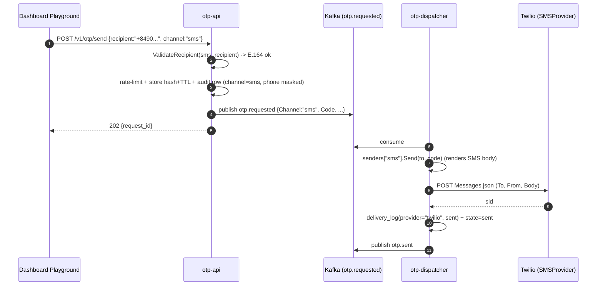

# SMS Channel for OTP - Design

**Date:** 2026-08-18
**Status:** Approved (brainstorm). Next: implementation plan.
**Gate this unblocks:** the "OTP email **and SMS** live in production" hard gate that
fronts the [notification-platform + link-service roadmap](../../roadmap/2026-08-16-notification-platform-and-link-service.md).

## 1. Goal

Add **SMS** as a second OTP delivery channel end-to-end - from the dashboard playground,
through `otp-api`, over Kafka, to `otp-dispatcher`, out via **Twilio** - alongside the
existing email channel. The channel model is built to extend (push later) without
reshaping the handler.

**In scope:** full E2E in the compose stack with a real Twilio HTTP adapter tested via
`httptest`/test-credentials; dashboard playground channel selection (send **and** verify);
a country-dial-code phone input; recipient validation and masking per channel; unit +
integration tests green.

**Out of scope (operational follow-up):** buying/verifying a live Twilio number, prod
secrets, deploy, smoke test on a real handset. **Bulk import** of phone lists: only the
pure phone helper is factored for reuse; no import UI is built now.

**Operational note:** the author already holds Resend and Twilio accounts, so Twilio
**test credentials** are available for the adapter tests, and live cutover is feasible in
the later operational step.

## 2. Non-goals / YAGNI

- No per-tenant default channel, no auto-detect from recipient format - the caller states
  the channel explicitly.
- No global phone library (`libphonenumber`). A small curated dial-code list covers the
  playground; the pure helper still accepts any E.164 for future import.
- No new Kafka topics. `otp.requested` already carries a `Channel` field; we stop
  hardcoding it.

## 3. Decisions settled during brainstorming

| # | Decision | Rationale |
|---|----------|-----------|
| Provider | **Twilio**, sandbox/test-creds first, behind a swappable `SMSProvider` port | Best-documented to learn; VN carrier + brandname approval avoided so it never blocks |
| Channel selection | Caller states `channel` explicitly; default `email` when absent | Explicit, auditable, backward compatible |
| Dispatcher routing | `Sender` port + `map[channel]Sender` registry; unknown channel -> DLQ | Clean, testable per channel; adding push = one entry |
| Sender rendering | Each `Sender` renders its own message (owns its template) | Keeps the handler fully channel-agnostic |
| Verify channel | Verify is keyed by `(tenant, recipient)`; no channel needed for lookup | The recipient string already disambiguates; UI still switches the input per channel |
| Phone input | Country dial-code `Select` -> national number -> composed E.164 | Clear entry; pure helper is import-reusable |
| SMS template | English default | Requested |
| Dial-code list | Small hardcoded list (~10 common, VN default) | Simple, sufficient, easy to extend |

## 4. Architecture and data flow



Unknown channel at the dispatcher (defensive) -> failed delivery + DLQ, no redelivery.

## 5. Backend components

### 5.1 `pkg/contracts/otp` - unchanged shape, real value
`RequestedEvent.Channel` already exists. `otp-api` stops hardcoding `"email"` and passes
the requested channel; the dispatcher reads it.

### 5.2 `otp-api`

- **`internal/domain/request.go`**
  - Add `ChannelSMS Channel = "sms"`; `ValidChannel(c Channel) bool`.
  - `ValidateRecipient(channel Channel, recipient string) error`:
    - `email` -> RFC email (reuse the existing email check the DTO relied on).
    - `sms` -> E.164 regex `^\+[1-9]\d{7,14}$`.
  - Channel-aware masking. Keep `MaskRecipient` for email; add phone masking
    (keep leading `+`, first 2 digits, last 2 digits, e.g. `+84***67`). Expose one
    `Mask(channel, recipient)` entry so callers do not branch.
- **`internal/adapters/inbound/http/dto.go`**
  - Send DTO: add `Channel string json:"channel"` (optional); relax recipient from
    `binding:"required,email"` to `binding:"required"` (channel-aware validation moves
    into the app/domain layer).
  - Verify DTO: relax recipient to `binding:"required"` (lookup key, format-agnostic).
- **`internal/app/send.go`**
  - `SendInput.Channel` (default `email` when empty). Call `ValidateRecipient`; on
    mismatch return a validation error surfaced as **400**. Persist audit row + publish
    event with the real channel. Rate-limit/idempotency/`codeKey` unchanged - all keyed
    by `(tenant, recipient)`, so phone works unchanged.
- **`internal/adapters/inbound/http/handlers.go`**
  - Map the new `channel` field into `SendInput`; map a validation error to 400.

### 5.3 `otp-dispatcher`

- **`internal/app/ports.go`** - new port:
  ```go
  type Sender interface {
      Name() string // provider label for delivery_log.Provider, e.g. "resend" | "twilio"
      Send(ctx context.Context, to, code string) (msgID string, err error)
  }
  ```
  `EmailProvider` stays; an `emailSender` wraps it plus the email `Template`
  (subject+body). An `smsSender` wraps an `SMSProvider` plus the SMS body template.
- **`internal/app/handler.go`**
  - `Deps.Senders map[string]Sender` replaces `Deps.Mail`. Look up
    `senders[evt.Channel]`; missing -> treat as failed -> record + `UpdateState(failed)`
    + publish failed + DLQ + return nil (no redelivery). Success path unchanged; the
    delivery-log `Provider` comes from `sender.Name()`. `Config.ProviderName` and
    `Config.Template` move into the email sender construction; `Config` keeps the topics.
- **SMS template**: reuse the `Template`/`fmt.Sprintf` mechanism, body-only. Default
  (English): `"Your verification code is %s. It expires in 5 minutes."` (< 160 chars).
- **`internal/adapters/outbound/twiliosms/provider.go`** (new) - mirror `resendmail`:
  - Basic-auth (`AccountSID:AuthToken`), form-encoded POST to
    `{baseURL}/2010-04-01/Accounts/{SID}/Messages.json` with `To`, `From`, `Body`.
    `baseURL` injected so `httptest` can stub it. Return Twilio `sid` as `msgID`; any
    non-2xx -> error (so the handler records a failed delivery).
- **`main.go`** wiring + config: build both senders and the registry. New env:
  `TWILIO_ACCOUNT_SID`, `TWILIO_AUTH_TOKEN`, `TWILIO_FROM`, `TWILIO_BASE_URL`,
  `OTP_SMS_BODY_FMT`. Add to `.env.example` and the dispatcher service in
  `deploy/compose`.

## 6. Dashboard components

### 6.1 Data layer
- **`lib/api/source.ts`**: `send(recipient, channel)` and `verify(recipient, code, channel?)`.
  (`channel` on verify is passed for symmetry/UI but the backend ignores it for lookup.)
- **`lib/api/live.ts`**: include `channel` in the `POST /v1/otp/send` body.
- **`lib/api/mock.ts`**: record `channel` on the request/log it appends (the `channel`
  column already exists in fixtures).
- **`lib/queries/use-otp.ts`**: thread `channel` through `useSend`/`useVerify`.

### 6.2 Phone helper (pure, reusable, tested)
- **`lib/phone.ts`**: `DIAL_CODES` (curated: `+84 VN` default, `+1 US`, `+44 GB`,
  `+65 SG`, `+81 JP`, `+61 AU`, `+91 IN`, `+49 DE`, `+33 FR`, `+82 KR`),
  `toE164(dialCode, national)`, `isValidE164(value)`, `parsePhone(value)`. No React,
  no network - so a future bulk-import path reuses the exact normalization/validation.

### 6.3 UI
- **`components/common/phone-input.tsx`**: dial-code `Select` + national-number `Input`,
  emits a composed E.164 string; shown when channel = SMS.
- **`components/playground/playground.tsx`**: lift a shared `channel` state
  (`email | sms`) into the container so **both** Send and Verify switch their recipient
  input; prefill carries `{ recipient, code }` as today.
- **`send-form.tsx` / `verify-form.tsx`**: render an email `Input` or the `PhoneInput`
  based on the shared channel; validate recipient per channel via Zod.
- **`lib/schemas.ts`**: recipient validation becomes channel-aware (email vs E.164).

## 7. Error handling

| Condition | Handling |
|-----------|----------|
| Recipient format does not match channel | `otp-api` returns **400**, no request created (fail fast) |
| Unknown channel at dispatcher | Recorded failed + `UpdateState(failed)` + failed/DLQ publish, return nil (no redeliver) |
| Twilio non-2xx / network error | Same as email failure today: log failed, state failed, publish failed + DLQ |
| Invalid phone in UI | Zod error inline; submit blocked |

## 8. Testing (TDD, table-driven, `-race`)

**Backend**
- `domain`: `ValidateRecipient` and `Mask` for email and phone (valid + malformed).
- `otp-api` app + http: `channel=sms` with a valid phone publishes an event with
  `Channel="sms"`; phone under `channel=email` -> 400; omitted channel defaults to email
  (regression).
- `dispatcher` handler: fake senders route email vs sms; unknown channel -> DLQ; delivery
  log uses `sender.Name()`.
- `twiliosms`: `httptest` stub - success returns the sid; non-2xx returns an error.

**Frontend**
- `lib/phone.ts`: `toE164`/`isValidE164`/`parsePhone` incl. error cases.
- `send-form`/`verify-form`: input switches with channel; mock `send`/`verify` carry
  `channel`.

**Gate before done:** `go vet ./...`, `go test -race ./...`, and dashboard
`pnpm lint && pnpm typecheck && pnpm test` all green.

## 9. Rollout

1. Backend channel model + Twilio adapter (tested with test-creds/stub).
2. Dashboard channel selection + phone input.
3. Compose env wired; local E2E send-sms exercised.
4. **Operational (separate, out of scope here):** live Twilio number, prod secrets,
   deploy, real-handset smoke test - after which the OTP-prod gate is closed.
