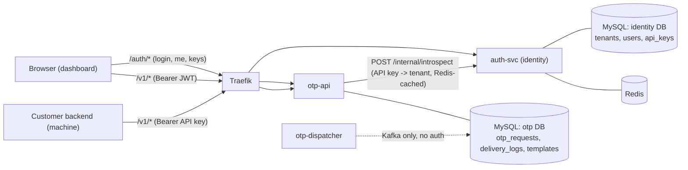
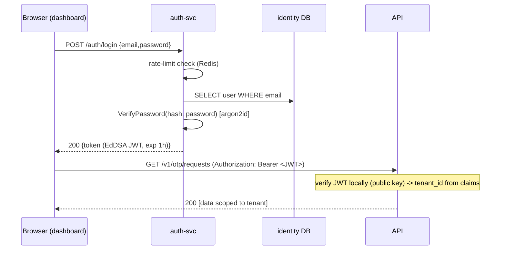

# Dashboard Auth & Identity Service - Design

**Date:** 2026-08-19
**Status:** Approved (brainstorm). Next: implementation plan.
**Immediate value:** stop the dashboard from making a human **paste a raw API key** into
the live-API field. Replace it with real email+password login.
**Long-term:** stand up a dedicated **identity service** so auth is a reusable, scalable
bounded context for the future multi-product platform
([notification-platform roadmap](../../roadmap/2026-08-16-notification-platform-and-link-service.md)).

## 1. Goal

Introduce human authentication for the dashboard and separate the **identity bounded
context** (tenants, users, API keys) from the OTP delivery domain.

Two distinct identities, one API surface:
- **Humans** log into the dashboard with email+password and receive a short-lived JWT.
- **Machines** (a customer's backend) keep calling `/v1/*` with a tenant **API key**.

**In scope:** a new `auth-svc` owning identity; email+password login issuing an EdDSA
JWT; `otp-api` verifying JWTs locally and validating API keys via introspection; a real
dashboard login + auth guard with the paste-key field removed; a seed CLI that provisions
tenant+user; unit/integration tests green.

**Out of scope (v1 / YAGNI):** roles & permissions, multi-user invites, public signup,
password-reset flow (CLI only), refresh tokens, one-user-many-tenants. Tables and keys are
shaped so these can be added later without a breaking migration.

## 2. Decisions settled during brainstorming

| # | Decision | Rationale |
|---|----------|-----------|
| Scope | Single-operator login first (schema allows many users/tenant later) | Smallest change that removes paste-key; extensible |
| Login method | Email + password, **argon2id** hashing | Familiar; memory-hard hash resists GPU brute-force |
| Session | **JWT bearer** held in the browser | Stateless, familiar; XSS tradeoff accepted |
| Token TTL | Access ~1h, **no refresh**, re-login on expiry | Simplest; refresh can be added later |
| Provisioning | **CLI seed only**, no public signup | Fits single-operator; no abuse surface |
| Placement | **Dedicated `auth-svc`** owning tenants+users+api_keys | True microservice split; identity is cross-cutting for the platform roadmap |
| JWT signing | **EdDSA/Ed25519 (asymmetric)** | auth-svc signs (private key); resource services only verify (public key) - cannot forge |

### Rejected alternatives
- **Auth inside otp-api** - fastest, but parks a second bounded context in otp-api and
  forces a painful extraction later.
- **auth-svc owning only `users`, leaving tenants/api_keys in otp-api** - splits one
  bounded context across two services (cross-references, distributed coupling). A trap.
- **Shared identity DB between services** - violates database-per-service; hidden coupling
  through schema.
- **HS256 shared secret** - fine for one issuer/verifier, but with multiple resource
  services any secret-holder could mint tokens. Asymmetric confines minting to auth-svc.

## 3. Architecture



- `/internal/introspect` is **not** routed through Traefik; otp-api reaches it over the
  internal Docker network, guarded by a shared `INTERNAL_API_TOKEN` header.
- otp-dispatcher is unchanged - it does no auth.

### Data ownership
- **identity DB** (auth-svc): `tenants`, `users` (new), `api_keys` (moved out of otp-api).
- **otp DB** (otp-api): `otp_requests`, `delivery_logs`, `templates`.
- Same MySQL instance, two logical databases; each service connects only to its own.
- `otp_requests.tenant_id` / `delivery_logs.tenant_id` become **soft references** (id
  only, no cross-DB FK) - standard for microservices, and the current schema has no FKs to
  break.

## 4. auth-svc (new service)

Hexagonal layout mirroring otp-api:

```
services/auth-svc/
  main.go                         # composition root: config -> adapters -> usecase
  internal/
    app/        ports.go, usecase.go        # Login/Me/Introspect/CreateAPIKey/...; ports: Repo, Issuer, Hasher, Clock, RateLimiter
    domain/     errors.go                    # ErrInvalidCredentials, ErrInactive, ...
    adapters/
      inbound/http/   router.go, handlers.go, dto.go, middleware.go, errors.go
      outbound/mysqlrepo/  repo.go            # users, tenants, api_keys
    arch/       arch_test.go
```

### Endpoints

**Public**
- `POST /auth/login` `{email,password}` -> `200 {token, expires_at, user:{id,email,tenant_id}}` | `401` | `429`

**Require user JWT** (auth-svc middleware, verifies with public key)
- `GET /auth/me` -> `{id,email,tenant_id}`
- `GET /auth/api-keys` -> list *(moved from otp-api)*
- `POST /auth/api-keys` -> creates a key, returns plaintext **once** `{id,key}`
- `DELETE /auth/api-keys/:id` -> revoke (`status='revoked'`)

**Internal service-to-service (NOT exposed via Traefik)**
- `POST /internal/introspect` `{token}` -> `{active, tenant_id}` - validates an **API key**
  (hash + lookup). Guarded by `X-Internal-Token: <INTERNAL_API_TOKEN>`.

### Data model (identity DB)

```sql
-- tenants, api_keys: moved verbatim from otp-api's 0001_init (unchanged shape)
CREATE TABLE users (
  id            CHAR(36) PRIMARY KEY,
  tenant_id     CHAR(36) NOT NULL,
  email         VARCHAR(255) NOT NULL UNIQUE,
  password_hash VARCHAR(255) NOT NULL,        -- encoded argon2id string ($argon2id$v=19$m=...$salt$hash)
  status        VARCHAR(16)  NOT NULL DEFAULT 'active',
  created_at    DATETIME     NOT NULL DEFAULT CURRENT_TIMESTAMP,
  INDEX idx_users_tenant (tenant_id)
);
```
- `email` globally unique (single-operator simplicity; can become `(tenant_id,email)` later).
- `status` allows disabling a user without deletion.
- `password_hash` stores the self-describing argon2id string, so verification carries its
  own params and params can be raised later without breaking existing rows.

### Crypto (consolidated in `pkg/security`)
- `HashPassword(plain) -> encoded` / `VerifyPassword(encoded, plain) -> bool` using
  **argon2id** (`golang.org/x/crypto/argon2`).
- `jwt.go`: split **`Issuer`** (holds Ed25519 private key, `IssueToken`) and **`Verifier`**
  (holds public key, `ParseToken`). auth-svc imports Issuer; resource services import only
  Verifier - the sign/verify boundary is enforced by type. Backed by
  `github.com/golang-jwt/jwt/v5`.
  - Claims: `sub` (user id), `tenant_id`, `email`, `iat`, `exp` (1h).
- `GenerateAPIKey` + `HashKey` (existing) now used by auth-svc.

### Login hardening
- `POST /auth/login` wrapped by a Redis rate-limit (reusing otp-api's `ratelimit.go`
  pattern) keyed by `email`+IP -> `429` on excess.
- Wrong login returns a **generic** "invalid email or password" (no user enumeration).

### Login sequence



## 5. otp-api changes

### Unified `authenticate` middleware (replaces `apiKeyAuth`)
```
Bearer <token>:
  token is "a.b.c" (3 dot-parts) -> verify JWT locally with public key -> tenant_id from claims
                                     (expired / bad signature -> 401)
  otherwise (opaque key)          -> Redis cache: sha256(key) -> tenant_id?
                                     miss -> POST http://auth-svc/internal/introspect
                                             active -> cache with short TTL + set tenant_id
                                             else   -> 401
```
Both branches set `tenant_id` in context; downstream handlers are unchanged.

### Loses identity ownership
- Drop `tenants`/`api_keys` from otp-api's schema; its migrations keep only
  `otp_requests`/`delivery_logs`/`templates`.
- Remove `GET /v1/api-keys` + `repo.FindAPIKey`.
- Add outbound adapter `internal/adapters/outbound/identity/client.go` (HTTP client to
  introspect) + Redis cache wrapper. otp-api depends on the port interface, tested with an
  `httptest` stub like other adapters.

### New config
`AUTH_JWT_PUBLIC_KEY`, `AUTH_SVC_URL` (internal), `INTERNAL_API_TOKEN`.

### Why this scales
- The dashboard's hot path (JWT) is **stateless, verified locally** - otp-api scales
  horizontally with zero auth network chatter for user traffic.
- API-key introspection is the only cross-service call, Redis-cached -> amortized O(1);
  cache TTL bounds revocation staleness (e.g. <=60s), a conscious tradeoff.
- Future resource services verify JWTs with just the **public key** - auth-svc needs no
  change. auth-svc itself is stateless (state in DB/Redis) and scales horizontally.

## 6. Delivery in two milestones

**Status: M1 shipped; M2 shipped** (identity DB split, `api_keys` moved to auth-svc,
otp-api resolves keys via introspection). Plan:
`docs/superpowers/plans/2026-08-19-dashboard-auth-m2.md`.

To ship the immediate value without a big-bang migration:

- **M1 (removes paste-key):** stand up auth-svc with `tenants`+`users`+login+JWT; otp-api
  verifies JWTs locally; the dashboard gets real login. **Temporarily keep** otp-api's
  existing local API-key check so the machine path never breaks mid-transition.
- **M2 (completes the clean split):** move `api_keys` fully into auth-svc; otp-api switches
  API-key validation to introspection; remove otp-api's local identity tables.

Dashboard stops pasting keys at M1; the machine/introspection path finishes at M2.

## 7. Dashboard changes

- **Real login** (`app/login/page.tsx`, rewrite `login-view.tsx`): email+password form ->
  `POST /auth/login` -> store JWT + redirect. Add `lib/api/auth.ts` (login, me) separate
  from the OTP `DataSource`.
- **Token store:** replace `worklane-api-key` with `worklane-token` (the JWT) in zustand +
  localStorage (keeps the existing pattern; XSS tradeoff accepted). `getToken` already
  reads `useUIStore` - nearly no change.
- **Remove the "Paste API key" field** (`components/shell/api-key-field.tsx`).
- **Auth guard:** no token -> redirect `/login`; any API `401` (expired JWT) -> clear token
  + redirect `/login` (implements re-login on expiry).
- **`/auth/me` on load** -> show the real email/tenant in the sidebar (replaces the
  hardcoded "Acme Inc / tnt_a1b2c3d4").
- **API keys page stays** but calls `/auth/api-keys` (list/create/revoke) - machine
  credential management, not login. Create surfaces the plaintext key once (copy).
- **Env:** none new - Traefik serves `/auth/*` and `/v1/*` at the same origin
  (`NEXT_PUBLIC_API_BASE=http://localhost`).

## 8. Seed CLI

Extend `services/seed`: `--name --email --password` -> creates tenant + user (argon2id),
optional `--with-key` to mint an API key for machine testing. Runs against the identity DB.
(`--reset-password` deferred.)

## 9. Error handling

- Login: `401` generic on bad credentials; `429` when rate-limited; network error -> toast.
- Expired/invalid JWT -> `401` -> dashboard auto-redirects to login.
- Missing keys/secrets at startup (auth-svc private key; otp-api public key;
  `INTERNAL_API_TOKEN`) -> **fail-fast fatal**.
- introspect down -> otp-api's API-key branch returns `401/503` gracefully (no crash); the
  JWT branch is unaffected (local verification).

## 10. Testing (TDD)

- `pkg/security`: password round-trip + wrong; Issuer<->Verifier issue/parse, expired,
  tampered, wrong-key -> error.
- auth-svc: login success / wrong-pass / unknown-email (`401`) / rate-limited (`429`);
  `/auth/me` valid+invalid JWT; api-keys create/list/revoke tenant-scoped; introspect
  active/revoked/unknown + internal-token guard.
- otp-api: `authenticate` middleware - valid JWT -> tenant; API key via introspect stub ->
  tenant; garbage -> `401`; expired JWT -> `401`; cache hit avoids a second introspect call.
- dashboard: login-view (submit -> store token -> redirect); guard redirect on
  missing/expired; client attaches Bearer; api-keys page create shows plaintext once.
- `arch_test` green in both services.

## 11. Infrastructure (compose)

- New `auth-svc` service (build, env, `depends_on` mysql + redis).
- MySQL creates two databases `identity` + `otp`; auth-svc owns identity migrations,
  otp-api owns otp migrations.
- Traefik: route `/auth` -> auth-svc, `/v1` -> otp-api (existing); `/internal/*` is not
  routed.
- New env across the stack: `AUTH_JWT_PRIVATE_KEY` (auth-svc), `AUTH_JWT_PUBLIC_KEY`
  (otp-api), `INTERNAL_API_TOKEN` (both), `AUTH_SVC_URL` (otp-api), `AUTH_TOKEN_TTL`
  (default 1h).

## 12. Out of scope / YAGNI

Roles & permissions; multi-user invites & management UI; public signup; password-reset
flow (CLI only for now); refresh tokens; one-user-many-tenants. Schema and keys are shaped
so each can be added later without a breaking change.
