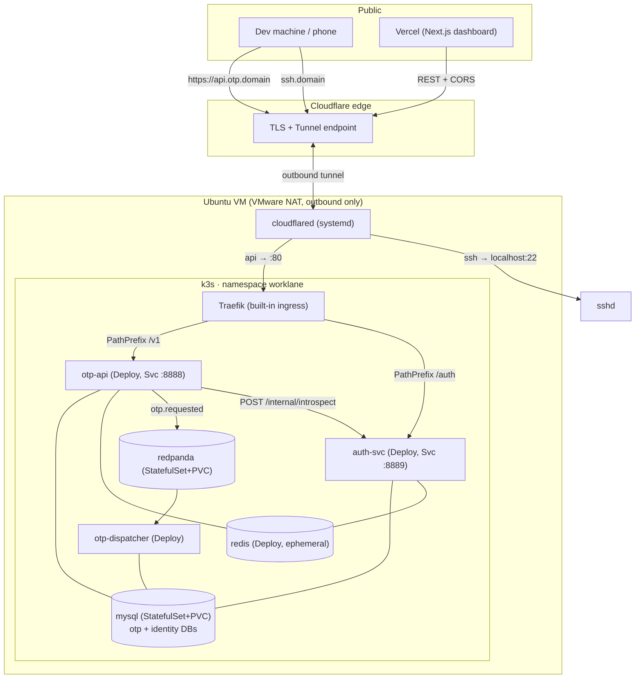

# Productionize worklane on self-hosted k3s - Design

**Date:** 2026-08-19
**Status:** Approved (brainstorm). Next: implementation plan.
**Gate this unblocks:** the "OTP email + SMS **live in production, stable**" hard gate that
fronts the [notification-platform + link-service roadmap](../../roadmap/2026-08-16-notification-platform-and-link-service.md).
**Companion:** [self-hosted infra setup (host/network)](./2026-08-07-self-hosted-infra-setup.md),
[OTP MVP scope](./2026-08-07-otp-mvp-scope.md).

## 1. Goal

Take the walking skeleton - which today runs end-to-end only on docker-compose - and deploy it
**for real** to a self-hosted single-node **k3s** cluster, reachable at `https://api.otp.<domain>`
over HTTPS, with the dashboard on Vercel. This is both the MVP's unmet success criterion #3 and
the whole point of the project (a full distributed architecture deployed, not just coded).

**In scope (one spec, four areas):**
1. **Host / network:** Cloudflare Tunnel + k3s (built-in Traefik) + SSH over the tunnel, rebuilt
   clean per the companion infra doc.
2. **App workloads:** Kustomize manifests for `otp-api`, `auth-svc`, `otp-dispatcher`.
3. **Stateful infra:** MySQL, Redpanda, Redis running **in-cluster**.
4. **Image pipeline:** GitHub Actions build + push to **GHCR**; manual `kubectl apply -k` deploy.

**Out of scope (separate tracks, per roadmap):** ArgoCD / GitOps auto-deploy, HPA / autoscaling,
multi-node / HA for stateful infra, observability (LGTM + OpenTelemetry), `worker/cron` (DLQ
drainer + cleanup). These are named so the boundary is explicit.

## 2. Decisions settled during brainstorming

| # | Decision | Rationale |
|---|----------|-----------|
| Scope | One "productionize" spec covering host + app + infra + images | One continuous goal: get it live on the domain |
| Stateful infra | **In-cluster** StatefulSets (MySQL, Redpanda) + Deployment (Redis) | Self-contained; shows the full architecture on k8s (the showcase point) |
| Redis persistence | **Ephemeral** (Deployment, no PVC) | All Redis data is TTL codes / rate-limit counters / cache - regenerable |
| Images | **GHCR** (build + push), cluster pulls via `imagePullSecret` | "Real"/CV-grade pipeline; private packages |
| Secrets | **Plain k8s Secrets created out-of-band** (not in git) | Simplest safe path for a home showcase; keypair still mounts via `*_FILE` |
| CI/CD | GH Actions **build + push** to GHCR; **deploy manual** (`kubectl apply -k`) | GitOps/ArgoCD is Phase 3; manual apply keeps kubeconfig off CI |
| Tunnel | **cloudflared as systemd in the VM**, handling both API and SSH | Reuses the companion infra doc directly; no in-cluster tunnel complexity |
| Ingress | **k3s built-in Traefik** via `IngressRoute` + `Middleware` CRDs | Ships with k3s; mirrors the compose Traefik dynamic config |
| Migrations | **Keep migrate-on-startup** + an `initContainer` that waits for MySQL | Already coded (`mysql.Migrate` in each main.go); no new migration Jobs |
| Health | **Add unauthenticated `/healthz`** to otp-api + auth-svc | k8s liveness/readiness need an unauthenticated endpoint; none exists today |

### Rejected alternatives
- **Hybrid (infra in docker-compose, only Go services in k3s):** simpler but does not demonstrate
  the full architecture on k8s - the showcase point is lost.
- **Managed MySQL/Redis (PlanetScale/Upstash):** cost + external dependency, poor fit for a home
  single-node demo.
- **cloudflared in-cluster Deployment:** cleaner k8s-wise, but the SSH route needs host access,
  so a systemd cloudflared in the VM covers both paths with less moving parts.
- **Migration Jobs instead of startup migration:** more "correct" for multi-replica, but the
  services already migrate at startup and run at replica=1; an initContainer wait is enough.

## 3. Architecture



- TLS terminates at Cloudflare; the in-cluster path is plain HTTP on Traefik's `web` entrypoint.
- `/internal/introspect` has no IngressRoute -> never reachable from outside; otp-api reaches
  auth-svc over the cluster network (`http://auth-svc:8889`).

## 4. Kustomize layout

```
deploy/k8s/
  base/
    namespace.yaml                     # namespace: worklane
    config.yaml                        # ConfigMap worklane-config (non-secret env)
    mysql/          statefulset.yaml svc.yaml initdb-configmap.yaml
    redpanda/       statefulset.yaml svc.yaml
    redis/          deployment.yaml svc.yaml
    otp-api/        deployment.yaml svc.yaml
    auth-svc/       deployment.yaml svc.yaml
    otp-dispatcher/ deployment.yaml
    ingress/        ingressroute.yaml middlewares.yaml
    kustomization.yaml
  overlays/
    develop/
      kustomization.yaml               # namespace, images: GHCR tags, patches
      seed-job.yaml                    # one-off tenant/user/key provisioning (applied on demand)
```

- **Secrets are NOT in kustomize.** They are created out-of-band (documented commands) and
  referenced by name (`worklane-secrets`, `worklane-jwt`, `ghcr-pull`) in env/volumes/imagePullSecrets.
- The `develop` overlay pins image tags via the `images:` transformer and sets the namespace.
- A future `prod` overlay can add replicas/limits/HA without touching base.

## 5. Config & Secrets (mapped from compose)

### ConfigMap `worklane-config` (non-secret)
`REDIS_URL=redis://redis:6379/0`, `KAFKA_BROKERS=redpanda:9092`, `AUTH_SVC_URL=http://auth-svc:8889`,
`AUTH_TOKEN_TTL=1h`, `EMAIL_PROVIDER`, `RESEND_FROM`, `RESEND_BASE_URL`, `TWILIO_FROM`,
`TWILIO_BASE_URL`, `OTP_SMS_BODY_FMT`, and OTP tuning (`OTP_CODE_LENGTH`, `OTP_TTL`, limits...).
`HTTP_ADDR` and `MIGRATIONS_DIR` are already baked into the images (Dockerfile `ENV`).

### Secret `worklane-secrets`
`MYSQL_ROOT_PASSWORD`, `OTP_MYSQL_DSN` (points at `.../otp`), `IDENTITY_MYSQL_DSN`
(points at `.../identity`), `INTERNAL_API_TOKEN`, `RESEND_API_KEY`, `TWILIO_ACCOUNT_SID`,
`TWILIO_AUTH_TOKEN`. Services read `MYSQL_DSN` from the appropriate key (otp-api/dispatcher ->
`OTP_MYSQL_DSN`; auth-svc -> `IDENTITY_MYSQL_DSN`).

### Secret `worklane-jwt`
`auth_priv.pem`, `auth_pub.pem` mounted as files; `AUTH_JWT_PRIVATE_KEY_FILE` /
`AUTH_JWT_PUBLIC_KEY_FILE` point at the mount path (auth-svc gets both, otp-api gets the public
key only) - identical mechanism to the current compose `*_FILE` wiring.

### Secret `ghcr-pull`
`kubernetes.io/dockerconfigjson` for pulling private GHCR images; referenced as `imagePullSecrets`
on each app Deployment (and the seed Job).

> Creation is documented as `kubectl create secret ...` commands in the plan; nothing secret is
> committed. `.gitignore` already excludes `deploy/compose/secrets/` and `.env`.

## 6. Stateful infra details

- **mysql** (`mysql:8.0`) StatefulSet, 1 replica, `volumeClaimTemplates` PVC on k3s `local-path`.
  `MYSQL_DATABASE=otp` creates `otp`; an `initdb-configmap` mounted at
  `/docker-entrypoint-initdb.d` runs `CREATE DATABASE IF NOT EXISTS identity;` (same content as
  `deploy/compose/initdb/01-create-identity-db.sql`). Headless Service `mysql:3306`.
- **redpanda** single-node StatefulSet + PVC (Kafka needs durable log), Service `redpanda:9092`
  advertising `redpanda:9092` (mirrors the compose flags). Readiness via `rpk cluster health`.
- **redis** (`redis:7`) Deployment (ephemeral), Service `redis:6379`. No PVC - acceptable because
  every key is TTL-bound OTP state, a rate-limit counter, or an introspection cache entry.

## 7. App workloads

Each app Deployment (replicas=1 for the MVP):
- `envFrom` the ConfigMap + the Secret; JWT keys via the `worklane-jwt` Secret volume.
- **initContainer `wait-for-deps`** (`busybox`, `nc -z` loop) blocking on MySQL (otp-api,
  auth-svc, dispatcher) and Redpanda (otp-api, dispatcher) so startup migration and the Kafka
  consumer never race a cold dependency.
- **Probes:** otp-api & auth-svc get liveness+readiness HTTP GET `/healthz`. otp-dispatcher (no
  HTTP server) uses a liveness `exec`/process check.
- Modest `resources.requests`/`limits` (e.g. 50m/128Mi requests, 250m/256Mi limits) so the
  single node stays schedulable.
- `imagePullSecrets: [ghcr-pull]`; image ref set by the overlay's `images:` transformer.

### New code required: `/healthz`
otp-api and auth-svc currently mount every route behind auth, so k8s has nothing safe to probe.
Add an **unauthenticated** `GET /healthz` (outside the `/v1` and `/auth` auth groups) returning
`200 {"status":"ok"}`. It must not touch the DB (a liveness probe should reflect the process, not
its dependencies). This is the only application code change in this spec.

### Seed
`overlays/develop/seed-job.yaml` is a one-off `Job` running the seed image against
`IDENTITY_MYSQL_DSN` to create a tenant + user + API key. Applied on demand
(`kubectl apply -f seed-job.yaml`) and its log prints the plaintext key once.

## 8. Ingress (Traefik CRDs)

- One `IngressRoute` on entrypoint `web`, host `api.otp.<domain>`:
  - `PathPrefix(/v1)` -> `otp-api:8888`
  - `PathPrefix(/auth)` -> `auth-svc:8889`
  - middlewares: `otp-ratelimit` + `otp-cors`.
- `Middleware` `otp-cors`: `accessControlAllowMethods: [GET, POST, DELETE, OPTIONS]`,
  `accessControlAllowHeaders: [authorization, content-type, idempotency-key]`,
  **`accessControlAllowOriginList: [https://<vercel-dashboard-origin>]`** (tighten from the
  compose `*`). `Middleware` `otp-ratelimit`: average 100 / burst 50 (mirrors compose).
- No route for `/internal` -> introspection stays cluster-internal.

## 9. Image pipeline + CI

- **GH Actions** workflow `.github/workflows/images.yml`: on push to `main` and on tags, a matrix
  over `[otp-api, auth-svc, otp-dispatcher, seed]` builds each service (repo-root context, the
  existing per-service Dockerfiles) and pushes `ghcr.io/duykhanh/worklane-<svc>:<git-sha>` and
  `:latest` (tags also push `:vX.Y.Z`). Uses `docker/build-push-action` + `GITHUB_TOKEN` with
  `packages: write`.
- Cluster pulls via the `ghcr-pull` Secret (packages kept private).
- **Deploy is manual:** `kubectl apply -k deploy/k8s/overlays/develop` after setting image tags in
  the overlay. (Simpler public-GHCR variant - drop `ghcr-pull` if packages are made public - is
  noted but not the default.)

## 10. Dashboard (Vercel)

No dashboard code change beyond env:
- `NEXT_PUBLIC_DATA_SOURCE=live`, `NEXT_PUBLIC_API_BASE=https://api.otp.<domain>`.
- The Vercel origin must match the `otp-cors` allow-list (§8).
- Deploy the `dashboard/` app to Vercel (project settings + env). Login and all live screens then
  talk to the k3s API through Cloudflare.

## 11. Host / network setup

Follow the companion [self-hosted infra doc](./2026-08-07-self-hosted-infra-setup.md) phases A-E
(VM NAT baseline -> domain on Cloudflare -> Cloudflare Tunnel -> k3s + built-in Traefik -> SSH over
tunnel), rebuilding from a clean state (it notes a current partial-SSH blocker). This spec adds the
in-cluster ingress target: the tunnel's `api.otp.<domain>` ingress rule points at the node's `:80`
(k3s servicelb -> Traefik). Resolve the infra doc's open questions at execution time (exact
subdomains, SSH login user, dashboard hostname).

## 12. Bring-up order & verification (each step gated)

1. **Host/network** (infra doc A-E) -> `https://api.otp.<domain>` reaches a hello route; SSH over
   tunnel works.
2. **GHCR** -> CI green, images pushed; `ghcr-pull` secret created in the cluster.
3. **Secrets** -> `worklane-secrets`, `worklane-jwt`, `ghcr-pull` created out-of-band.
4. **Apply** -> `kubectl apply -k overlays/develop`; all pods Ready (mysql/redpanda/redis first via
   initContainer waits, then the three apps).
5. **DB split check** -> `identity` has tenants/users/api_keys; `otp` has otp_requests/
   delivery_logs/templates (migrations ran at startup).
6. **Seed** -> apply the seed Job; capture the printed API key.
7. **Machine path** -> `curl -H "Authorization: Bearer <key>" https://api.otp.<domain>/v1/otp/send`
   -> 202 and a real email/SMS; `/v1/otp/verify` accepts the code.
8. **Human path** -> `POST /auth/login` -> JWT; `GET /auth/api-keys` returns the key; a bogus key
   -> 401; `/internal/introspect` via the public host -> 404 (not routed).
9. **Dashboard** -> Vercel deploy with the live env logs in and shows requests/logs.
10. **Stability soak** -> leave it running; confirm restart-safety (delete a pod, it rejoins and
    re-migrates cleanly; Redpanda/MySQL survive a pod restart via PVC).

## 13. Success criteria (verifiable)

1. `https://api.otp.<domain>/v1/otp/send` + `/verify` work through Cloudflare -> Traefik -> k3s,
   delivering a real email and SMS.
2. Both DBs live in-cluster on the single MySQL instance, correctly split (identity vs otp).
3. Human login + API-key management work over HTTPS; introspection resolves machine keys; the
   internal endpoint is not publicly reachable.
4. Images are built and pushed by CI to GHCR and pulled by the cluster.
5. The Vercel dashboard, pointed at the live API, logs in and renders live data (CORS correct).
6. Pods are restart-safe (PVC-backed stateful infra survives; apps re-migrate idempotently).

## 14. Pitfalls to remember

- **Startup migration races:** without the `wait-for-deps` initContainer, otp-api/auth-svc crash-loop
  until MySQL is up. The initContainer makes ordering deterministic.
- **`/healthz` must not hit the DB** - a liveness probe that fails on a slow DB will kill healthy pods.
- **CORS origin:** ship the exact Vercel origin, not `*`; browsers reject `*` with credentialed
  patterns and it is needlessly open.
- **Redpanda advertised address** must be the in-cluster Service name (`redpanda:9092`), or clients
  connect then fail on a bad broker address.
- **Redis is ephemeral by design** - never store anything durable there; a pod restart wipes it.
- **GHCR pull:** private packages need the `ghcr-pull` secret referenced on every pod, or images
  `ImagePullBackOff`.
- **cloudflared is outbound** - the VM stays on VMware NAT; do not switch to bridged or open router
  ports.
