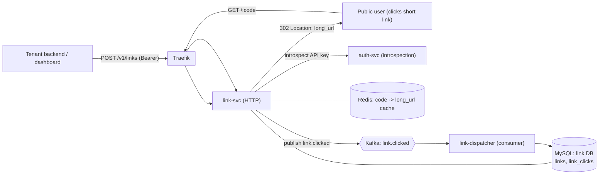

# Link Service (URL Shortener) - Design

**Date:** 2026-08-19
**Status:** Approved (brainstorm). Next: implementation plan (deferred by gate).
**Reference followed:** [system-design-notes #08 - URL Shortener](https://github.com/liquidslr/system-design-notes/blob/main/08.%20URL%20Shortener/Readme.md).
**Roadmap piece:** sub-project **C** of the
[notification-platform + link-service roadmap](../../roadmap/2026-08-16-notification-platform-and-link-service.md).

> **HARD GATE.** The roadmap gates all of A/B/C behind "OTP email + SMS live in production,
> stable". OTP is not yet in production (k3s deploy Part B pending). This spec is prepared
> ahead of the gate for design/learning; **do not build-and-ship until the gate opens.**

## 1. Goal

A self-contained `link-svc` bounded context that shortens URLs and redirects them, with click
analytics - following the reference design's patterns (Base62-of-a-unique-ID, cache-aside reads,
302 for trackable redirects, dedup on write, IP rate-limiting) adapted to worklane's single-node,
event-driven, hexagonal architecture.

**In scope (first cut, standalone):**
- Create a short link (tenant-scoped) and redirect it publicly (302).
- Click tracking via Kafka `link.clicked` -> a consumer that persists clicks; 14-day series + recent.
- Redis cache-aside on the redirect hot path.

**Out of scope (deferred):**
- Template `{{link "..."}}` auto-shortening and per-notification **CTR** (need Notification Service B).
- Geo lookup (GeoIP), custom vanity aliases, link expiry, 301 redirects.
- DB sharding/replication (single-node first cut; scale-out path noted).

## 2. Decisions settled during brainstorming

| # | Decision | Rationale |
|---|----------|-----------|
| Scope | Standalone minimal: create + public 302 redirect + click tracking + cache | Smallest slice that is a real, useful shortener; matches reference's two operations |
| Code gen | **Snowflake ID -> Base62** (`pkg/idgen`) | Reference's recommended "distributed-ID -> base62" (collision-free, no DB round-trip); Snowflake mitigates the naive-counter enumeration concern the reference flags |
| Services | Two deployables: `link-svc` (HTTP) + `link-dispatcher` (Kafka consumer) | Mirrors otp-api / otp-dispatcher; keeps the redirect hot path off the DB write |
| Auth | Create/list = tenant (JWT or API key via introspection); **redirect = public** | Reuses otp-api's exact `authenticate` middleware; a public short link must not require auth |
| Data | Own `link` database (database-per-service) | Consistent with the identity/otp split; no cross-DB coupling |
| Dedup | `(tenant_id, long_url_hash)` unique -> return existing code | Reference's "return existing short URL if the long URL already mapped" |
| Redirect | **302** (temporary) | Reference: 301 is browser-cached and kills click analytics |
| Click ingest | Redirect publishes `link.clicked`; `link-dispatcher` persists | Non-blocking 302; reuses Kafka; teaches the analytics pipeline the reference calls out |
| Privacy | Store `ip_hash`, never the raw IP | Matches worklane's PII-masking ethos (recipient masking in OTP) |

### Rejected / reconciled alternatives
- **Random base62 + retry** (an earlier pick): opaque and simple, but it is the reference's
  *less-preferred* family (hash + collision resolution). "Follow the reference" -> Base62-of-ID.
- **DB auto-increment -> base62**: closest to the reference's literal example, but a single DB
  counter is enumerable and does not scale across replicas; Snowflake gives per-pod IDs.
- **Synchronous click write on redirect**: simplest, but blocks the hot path the reference says
  must stay fast.
- **One binary running HTTP + consumer goroutine**: fewer moving parts, but breaks the
  sync/async deployable split worklane uses everywhere else.

## 3. Architecture



## 4. Service layout (hexagonal, mirrors otp-api)

```
services/link-svc/
  main.go
  internal/
    app/        ports.go, usecase.go        # Shorten, Resolve, ListLinks, LinkDetail; ports: Repo, Cache, Introspector, Publisher, IDGen, Clock
    domain/     link.go, errors.go
    adapters/
      inbound/http/    router.go, handlers.go, dto.go, middleware.go (copied authenticate), errors.go
      outbound/mysqlrepo/  repo.go
      outbound/rediscache/ cache.go
      outbound/identity/   client.go, cache.go   # introspection (copied pattern)
    arch/       arch_test.go
services/link-dispatcher/
  main.go
  internal/
    app/        consumer usecase (persist click)
    adapters/inbound/consumer/  handler.go
    adapters/outbound/mysqlrepo/ repo.go
pkg/idgen/      snowflake.go, base62.go        # shared, pure/testable
db/link/migrations/ 0001_init.up.sql / .down.sql
```

## 5. Code generation - `pkg/idgen`

- **Snowflake** (`snowflake.go`): 64-bit `[ 41 bits ms-since-epoch | 10 bits node-id | 12 bits sequence ]`,
  custom epoch (e.g. 2026-01-01). A `*Snowflake` holds `nodeID`, last-timestamp, sequence, and a
  mutex; `Next() int64` is monotonic and thread-safe. Node id comes from config
  (`LINK_NODE_ID`), so **each link-svc pod gets a distinct node id** and replicas never collide.
- **Base62** (`base62.go`): pure `Encode(uint64) string` / `Decode(string) (uint64, error)` over
  `[0-9a-zA-Z]`. 7+ chars comfortably exceeds worklane volume.
- Tests: snowflake uniqueness + monotonicity under concurrency (`-race`); base62 round-trip and
  known vectors.

**Mechanism / pitfall to teach:** a naive auto-increment -> base62 leaks order and total volume
(anyone can enumerate `code+1`). Snowflake interleaves a timestamp + node + sequence, so codes are
non-sequential across time/pods; still not a secret (short codes never are) but not trivially
enumerable. If true unguessability were required, encrypt the ID (e.g. Feistel/`skip32`) before
base62 - noted as a future option.

## 6. Data model (`link` DB)

```sql
CREATE TABLE links (
  id            BIGINT PRIMARY KEY,           -- snowflake
  code          VARCHAR(16) NOT NULL UNIQUE,
  tenant_id     CHAR(36) NOT NULL,
  long_url      TEXT NOT NULL,
  long_url_hash CHAR(64) NOT NULL,            -- sha256(long_url) for dedup
  created_at    DATETIME NOT NULL DEFAULT CURRENT_TIMESTAMP,
  UNIQUE KEY uq_tenant_url (tenant_id, long_url_hash),
  INDEX idx_links_tenant (tenant_id, created_at)
);

CREATE TABLE link_clicks (
  id         BIGINT AUTO_INCREMENT PRIMARY KEY,
  code       VARCHAR(16) NOT NULL,
  tenant_id  CHAR(36) NOT NULL,
  ts         DATETIME NOT NULL DEFAULT CURRENT_TIMESTAMP,
  referer    VARCHAR(255),
  ua         VARCHAR(255),
  ip_hash    CHAR(64),                        -- hashed, never raw
  INDEX idx_clicks_code_ts (code, ts)
);
```

- `code` in `link_clicks` is denormalized so click aggregates need no join.
- 14-day series = `SELECT DATE(ts), COUNT(*) ... WHERE code=? AND ts>=? GROUP BY DATE(ts)`.
- `device` is parsed from `ua` at read time (simple classifier); `geo` is deferred (needs a GeoIP
  database) and returns empty for now.

## 7. Endpoints (link-svc)

**Tenant-scoped** (Bearer JWT or API key, same `authenticate` as otp-api):
- `POST /v1/links` `{long_url}` -> `201 {code, short_url}`; dedup returns the existing mapping.
- `GET /v1/links` -> `[{code, target, clicks, created}]` for the tenant.
- `GET /v1/links/:code` -> `{code, target, clicks, series[14], recent[]}` (dashboard detail shape).

**Public:**
- `GET /:code` -> `302 Location: <long_url>` (cache-aside); unknown code -> `404`. Publishes
  `link.clicked`.
- `GET /healthz` -> `200 {"status":"ok"}`.

`short_url` is built from a configured base (`LINK_PUBLIC_BASE`, e.g. `https://link.<domain>`).

## 8. Read path (redirect) and write path (create)

**Redirect (hot path):**
```
GET /:code
  -> Redis GET link:<code>
       hit  -> 302 + publish link.clicked (fire-and-forget)
       miss -> DB lookup by code
                 found   -> SET Redis (TTL ~1h) -> 302 + publish
                 missing -> 404
```
A Kafka publish failure is logged but never blocks the 302 (analytics is best-effort; the redirect
is the product).

**Create (write path):**
```
POST /v1/links {long_url}
  -> authenticate -> tenant_id
  -> compute long_url_hash; SELECT existing (tenant_id, long_url_hash)
       found   -> return existing {code, short_url}
       missing -> id = snowflake.Next(); code = base62(id)
                  INSERT links; warm Redis; return 201 {code, short_url}
```

## 9. Click analytics ingest (Kafka)

- Topic `link.clicked`, event `{code, tenant_id, ts, referer, ua, ip_hash}`.
- `link-dispatcher` consumes and `INSERT`s into `link_clicks` (idempotency is not required - clicks
  are additive; at-least-once double-counting is acceptable for analytics, noted).
- Reuses the sarama consumer pattern from otp-dispatcher.

## 10. Caching, rate limiting, auth

- **Cache-aside** Redis `link:<code>` -> `long_url`, TTL ~1h; warmed on create, populated on read
  miss. (No negative caching in the first cut.)
- **Rate limiting:** create is per-tenant (Redis fixed-window, the existing limiter pattern);
  redirect is per-IP at the Traefik edge (reference: "limits on requests per IP").
- **Auth:** `link-svc` carries the same `Introspector` (HTTP client to auth-svc
  `/internal/introspect` + Redis cache) and unified `authenticate` middleware as otp-api. The
  redirect route is outside the auth group.

## 11. Ingress / hostname

A dedicated short host, e.g. `link.<domain>`, routed to `link-svc`: `GET /:code` public,
`PathPrefix(/v1/links)` behind the auth middleware, `/healthz` public. (k8s manifests are written
at deploy time, following the k3s deploy spec's Kustomize pattern; not part of this design.)

## 12. Scale-out (reference, adapted - future)

- `link-svc` is stateless -> scale horizontally; **each pod needs a unique `LINK_NODE_ID`** so
  Snowflake IDs never collide across replicas (e.g. from a StatefulSet ordinal).
- Redis absorbs the reference's ~10:1 read:write ratio on redirects.
- DB read replicas (reads) + sharding by code-prefix / id-range (writes + volume) are the
  documented scale path; unnecessary at worklane's single-node first cut.

## 13. Testing (TDD)

- `pkg/idgen`: base62 round-trip + vectors; snowflake uniqueness/monotonic under `-race`.
- link-svc app: Shorten (new + dedup), Resolve (hit/miss), ListLinks/LinkDetail aggregation;
  ports faked.
- link-svc http: create 201 + dedup, redirect 302 + 404, auth required on `/v1/*`, public redirect,
  `/healthz`.
- rediscache + mysqlrepo: miniredis / sqlite like the existing adapters.
- link-dispatcher: consume event -> row inserted.
- `arch_test` green (domain/app infra-free).

## 14. Success criteria (verifiable)

1. `POST /v1/links` with a tenant credential returns a Base62 code; re-posting the same URL returns
   the same code (dedup).
2. `GET /:code` issues a 302 to the original URL; an unknown code returns 404.
3. A click publishes `link.clicked`; `link-dispatcher` persists it; `GET /v1/links/:code` reflects
   the click in `clicks` and the 14-day series.
4. Redirects are served from Redis on repeat (cache-aside), DB only on miss.
5. Snowflake codes are unique across concurrent creation and across pods (distinct node ids).
6. Domain/app stay infra-free (`arch_test`); `go test -race ./...` green.

## 15. Pitfalls to remember

- **301 kills analytics** - browsers cache it and never re-hit the service; use 302.
- **Naive counter -> base62 is enumerable** - Snowflake (or encrypt-then-encode) mitigates.
- **Redirect must not block on DB/Kafka** - cache-aside + fire-and-forget publish keep it fast.
- **Per-pod Snowflake node id is mandatory** - two pods sharing a node id can mint duplicate ids.
- **Never store raw IPs** - hash them; short-link analytics does not need PII.
- **Dedup needs a hash column** - `long_url` is TEXT and cannot be uniquely indexed directly; index
  `sha256(long_url)` per tenant.
