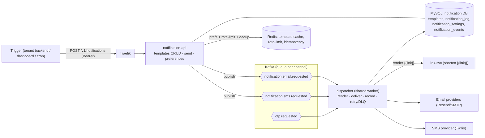

# Notification System - Design

**Date:** 2026-08-19
**Status:** Approved (brainstorm). Next: implementation plan (deferred by gate).
**Reference followed:** [system-design-notes #10 - Notification System](https://github.com/liquidslr/system-design-notes/blob/main/10.%20Notification%20System/Readme.md).
**Roadmap pieces:** **A** (Template Studio) + **B** (Notification Service) of the
[notification-platform + link-service roadmap](../../roadmap/2026-08-16-notification-platform-and-link-service.md);
integrates with **C** ([link-svc](./2026-08-19-link-service-url-shortener-design.md)) for `{{link}}`.

> **HARD GATE.** The roadmap gates A/B/C behind "OTP email + SMS live in production, stable".
> OTP is not yet in production (k3s deploy Part B pending). This spec is prepared ahead of the
> gate for design/learning; **do not build-and-ship until the gate opens.**

## 1. Goal

Generalize worklane from OTP-only into a **multi-channel notification platform** - following the
reference design's shape (notification API -> per-channel queues -> workers -> providers, with
preferences, idempotency, retry, and engagement analytics) - by **building on the existing base**:
the otp-dispatcher Sender registry, the email/SMS providers, Kafka, MySQL, Redis, the `templates`
table, link-svc for `{{link}}`, and the dashboard's already-mocked Templates/Campaigns screens.

**In scope (first cut):**
- **Template Studio** (piece A): tenant-scoped `templates` CRUD + versioning + safe `{{var}}` /
  `{{link}}` rendering that runs through the exact delivery path (preview cannot lie).
- **Transactional notification pipeline** (piece B): `notification-api` accepts a send, enforces
  preferences + rate-limit + idempotency, and routes to per-channel Kafka queues; a generalized
  shared worker renders + delivers via the reused email/SMS providers and records outcomes.
- **Preferences / opt-out**, **idempotency (dedup by notification id)**, **retry + backoff + DLQ**.
- **Engagement**: sent/failed + click-through (joined from link-svc `link.clicked`).

**Out of scope (deferred):**
- **Push** (FCM/APNS) + `device_tokens` (email + SMS only first cut).
- **Broadcast campaigns** (audience fan-out to many recipients) - the dashboard Campaigns screen
  stays mock until a follow-up iteration.
- Open-pixel + provider delivered-webhooks; DLQ **drainer** (the worker/cron track); HPA/autoscaling.
- Migrating the OTP path onto the generic pipeline (OTP keeps its own producer/audit; see below).

## 2. Decisions settled during brainstorming

| # | Decision | Rationale |
|---|----------|-----------|
| Topology | New **`notification-api`** + **generalize `otp-dispatcher`** into a shared worker | Roadmap B: "generalize the dispatcher; add `notification.requested` alongside `otp.requested`"; reuses the Sender registry + providers |
| Templates | **Include** Template CRUD + dynamic render in this spec (piece A) | Notifications need real templates; B depends on A |
| Channels | **email + SMS** (reuse resend/smtp/twilio); **push deferred** | Reuses working providers; push needs device tokens + new gateways |
| Queues | **Per-channel topics** (`notification.email.requested`, `notification.sms.requested`) | Reference's queue-per-channel enables independent worker scaling |
| OTP path | **Left intact** (own producer `otp-api`, own `otp.requested`, own audit) | Never disrupt the working secret-bearing OTP flow; the worker gains generic handlers beside it |
| Reliability | Idempotency by notification id; retry+backoff; terminal -> failed + DLQ | Reference: dedup-before-send, at-least-once, retry |
| Preferences | `notification_settings` per (tenant, user, channel); enforced pre-enqueue; **marketing respects opt-out, transactional bypasses** | Reference opt-out; transactional (OTP-like) must still deliver |
| Rendering | Pure `{{var}}` render in `pkg/template`; `{{link}}` shortening via a link-svc port at delivery; **preview uses the same render** | Reference/roadmap pitfall: preview must render through the real path or it lies |
| Data | New **`notification` DB** (templates, notification_log, settings, events) | Database-per-service; generalizes `delivery_logs` into `notification_log` |

### Rejected alternatives
- **Extend otp-api/otp-dispatcher in place:** fewer services, but tangles two bounded contexts.
- **Merge OTP into the generic `notification.requested` stream:** elegant, but risks the OTP-code
  secrecy invariant (`Code` must never reach downstream topics) and refactors a working path.
- **Single `notification.requested` topic:** simpler, but drops the reference's per-channel scaling;
  kept as the fallback if per-channel worker scaling is never needed.

## 3. Architecture



## 4. Service topology (build on the base)

- **`notification-api`** (new, hexagonal like otp-api): templates CRUD, send, preferences, reads.
  Reuses the `authenticate` middleware + `Introspector` (auth-svc introspection) verbatim.
- **`dispatcher` (generalized `otp-dispatcher`)**: keep the deployable; broaden it to consume
  `otp.requested` **and** the per-channel `notification.*.requested` topics. The existing
  `Sender` registry, `EmailProvider`/`SMSProvider` ports, and delivery-logging stay; the `Sender`
  interface is generalized from `Send(to, code)` to deliver a **rendered `Message{To,Subject,Body}`**
  so both OTP (renders code) and notifications (render template) share one delivery path.
  (A rename to `services/dispatcher` is optional cleanup, not required.)
- **Shared kernels:** `pkg/template` (pure render), `pkg/contracts/notification` (event payloads).

## 5. Generalizing the worker (surgical refactor of otp-dispatcher)

Today `Sender.Send(ctx, to, code)` and each sender renders internally. Change to:

```go
type Message struct { To, Subject, Body string }        // Subject empty for SMS
type Sender interface { Name() string; Deliver(ctx, Message) (msgID string, err error) }
```

- The **OTP handler** renders its fixed OTP template with `code` -> `Message` -> `Deliver`
  (behavior unchanged; the code still never reaches downstream topics).
- The **notification handler** loads the DB template, renders `{{var}}`/`{{link}}` -> `Message` ->
  `Deliver`.
- Both write to their own store: OTP -> `otp.delivery_logs` (unchanged); notifications ->
  `notification.notification_log`. The composition root wires both repos; each handler uses its own.
- Retry/backoff + failed/DLQ fan-out (already present for OTP) is reused for both.

## 6. Data model (`notification` DB)

```sql
CREATE TABLE templates (
  id         CHAR(36) PRIMARY KEY,
  tenant_id  CHAR(36) NOT NULL,
  name       VARCHAR(255) NOT NULL,
  channel    VARCHAR(16) NOT NULL,          -- email | sms
  locale     VARCHAR(16) NOT NULL,
  subject    VARCHAR(255) NOT NULL,         -- email only
  body       TEXT NOT NULL,                 -- may contain {{var}} and {{link "url"}}
  version    INT NOT NULL DEFAULT 1,
  status     VARCHAR(16) NOT NULL DEFAULT 'active',   -- active | archived
  created_at DATETIME NOT NULL DEFAULT CURRENT_TIMESTAMP,
  updated_at DATETIME NOT NULL DEFAULT CURRENT_TIMESTAMP,
  INDEX idx_templates_tenant (tenant_id, channel)
);

CREATE TABLE template_versions (           -- immutable history for rollback
  id CHAR(36) PRIMARY KEY, template_id CHAR(36) NOT NULL,
  version INT NOT NULL, subject VARCHAR(255), body TEXT,
  created_at DATETIME NOT NULL DEFAULT CURRENT_TIMESTAMP,
  UNIQUE KEY uq_tpl_version (template_id, version)
);

CREATE TABLE notification_log (            -- generalizes delivery_logs
  id           CHAR(36) PRIMARY KEY,       -- notification id = idempotency key
  tenant_id    CHAR(36) NOT NULL,
  channel      VARCHAR(16) NOT NULL,
  recipient_masked VARCHAR(255) NOT NULL,  -- masked, never raw PII
  template_id  CHAR(36),
  kind         VARCHAR(16) NOT NULL,       -- transactional | marketing
  state        VARCHAR(16) NOT NULL,       -- queued | sent | failed | suppressed
  provider     VARCHAR(32), provider_msg_id VARCHAR(128),
  latency_ms   BIGINT, error TEXT,
  created_at   DATETIME NOT NULL DEFAULT CURRENT_TIMESTAMP,
  updated_at   DATETIME NOT NULL DEFAULT CURRENT_TIMESTAMP,
  INDEX idx_notif_tenant (tenant_id, created_at)
);

CREATE TABLE notification_settings (       -- preferences / opt-out
  tenant_id CHAR(36) NOT NULL,
  user_ref  VARCHAR(255) NOT NULL,         -- tenant's own user identifier
  channel   VARCHAR(16) NOT NULL,
  enabled   BOOLEAN NOT NULL DEFAULT TRUE,
  PRIMARY KEY (tenant_id, user_ref, channel)
);

CREATE TABLE notification_events (         -- engagement: delivered/opened/clicked
  id BIGINT AUTO_INCREMENT PRIMARY KEY,
  notification_id CHAR(36) NOT NULL,
  type VARCHAR(16) NOT NULL,               -- delivered | opened | clicked
  ts   DATETIME NOT NULL DEFAULT CURRENT_TIMESTAMP,
  meta VARCHAR(255),
  INDEX idx_events_notif (notification_id, type)
);
-- device_tokens: DEFERRED (push).
```

- `templates` moves here (tenant-scoped + versioned) and becomes the notification single source.
  The **OTP** path keeps its own fixed template for now (decoupled); unifying it is future work.
- `notification_log.id` is the idempotency key: a duplicate send with the same id is a no-op.

## 7. notification-api endpoints

Tenant-scoped (JWT or API key via introspection; same `authenticate` as otp-api):

**Templates (piece A):**
- `GET /v1/templates` / `POST /v1/templates` / `GET /v1/templates/:id` / `PUT /v1/templates/:id`
- `POST /v1/templates/:id/preview` `{variables}` -> renders through the **exact** delivery render
  (returns subject+body; `{{link}}` shows a preview short link) - so preview cannot lie.
- Versioning: a `PUT` snapshots the prior version into `template_versions`.

**Send (piece B):**
- `POST /v1/notifications` `{channel, recipient, template_id, variables, kind, user_ref?, idempotency_key?}`
  -> validate -> **preference check** (marketing + channel disabled for `user_ref` -> `suppressed`)
  -> **rate-limit** (per tenant/user, Redis) -> **dedup** (idempotency id; existing -> return it)
  -> persist `notification_log(queued)` -> publish `notification.<channel>.requested`
  -> `202 {notification_id}`.

**Preferences:**
- `GET /v1/preferences?user_ref=` / `PUT /v1/preferences` `{user_ref, channel, enabled}`.

**Reads (dashboard):**
- `GET /v1/notifications` (log), `GET /v1/notifications/:id` (+ events). `GET /healthz`.

## 8. Rendering + `{{link}}` integration

- `pkg/template`: pure `Render(subject, body string, vars map[string]string) (subject, body)`;
  `{{var}}` substitution is **literal-only** (no template execution -> no injection); unknown vars
  render empty and are reported. Tested in isolation.
- `{{link "https://..."}}`: a `Shortener` port (implemented by an HTTP client to link-svc
  `POST /v1/links`) replaces the directive with the returned short URL **at delivery time**, so the
  delivered message and the previewed message use the identical code path.
- Rendering lives in the worker (delivery) and is reused by `notification-api` preview via the same
  `pkg/template` + `Shortener` port.

## 9. Reliability (reference)

- **Idempotency:** `notification_log.id` unique; `notification-api` dedups on insert; the worker
  also skips if the row is already `sent` (defensive against redelivery).
- **Retry + backoff:** transient provider errors are retried with exponential backoff; a terminal
  failure records `failed`, publishes `notification.failed` + routes to `notification.dlq`
  (the **DLQ drainer** is the separate worker/cron track).
- **At-least-once:** Kafka delivery + idempotency reconcile duplicates.

## 10. Preferences, rate limiting, analytics

- **Preferences/opt-out:** enforced in `notification-api` before enqueue. `kind=marketing`
  respects `notification_settings`; `kind=transactional` (OTP-like) bypasses opt-out. A suppressed
  send is logged `state=suppressed`, never delivered.
- **Rate limiting:** per-tenant and per-`user_ref` frequency caps (Redis fixed-window, reusing the
  existing limiter) to prevent notification fatigue (reference).
- **Engagement:** `clicked` comes from **link-svc `link.clicked`** joined by notification id (the
  shortener tags created links with the notification id); `delivered`/`opened` (provider webhooks +
  email open pixel) are near-future. `notification_events` feeds the dashboard's CTR.

## 11. Scaling (reference, adapted - future)

- Queue-per-channel already in the design -> **worker pools per channel** scale independently;
  queue-depth-driven autoscaling ties into the observability/HPA track.
- `notification-api` is stateless -> horizontal scale; Redis caches templates + preferences.
- The current single-node worker handles both OTP and notifications; splitting per channel is a
  deployment change, not a code change.

## 12. Dashboard

The mocked **Templates** and **Campaigns** screens (`dashboard/lib/roadmap/*`) become live against
`notification-api`: Templates CRUD + preview wire to `/v1/templates`; the notification log +
per-notification engagement wire to `/v1/notifications`. Broadcast **Campaigns** (audience fan-out)
stay mock until the campaigns iteration.

## 13. Testing (TDD)

- `pkg/template`: `{{var}}` substitution (present/missing/injection-safe); `{{link}}` via a fake
  Shortener.
- notification-api app: send (dedup, preference suppression, rate-limit), templates CRUD + versioning.
- worker: notification handler (render -> deliver -> log -> sent/failed/DLQ); OTP handler unchanged
  after the `Sender.Deliver(Message)` refactor (existing OTP tests still green).
- adapters: mysqlrepo (sqlite), rediscache (miniredis), shortener/introspection (httptest).
- `pkg/contracts/notification`: payload shapes + PartitionKey. `arch_test` green in both services.

## 14. Success criteria (verifiable)

1. Create a template, then `POST /v1/notifications` with variables -> a real email/SMS arrives whose
   body matches the **preview** exactly (same render path), including a shortened `{{link}}`.
2. Re-sending with the same idempotency id does **not** send twice (dedup).
3. A `user_ref` opted out of `email` for `kind=marketing` -> `suppressed`, no delivery; a
   `transactional` send to the same user still delivers.
4. A provider failure records `failed` + routes to the DLQ; a transient error is retried.
5. The existing OTP path still passes all its tests after the `Sender.Deliver(Message)` refactor.
6. `go test -race ./...` green; domain/app stay infra-free (`arch_test`).

## 15. Pitfalls to remember

- **Preview must render through the delivery path** (`pkg/template` + `Shortener`), or it lies.
- **Design idempotency in from day one** (notification id), never bolt it on - reference's core.
- **Never merge the OTP `Code` into downstream/generic topics** - it belongs only on `otp.requested`.
- **`{{var}}` must be literal substitution**, not template execution - avoid injection via user vars.
- **Transactional vs marketing opt-out** - suppressing a transactional (OTP) notification is a bug.
- **Mask recipients at rest** in `notification_log`, as OTP already does.
- **Tag shortened links with the notification id** at render time, or click-through can't be joined.
