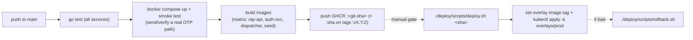
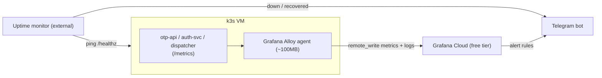

# Solo-operator prod hardening for worklane - Design

**Date:** 2026-08-25
**Status:** Approved (brainstorm). Next: implementation plan.
**Base spec (this layers on top of):** [k3s production deploy](./2026-08-19-k3s-production-deploy-design.md).
**Relation:** The base spec gets worklane *deployed* (host + app + infra + images). This spec makes it
*operable by one person as real production* - it fills the three areas the base spec explicitly
deferred: **observability, safe delivery + rollback, and resource/disk guardrails.**

## 1. Framing: what a backend owns when there is no DevOps team

At work a DevOps team hands you 4 environments, GitLab pipelines, ArgoCD and Grafana - you only
*consume* them. Solo, you hold the whole **control surface**. Five layers, bottom-up:

| Layer | Core question | Base spec | This spec |
|---|---|---|---|
| 1. Compute / cluster | Where does it run, who owns the node | done (1 VPS + k3s) | disk/RAM guardrails |
| 2. Delivery (CI/CD) | commit -> image -> running, safely | half (build+push) | **+ test gate, pinned tags, rollback** |
| 3. Environments | how dev/prod split, how to promote | implicit | **dev=compose / prod=k3s, explicit** |
| 4. Config & secrets | per-env config, where secrets live | done (out-of-band) | unchanged |
| 5. Observability | is it alive, where is it slow | deferred | **Grafana Cloud + uptime alert** |

**Goal #1 (chosen): OTP running stably in production, operated by one person.** Tooling is added only
where it defends stability. This ordering is deliberately *not* "ArgoCD first" - GitOps solves
frequent-deploy / many-people drift, which a solo project barely has. The things that actually keep
prod alive - eyes on the system, a safe path in, a fast path back - come first.

## 2. Hard constraint that shapes everything: 15GB disk

The VPS is 6GB RAM / 4 vCPU / **15GB disk**. RAM exhaustion kills a pod and it restarts; a **full
disk trips k3s `DiskPressure`, which evicts pods across the node and takes OTP prod down** - the exact
failure we are trying to prevent. Every "push it off-box" decision below traces to this one number.

Rough disk map of 15GB: OS + k3s ~4GB, container images ~2.5-4GB, then MySQL data + Redpanda log
segments grow into whatever is left. Self-hosting a Prometheus TSDB + Loki log store here would eat
the remainder and *manufacture* the outage. Hence: metrics and logs leave the box.

## 3. Decisions settled during brainstorming

| # | Decision | Rationale |
|---|----------|-----------|
| Goal | Optimize for **stable OTP prod**, solo; add tooling only on a real blocker | Base project gate is "OTP live + stable"; not a platform-eng showcase |
| Env model | **dev = docker-compose (laptop), prod = k3s namespace `worklane`** | Honest 2-stage on one node; 4 real envs on one VPS is fiction |
| Overlay rename | `overlays/develop` -> **`overlays/prod`** | It *is* the prod deploy; the "develop" name is an operational trap |
| Kafka | **Keep Redpanda**, cap `--memory 1G` + short retention | Redpanda *is* the lightweight self-host answer (Kafka-compatible, no JVM/ZK); core to the project's stack mirroring; only the disk must be bounded |
| Observability | **Grafana Alloy -> Grafana Cloud free tier**; uptime ping -> **Telegram** | Real Grafana, ~100MB local, **zero local TSDB disk** - fits 15GB |
| Delivery | **GH Actions: test + smoke -> build -> push `:<git-sha>`**; scripted `kubectl apply`; human gate before prod | No `:latest` in prod; a person approves each prod change |
| Rollback | `kubectl rollout undo` / re-apply previous SHA via a script | Deploy into the only k8s env = must have a one-command way back |
| Backup | Nightly `mysqldump` -> **Cloudflare R2 free**; low-criticality | No real users; the value is rehearsing the *restore drill*, not saving data |
| Secrets | **Unchanged** - out-of-band k8s Secrets (base spec) | SOPS/sealed-secrets is a future learning phase, not needed now |
| ArgoCD | **Deferred** to Phase 2 (sketched in this doc) | GitOps payoff is low solo; it is a standalone learning project once the base is stable |

### Rejected / deferred alternatives
- **Self-host Prometheus + Grafana + Loki in-cluster:** the "learn the whole stack" option, but the
  TSDB + log chunks grow into the 15GB disk and risk the very `DiskPressure` outage we are avoiding.
  Deferred to a later learning phase, ideally after a disk resize.
- **Two namespaces (staging + prod) on the same k3s:** a real k8s promote flow, but ~2x the stateful
  RAM/disk on a box already tight. Not worth it for a no-user project; the compose stack is the test
  env instead.
- **Redis Streams to drop Redpanda entirely:** ~1GB lighter, but discards the Kafka/`sarama` mirroring
  that is the point of the project. Only revisit if disk/RAM is genuinely exhausted.
- **GH Actions auto-deploy straight to prod (no human gate):** faster, but one bad commit slipping the
  test net lands directly on live OTP. Rejected for a stability-first goal.
- **ArgoCD now:** ~200-400MB RAM and added moving parts against a "keep it light" goal; deferred.

## 4. Environment model

```
dev  = docker-compose on the laptop   (deploy/compose/, already exists) - also the CI test env
prod = k3s namespace `worklane`       (deploy/k8s/overlays/prod)
```

- Rename `deploy/k8s/overlays/develop` -> `deploy/k8s/overlays/prod` (dir, `kustomization.yaml`
  `namespace`/labels, README, and any script references). Purely a naming/clarity change; no infra
  behavior changes.
- There is **no k8s staging**. The gate that protects prod is the CI test + compose smoke-test in §5,
  plus the one-command rollback in §6.

## 5. Delivery pipeline (GitHub Actions)



- **Test gate is new.** The base spec's `images.yml` only builds+pushes. Here CI must first run
  `go test ./...` per service **and** stand up the compose stack to smoke-test the real OTP send/verify
  path. A red test or red smoke = no image pushed. Compose earns its keep as the test environment.
- **No `:latest` for prod.** Prod is always pinned to a `:<git-sha>` (tags also carry `:vX.Y.Z`). The
  overlay's `images:` transformer records exactly what is running - git is the source of truth for
  "what is in prod".
- **Deploy is human-gated and scripted:** `deploy/scripts/deploy.sh <sha>` writes the tag into
  `overlays/prod` and runs `kubectl apply -k`. A person triggers it; kubeconfig stays off CI.
- **Rollback is one command:** `deploy/scripts/rollback.sh` either `kubectl rollout undo deployment/<x>`
  (fast, last-known-good) or re-applies the previous SHA. Because prod is the only k8s env, this path
  must exist and be tested, not assumed.

## 6. Observability (pushed off-box)



- **Grafana Alloy** runs in-cluster and `remote_write`s metrics + ships logs to **Grafana Cloud free
  tier**. No local Prometheus TSDB, no local Loki - the 15GB disk is untouched by observability.
- **Uptime**: an external monitor (Uptime Kuma elsewhere, or a hosted free pinger) hits `/healthz`
  (already added in the base spec) and alerts **Telegram** on down/recovered.
- **Alerting channel = Telegram** for both Grafana Cloud alert rules and the uptime monitor.
- **The 4 signals to watch first** (a solo operator cannot watch everything):
  1. **OTP send success rate** - the product working at all.
  2. **p95 request latency** (otp-api) - degradation before it becomes an outage.
  3. **Redpanda consumer lag** (dispatcher) - the async path silently backing up.
  4. **Disk %** - the single most likely way this node dies (see §2). Alert at 80%.

> App code may need a lightweight `/metrics` (Prometheus) endpoint if not already present; scope this
> in the plan. Keep it minimal - request count/latency + a couple of OTP counters, not a metrics zoo.

## 7. Resource & disk guardrails

**RAM budget (~6GB):**

| Component | Budget |
|---|---|
| k3s + system | ~1.0 GB |
| MySQL (tuned `innodb_buffer_pool` small) | ~0.4 GB |
| Redpanda (`--memory 1G`) | ~1.0 GB |
| Redis | ~0.05 GB |
| otp-api / auth-svc / dispatcher | ~0.3 GB |
| Alloy agent | ~0.1 GB |
| **Used / headroom** | **~2.9 GB / ~3 GB** |

**Disk guardrails (~15GB, the tight one):**
- **Redpanda**: `--memory 1G` and **short retention** (OTP events are consumed within seconds; there
  is no reason to keep the log for hours). A bounded `retention.ms` / segment size keeps the log from
  eating disk. **This is the top disk-eater to cap.**
- **k3s image GC**: enable kubelet image garbage collection thresholds so old `:<git-sha>` images from
  past deploys are reclaimed automatically.
- **MySQL**: small buffer pool; the schema is tiny, but watch growth of `delivery_logs`.
- **Alert on disk > 80%** (signal #4) so you resize/prune *before* `DiskPressure`.
- **Recommendation:** if the provider offers a cheap disk resize, **+25GB is well worth it** and
  removes most of this section's risk (and re-opens the self-hosted-Grafana learning path later).

## 8. Backup & restore (low-criticality, drill-focused)

- No real users, so backups protect little actual data - the value is **rehearsing restore**, which is
  a real backend skill.
- **Nightly `mysqldump`** (both `otp` and `identity` DBs) -> gzip -> upload to **Cloudflare R2 free
  tier**. A `CronJob` in-cluster or a host cron; keep a short rotation (e.g. last 7).
- **Redis and Redpanda are NOT backed up** - both are ephemeral/regenerable by design in the base spec.
- **Restore drill** (documented, run once): pull the latest dump, restore into a scratch MySQL, verify
  row counts. Prove the backup is restorable, not just that it exists.

## 9. Secrets

Unchanged from the base spec: `worklane-secrets`, `worklane-jwt`, `ghcr-pull` created out-of-band, plus
new secrets for this layer (Telegram bot token, Grafana Cloud push token, R2 credentials) created the
same way and referenced by name. **SOPS / sealed-secrets is a future learning phase**, not in scope now.

## 10. Phased rollout order (each gate verifiable)

1. **Overlay rename** `develop` -> `prod`; `kubectl kustomize overlays/prod` still builds. (No infra change.)
2. **CI test gate** - `go test` + compose smoke-test added to the images workflow; a forced red test
   blocks the image push.
3. **Deploy/rollback scripts** - `deploy.sh <sha>` and `rollback.sh`; do a real deploy then a real
   rollback and confirm the running SHA changes both ways.
4. **Observability** - Alloy -> Grafana Cloud shows the 4 signals; uptime monitor -> Telegram fires on
   a deliberately killed pod and on recovery.
5. **Guardrails** - Redpanda retention + `--memory` capped; k3s image GC on; disk>80% alert wired.
6. **Backup** - nightly dump lands in R2; run the restore drill once and verify row counts.

## 11. Success criteria (verifiable)

1. A red unit test or red compose smoke-test **prevents** an image from reaching prod.
2. Prod runs a pinned `:<git-sha>`; `deploy.sh` and `rollback.sh` each move the running version and are
   proven by a real deploy + rollback.
3. Grafana Cloud shows the 4 signals; a killed pod produces a Telegram alert and a recovery alert.
4. Disk stays bounded: Redpanda retention capped, image GC reclaims old images, disk>80% alerts.
5. A nightly MySQL dump exists in R2 and has been restored successfully at least once.
6. No observability component stores its data on the 15GB node.

## 12. Pitfalls to remember

- **Disk, not RAM, is what kills this node** - `DiskPressure` evicts everything. Cap Redpanda, GC
  images, alert at 80%.
- **`:latest` in prod hides what is running** - always pin `:<git-sha>` so rollback and audit are real.
- **A backup you have never restored is not a backup** - run the restore drill.
- **A liveness `/healthz` that hits the DB will kill healthy pods** (carried from the base spec) - keep
  the health/uptime probe DB-free.
- **Alloy is an agent, not a store** - if Grafana Cloud is unreachable it should buffer briefly and
  drop, never spool unbounded onto the 15GB disk.
- **Rollback must be tested before you need it** - the first time you run `rollback.sh` should not be
  during an incident.

## 13. Phase 2 (future, sketched): ArgoCD / GitOps

Not in this spec. Recorded so the path exists once prod is stable and (ideally) the disk is resized.

**Why later, not never:** ArgoCD's real payoff - declarative desired-state, automatic drift
correction, self-heal, a UI showing exactly what is deployed, and rollback as a git revert - is a
genuine platform-eng skill worth owning. It is simply not a *stability prerequisite* for a solo,
low-traffic project, and it costs ~200-400MB RAM the box can spare only once the base is proven.

**Sketch of the migration when you take it on:**
1. Install ArgoCD into its own namespace (`argocd`); expose its UI via a Traefik `IngressRoute`
   (auth-gated) or keep it port-forward-only at first.
2. Point an ArgoCD `Application` at `deploy/k8s/overlays/prod` in this repo (GitHub, read-only deploy
   key). ArgoCD now watches git and syncs the cluster.
3. **Delivery inverts:** CI stops running `kubectl apply`. Instead CI bumps the image tag in the
   overlay and commits; ArgoCD detects the commit and syncs. `deploy.sh` is retired; a prod change
   becomes a git commit (the real GitOps loop).
4. Rollback becomes `git revert` of the tag-bump commit - ArgoCD syncs back to the previous SHA.
5. Turn on self-heal / prune once trusted, so manual `kubectl` drift is auto-corrected.

This is a clean standalone learning project: it reuses the exact overlays this spec produces and
changes only *who* applies them (a controller watching git, instead of a script you run).
